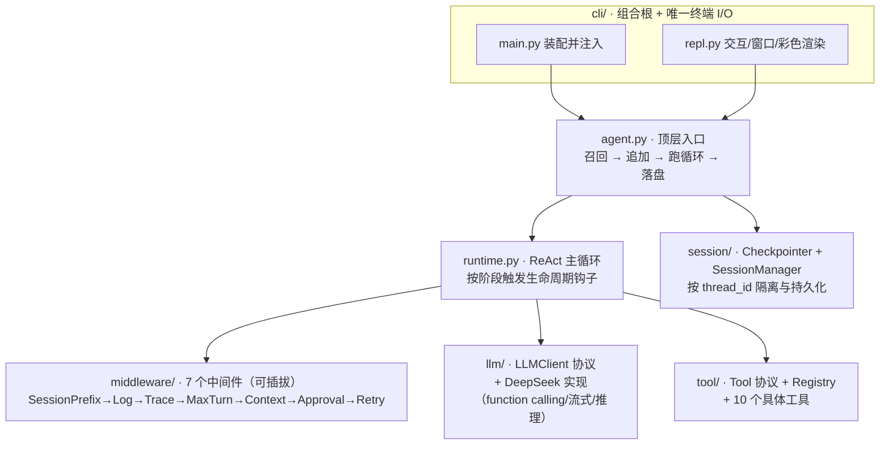

# agent-mvp · 从零实现的最小可用 ReAct Agent


> 一个**不依赖任何 Agent 框架、从零手写**的最小可用 ReAct Agent：以「**主循环 + 生命周期中间件**」为骨架（借鉴 LangGraph 的运行时生命周期与 LangChain 的中间件思想），具备工具调用、多窗口会话、上下文压缩、人工授权、推理模式与彩色分区终端。

## 背景

本项目源自一道**实习面试笔试题**——「从零实现一个最小可用 Agent」。我觉得它很有意思，于是把它当作一个**个人开源项目**继续打磨：在跑通面试要求（ReAct 主循环 / 工具注册 / 多窗口会话 / 上下文管理 / 测试）之后，又补做了一轮工程化（日志、HITL 授权、Bash/文件工具、推理模式、彩色分区 CLI 等）。

核心约束自始至终是：**核心 Runtime 完全自研，不用现成 Agent 框架**，但允许借鉴成熟框架的设计模式。整个过程采用 **TDD**，关注 SOLID 与依赖注入，并写有一套[设计思路文档](doc/agent-design/)。

## ✨ 特性

| 能力 | 说明 |
|---|---|
| 🔁 **ReAct 主循环** | 自研运行时：模型决策 → 调工具 → 回灌结果 → 继续/结束，全程可观测 |
| 🧩 **生命周期中间件** | 6 个顺序钩子 + 2 个环绕钩子；日志/压缩/授权/重试等横切关注点全部可插拔 |
| 🛠 **10 个工具 + 注册机制** | calculator / fetch / weather / todo / bash / read / write / edit / glob / grep；Pydantic 参数自动生成 JSON Schema 供 LLM 决策调用 |
| 🪟 **多窗口会话隔离** | 每个 `thread_id` 一份独立历史，可随时新建/切换；支持纯对话追问与带工具追问 |
| 🗜 **上下文压缩** | 历史超阈值时破坏性摘要早期对话、保留最近 N 条，并保护系统前缀 |
| 🧠 **推理模式** | 接入 DeepSeek 原生 thinking（`reasoning_content`），`:think` 一键开关 |
| 🔐 **HITL 人工授权** | 写/编辑类工具与危险 Bash 命令调用前征询「允许 / 拒绝 / 总是允许」 |
| 🎨 **彩色分区 CLI** | 四通道配色：用户 / 工具返回 / 思考 / 最终回复；支持 token 级流式 |
| 📝 **日志与 trace** | 每会话一份持久日志文件（审计，常开）+ 可开关的 stdout trace（调试） |
| ♻️ **错误分类与重试** | 逻辑错误回灌让模型自纠；基础设施错误指数退避重试 |
| ✅ **TDD + 高覆盖** | 183 个用例，触及代码覆盖率 99%，`ruff` 干净 |

## 🏗 架构总览

它是 **Agent 本体，不是造 Agent 的框架**——因此没有 graph/node 抽象，只有一条清晰的 ReAct 主循环 + 可插拔中间件。



> 想深入理解「为什么这么设计」，从 [doc/agent-design/](doc/agent-design/) 读起（10 篇设计思路汇报）；要精确签名与数据流见 [doc/ddd/](doc/ddd/)。

## 🧭 下一步开发（三期规划）

一/二期已交付（上方「✨ 特性」即其成果）。三期面向「**从 MVP 到可用产品**」，把评测、并发、持久化、记忆与性能补齐——目前处于**设计完成、待实现**阶段：需求 [03prd](doc/prd/03prd.md) R10–R18 · 设计 [03ddd](doc/ddd/03ddd.md) §24–§34 · 计划 [03plan](doc/plan/03plan.md) P15–P23。

| 阶段 | 方向 | 一句话 | 是否完成 |
|---|---|---|:---:|
| P15 | 📊 结构化可观测 | 把每次 run 沉淀为机读轨迹（token / 成本 / cache 命中），评测的地基 | ✅ |
| P16 | 🧪 评测回归体系 | 录制回放（确定性、进 CI）+ 真实 API 冒烟，守住行为零回归 | ✅ |
| P16.5 | 🧱 评测重构 | 场景化 jsonl 数据集 + 单一中间件事实源 + 场景报告 + 并行评测 | ✅ |
| P16.6 | ⏺ 在线录制 | CLI `:cassette` 一键录制真实会话为 cassette + case 桩（回放盒的写侧对偶）| ✅ |
| P17 | 💾 会话持久化 | JSONL 落盘 + 项目路径转义隔离，进程退出不丢、可重启续聊 | ⬜ |
| P18 | ⚡ src 异步核心 | 全链路 async，支撑多会话并发与未来 web / 飞书前端 | ⬜ |
| P19 | 🔀 并行工具调用 | 一轮多工具 `asyncio.gather` 并发，缩短时延 | ⬜ |
| P20 | 🚀 缓存 + 非破坏压缩 | 稳定前缀提升缓存命中；按 token 预算压缩、完整历史落盘 | ⬜ |
| P21 | 🎚 分级模型路由 | 小模型判路由、大模型生成，省成本降时延 | ⬜ |
| P22 | 🧠 分层记忆 | 工作 / 情景 / 语义三层 + 项目级长期记忆（渐进披露、语义召回）| ⬜ |
| P23 | 🛡 上线前安全 | 取消中断 / 工具沙箱 / 多用户鉴权隔离限流 / 多 provider | ⬜ |

> 推进次序：**先建评测网（P15–P16）再动刀**——P18 / P20 等重构都会改变 Agent 行为，有回归网才敢改。完整阶段拆解与验收见 [doc/plan/03plan.md](doc/plan/03plan.md)。

## 🚀 快速开始

### 前置

- **Python 3.13+**
- **[uv](https://docs.astral.sh/uv/)** 包管理器
- 一个 **DeepSeek API Key**（[platform.deepseek.com](https://platform.deepseek.com/)）

### 安装与配置

```bash
git clone https://github.com/hxy2321548628/agent_mvp.git
cd agent_mvp

uv sync                         # 安装依赖（含 dev 组），等价于 make install

cp .env.example .env            # 然后编辑 .env 填入真实 API Key
```

`.env` 关键项：

```ini
DEEPSEEK_API_KEY=your-deepseek-api-key
DEEPSEEK_BASE_URL=https://api.deepseek.com
DEEPSEEK_MODEL=deepseek-v4-pro
# 可选：本地有 Clash/V2Ray 等代理时填其 HTTP 端口；留空=直连
# DEEPSEEK_PROXY=http://127.0.0.1:7890
```

### 运行

```bash
uv run python -m cli.main       # 启动交互式 CLI，等价于 make run-cli
```

启动后直接输入消息对话，`:help` 查看命令。例如「查询北京天气并记一条待办」「算 12*8」。

## 💬 CLI 命令

| 命令 | 作用 |
|---|---|
| `:new [id]` | 开新窗口（缺省自动命名） |
| `:switch <id>` | 切换到指定窗口 |
| `:list` | 列出全部窗口（`*` 标记当前） |
| `:trace` | 开关执行/工具日志（stdout） |
| `:stream` | 开关流式输出 |
| `:think` | 开关推理（思考）模式 |
| `:help` | 显示帮助 |
| `:quit` / `:exit` | 退出 |

非 `:` 开头的普通文本即发送给当前窗口的 Agent。

## 🧠 Memory：召回时机与放置方式

「记住之前的状态、支持追问」是核心需求。本项目的「记忆」由三部分组成——**会话历史**、**待办（TodoStore）**、**系统前缀**——它们在不同**时机**被召回、放到 context 的不同**位置**：

### 召回时机（何时取）


1. **会话历史召回** —— 在 `Agent.run` 入口，按 `thread_id` 经 `SessionManager.get_or_create` 取回该窗口完整历史（含用户输入、AI 思考/答案、工具结果）。这是多窗口隔离与追问的基础。
2. **系统前缀 + todo 提醒注入** —— 在 `on_session_start` 钩子，`SessionPrefixMiddleware` 召回 `TodoStore` 中**未完成**待办，拼成提醒；每轮先清旧前缀再重注入（幂等、不累积）。
3. **上下文压缩（召回后的整形）** —— 在 `before_model` 钩子，`ContextMiddleware` 在消息数超阈值时把早期对话摘要成一条记录。

### 放置方式（放哪里）

context（即喂给模型的消息序列）自顶向下的布局：

```
[钉住前缀]  系统提示 + 运行环境 + 未完成 todo 提醒   （pinned=True，置顶，不被压缩）
[摘要]      早期对话的破坏性摘要                     （仅在压缩后出现，紧随前缀）
[最近历史]  最近 N 条：用户输入 / AI(思考+答案+工具调用) / 工具结果   （按时间顺序）
```

- **钉住前缀置顶**：系统提示与 todo 提醒标记为 `pinned=True` 的 `SystemMessage`，永远在最前；压缩时被整体跳过（不摘要系统提示）。
- **历史按时间顺序追加**：思考过程 / 工具调用 / 最终答案由同一条 `AIMessage` 的不同字段（`reasoning_content` / `tool_calls` / `content`）承载；工具结果是 `ToolMessage`。
- **压缩摘要紧随前缀**：超阈值时早期历史被摘要置于「钉住前缀之后、最近 N 条之前」，并对齐转折边界（避免工具结果脱离其调用导致端点报错）。
- **持久化位置**：`Checkpointer`（当前为进程内内存）按 `thread_id` 存整份会话状态；`Agent.run` 用 `try/finally` 落盘，异常也不丢历史。

> 「哪些信息该塞进 context」：用户输入、工具结果、AI 思考与答案都进历史；系统提示与待办作为钉住前缀；压缩时优先保留最近 N 条、摘要早期、保护前缀。详见 [04 数据模型与会话](doc/agent-design/04-data-model-and-session.md) 与 [06 横切关注点](doc/agent-design/06-cross-cutting.md)。

## 🧩 工具与中间件

**10 个工具**（实现 `Tool` 协议 + 注册即可被调用）：

| 类别 | 工具 |
|---|---|
| 计算 | `calculator`（白名单 AST 安全求值，非 `eval`） |
| 联网 | `fetch`（对用户提供的 URL 发起真实 HTTP 请求） |
| 信息 | `weather`、`todo`（内存待办，兼作记忆提醒来源） |
| 本地工程 | `bash`、`read`、`write`、`edit`、`glob`、`grep`（参照 Claude Code，写/编辑/危险命令走 HITL 授权） |

**7 个中间件**（按装配顺序）：

| 顺序 | 中间件 | 职责 |
|---|---|---|
| 1 | `SessionPrefix` | 装配系统提示 + 环境 + todo 提醒（钉住前缀） |
| 2 | `Log` | 每会话一份持久日志（审计，常开） |
| 3 | `Trace` | 结构化执行日志（stdout，可开关） |
| 4 | `MaxTurn` | 最大轮次保护（在压缩前短路） |
| 5 | `Context` | 上下文压缩 |
| 6 | `Approval` | HITL 人工授权（环绕工具调用） |
| 7 | `Retry` | infra 错误指数退避重试（环绕） |

## 🧪 测试与质量

```bash
uv run pytest                   # 全量测试 + 覆盖率，等价于 make test
uv run pytest -m slow           # 真实 DeepSeek API 冒烟（需 DEEPSEEK_API_KEY）
uv run ruff check               # 代码规范
```

- **183 个用例通过**，触及代码**覆盖率 99%**（目标 ≥ 80%）。
- 全程 **TDD**（先写失败测试再实现）；离线注入 `FakeLLMClient` 等假实现，无需联网即可跑全套。
- `ruff` 干净；函数 ≤ 50 行；关键参数集中于 `config.py`；单数命名。

## 📁 项目结构

```
agent_mvp/
├── src/                  # Agent 库（核心，不做终端 I/O）
│   ├── runtime.py        # ReAct 主循环
│   ├── agent.py          # 顶层入口
│   ├── message.py state.py  # 消息与状态类型
│   ├── middleware/       # 7 个生命周期中间件
│   ├── tool/             # Tool 协议 + Registry + 10 个工具
│   ├── llm/              # LLMClient 协议 + DeepSeek 实现
│   ├── session/          # Checkpointer + SessionManager
│   └── config.py         # 库级参数集中地
├── cli/                  # 客户端（组合根 + 终端 I/O）
│   ├── main.py           # 装配注入 + 入口
│   └── repl.py command.py render.py config.py
├── test/                 # 与 src/cli 镜像的测试
├── doc/                  # prd / ddd / agent-design / plan
└── log/                  # 运行时日志（每会话一份）
```

## 📚 文档

| 文档 | 内容 |
|---|---|
| [doc/agent-design/](doc/agent-design/) | **设计思路汇报**（10 篇）：心智模型、请求旅程、运行时与中间件、数据模型、工具与 LLM、横切关注点、设计原则、扩展指南、局限与演进 |
| [doc/ddd/](doc/ddd/) | 详细设计：架构、模块签名、数据流（§1–§33，分 01/02/03ddd 三期） |
| [doc/prd/](doc/prd/) | 产品需求（01prd 面试原题 · 02prd R1–R9 · 03prd R10–R18） |
| [doc/plan/](doc/plan/) | 分阶段 TDD 实施计划 |

## 🔗 相似项目 / Related Work

「从零写 Agent」的开源项目不少，但多数要么是**极简到只剩主循环**，要么是**完整框架/成品**。本项目卡在中间：**不做框架，却带完整的中间件生命周期 + 多窗口会话 + 上下文压缩 + HITL 授权**，定位更接近「一个带注释、可当教学样本的 mini coding agent」。下表为同类项目对照（⭐为 2026-06 快照）。

### 最接近 —— 从零手写的极简 coding agent

| 项目 | Star | 与本项目的关系 |
|---|---:|---|
| [SWE-agent/mini-swe-agent](https://github.com/SWE-agent/mini-swe-agent) | ⭐5.4k | 刻意压到 ~100 行、零框架的主循环；比本项目更极端地求「最小」，无中间件/会话抽象 |
| [gptme/gptme](https://github.com/gptme/gptme) | ⭐4.3k | 终端内本地 agent，shell/python/文件工具，理念高度一致；工程更杂，无可插拔中间件 |
| [huggingface/smolagents](https://github.com/huggingface/smolagents) | ⭐28k | 极简、code-as-action 的 agent 库；本质是**框架**（本项目刻意不做框架） |

### 较接近 —— 教学向「从零实现 Agent 范式」

| 项目 | Star | 与本项目的关系 |
|---|---:|---|
| [anthropics/claude-cookbooks](https://github.com/anthropics/claude-cookbooks)（含 *Building Effective Agents*） | ⭐46k | 只给「主循环 + 工具」范式、不给框架，与本项目设计理念一致 |
| [openai/swarm](https://github.com/openai/swarm) → [openai/openai-agents-python](https://github.com/openai/openai-agents-python) | ⭐22k / ⭐27k | 极简、教育性，暴露主循环与 handoff；Swarm 已被 Agents SDK 取代 |
| [langchain-ai/langchain-academy](https://github.com/langchain-ai/langchain-academy) | ⭐2.7k | 同讲「从零搭」；LangChain 的 **agent middleware** 正是本项目中间件思想的来源之一 |

### 同类但更重 —— 完整成品/框架（本项目刻意避开）

| 项目 | Star | 说明 |
|---|---:|---|
| [OpenHands/OpenHands](https://github.com/OpenHands/OpenHands) | ⭐78k | 完整 autonomous coding agent 平台 |
| [openinterpreter/openinterpreter](https://github.com/openinterpreter/openinterpreter) | ⭐64k | 在终端里跑代码的通用 agent |
| [Aider-AI/aider](https://github.com/Aider-AI/aider) | ⭐47k | 终端结对编程，成熟产品 |
| [Significant-Gravitas/AutoGPT](https://github.com/Significant-Gravitas/AutoGPT) · [yoheinakajima/babyagi](https://github.com/yoheinakajima/babyagi) | ⭐185k / ⭐22k | 早期自主 agent 范式开创者，体量远超 MVP |

## 🗺 局限与演进

这是一个**边界清晰的 MVP**，刻意把「ReAct 骨架 + 可插拔中间件 + 干净扩展点」做扎实，而把下列能力列为演进项：长期 / 跨会话记忆与向量召回、强持久化（当前为内存）、动态任务规划、并行工具与缓存、工具沙箱与评测回归。详见 [09 局限与演进](doc/agent-design/09-limitation-and-evolution.md)。

## 📄 许可证

本项目采用 [MIT](LICENSE) 许可证，欢迎学习与二次开发。

---

> 作者 hxy · 由一道面试笔试题生长成的个人学习项目。欢迎 issue / PR 交流。
