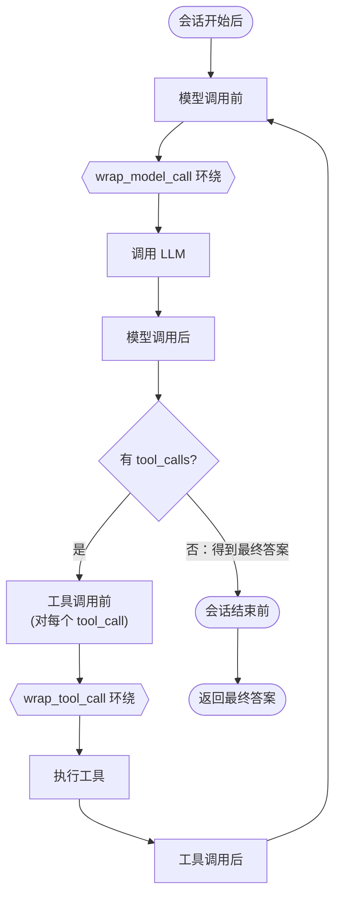

# 详细设计文档——最小可用 Agent 

> 借鉴两点：
>- **LangGraph 对"智能体运行时生命周期"的切分** —— 一次对话拆成 6 个阶段；
> - **LangChain 的"中间件（Middleware）"抽象** —— 用一个抽象基类承载这 6 个生命周期钩子，把运行时的各类关注点（trace / 压缩 / 最大轮次 / 记忆召回）拆成独立中间件，做到职责分离、便于维护。
> 
> 主流程是朴素 ReAct 循环，只在 6 个阶段点触发中间件钩子。本文档只描述设计与接口签名，不含完整实现。

---

## 1. 设计目标与边界

| 维度 | 目标 | 本期边界 |
|---|---|---|
| 核心循环 | 收输入 → 判断（回答 / 调工具）→ 调工具 → 判断（继续 / 返回）| 朴素 ReAct 循环 + 生命周期钩子 |
| 工具 | ≥3 个：calculator / search(mock) / weather / todo | 同步、单次串行 |
| 工具决策 | LLM 基于 Schema 自主决策 | **DeepSeek 原生 function calling** |
| 输出解析 | 提取 思考 / 工具调用 / 最终答案 | 解析 SDK 的 `tool_calls` 与 `content`，原理写进 docstring |
| 运行时职责分离 | 不同关注点解耦、可插拔 | **Middleware 抽象：6 顺序钩子 + 2 环绕钩子** |
| Session | 多窗口独立、可追问、记住状态、最大轮次 | 内存版 Checkpointer，按 `thread_id` 隔离 |
| Context | 合理装配 + 基础压缩 | 中间件做滑窗 + 摘要，**不做**向量检索 |
| 流式输出 | 最终答案逐 token 实时输出 | 同步流式 + `on_token` sink，**不引入 async** |
| 健壮性 | 异常处理 + 工具 trace | 重试 + 错误回灌 + trace 中间件 |
| 测试 | 覆盖以上功能 | 依赖注入 Fake LLM，离线可跑 |

**非目标（本期不做，留二面）**：并行工具调用、跨会话长期记忆/向量库、定时 reminder、持久化数据库。

---

## 2. 设计理念：运行时生命周期 + 中间件

朴素 ReAct 实现会把 trace、上下文压缩、轮次限制、记忆召回等横切关注点全塞进主循环，主循环越来越臃肿、难维护、难测试。

LangChain/LangGraph 的解法是：**把"一次对话"看成一条有固定阶段的流水线，每个阶段开放钩子**，横切关注点以"中间件"的形式挂到对应钩子上。主循环只负责"调模型 / 调工具 / 判断走向"这条主干，其余职责外移到中间件。

本项目采用的生命周期阶段（顺序钩子 + 环绕钩子）：



每个阶段默认挂载的中间件，及其满足的题目要求：

| 生命周期阶段 | 默认中间件 | 解决的题目要求 |
|---|---|---|
| 会话开始后 | `MemoryMiddleware` | 注入"未完成 todo"等提醒（历史召回由 SessionManager 负责）|
| 模型调用前 | `MaxTurnMiddleware` / `ContextMiddleware` | 最大轮次限制 / context 装配与压缩 |
| 模型调用后 | `TraceMiddleware` | 记录思考过程与工具调用决策 |
| 工具调用前 | `TraceMiddleware` | 工具 trace（即将调用：名称+参数）|
| 工具调用后 | `TraceMiddleware` | 工具 trace（结果/异常）|
| 会话结束前 | （SessionManager 落盘，见 §9/§12）| 持久化会话状态（"记住之前的状态"）|

上面 6 个是**顺序型（前/后）钩子**：到达某阶段时按注册顺序逐个执行。但有些关注点需要"**包住一次调用**、可重试、可改写请求与响应"——前/后钩子做不到。为此再加 **2 个环绕型（wrap）钩子**：

| 环绕钩子 | 包住的动作 | 典型用途 |
|---|---|---|
| `wrap_model_call` | 一次 LLM 调用 | 重试 / 超时 / 降级回退 / 改写请求或响应 |
| `wrap_tool_call` | 一次工具执行 | 工具级超时 / 权限校验 / 结果缓存 |

环绕钩子按"**洋葱**"方式嵌套：中间件列表里第一个的 `wrap` 在最外层，依次向内包裹，最内层才是真实调用（`llm.chat` / `registry.execute`）。它与前/后钩子的时序关系是：`before_model` → `wrap_model_call(洋葱)` 包住真实调用 → `after_model`。

> **职责分离的收益 = 项目宪法的开闭原则落点**：新增一类运行时职责 = 新增一个 `Middleware` 子类 + 注册进中间件列表，**不改主循环、不改已有中间件**。
> （注：项目 `CLAUDE.md` 里"新增 LangGraph 节点"的开闭示例，在本设计下应改述为"新增中间件"。）

---

## 3. 目录结构

> 单数命名；`src/` 为库，`cli/` 为客户端；关键参数集中在 `config.py`。

```
src/
  config.py              # 顶层参数 + Settings（model/base_url/max_turn/压缩阈值…）
  message.py             # 消息类型：System/Human/AI/Tool + ToolCall
  state.py               # AgentState（持久会话态）+ RunContext（单次运行上下文）
  llm/
    base.py              # LLMClient Protocol（依赖倒置）
    deepseek_client.py   # DeepSeek(OpenAI 兼容) 实现；docstring 讲 function calling 原理
  tool/
    base.py              # Tool Protocol（name/description/参数模型/run）
    registry.py          # ToolRegistry：注册 / 取 schema / 执行
    calculator.py        # 计算器
    search.py            # 搜索（mock）
    weather.py           # 天气（mock）
    todo.py              # 待办（内存持久，演示"记待办"）
  middleware/
    base.py              # Middleware 抽象基类（6 个生命周期钩子，默认空实现）
    trace.py             # TraceMiddleware：结构化执行日志（顺序钩子）
    max_turn.py          # MaxTurnMiddleware：最大轮次保护（顺序钩子）
    context.py           # ContextMiddleware：context 装配 + 滑窗/摘要压缩（顺序钩子）
    memory.py            # MemoryMiddleware：记忆召回/提醒注入（顺序钩子；持久化在 SessionManager）
    retry.py             # RetryMiddleware：wrap_model_call 重试/降级（环绕钩子）
  session/
    checkpointer.py      # Checkpointer Protocol + InMemoryCheckpointer
    manager.py           # SessionManager：thread_id ↔ State 的取用与隔离
  runtime.py             # AgentRuntime：编排 ReAct 主循环 + 触发 6 阶段钩子
  agent.py               # 顶层装配 + run(thread_id, user_input) 入口
cli/
  main.py                # REPL 客户端，演示窗口1/窗口2 多会话隔离
test/
  ...                    # 见第 11 节
```

---

## 4. 核心类型

### 4.1 消息 `message.py`

借鉴 LangChain：用类型区分角色，便于 context 装配与 trace。

```python
class ToolCall(BaseModel):
    """一次工具调用意图（由 LLM 决策产生）。"""
    id: str                       # SDK 返回的调用 id，回灌结果时要对应
    name: str
    arguments: dict[str, object]  # 已解析参数（来自 schema）

class Message(BaseModel):
    role: Literal["system", "user", "assistant", "tool"]
    content: str

class SystemMessage(Message): ...   # 角色设定 / 提醒注入
class HumanMessage(Message): ...    # 用户输入
class AIMessage(Message):
    """LLM 输出。content=思考/最终答案文本；tool_calls=工具调用意图。"""
    tool_calls: list[ToolCall] = []
class ToolMessage(Message):
    tool_call_id: str               # 对应 ToolCall.id
    is_error: bool = False          # 异常回灌（ReAct 健壮性来源）
```

> 题目"提取思考过程、工具调用或最终答案"——三者由同一条 `AIMessage` 的不同字段承载（`content` vs `tool_calls`）。

### 4.2 状态 `state.py`

区分**持久会话态**与**单次运行上下文**：

```python
class AgentState(BaseModel):
    """按 thread_id 持久化的会话状态（Checkpointer 存的就是它）。"""
    thread_id: str
    messages: list[Message] = []   # 完整对话历史

@dataclass
class RunContext:
    """单次 run() 的运行上下文，传给中间件钩子（瞬态，不持久化）。

    用 dataclass 而非 pydantic: 它会被钩子频繁 mutate, 无需每次校验。
    顺序钩子签名统一为 (ctx) -> None, 通过读写 ctx 完成职责;
    工具阶段的临时数据也挂在 ctx 上。
    """
    state: AgentState
    tools_schema: list[dict] = field(default_factory=list)
    on_token: Callable[[str], None] | None = None  # 流式 sink（CLI 注入；None=不流式）
    step: int = 0                  # 本次 run 的循环步数；最大轮次基准（每次 run 从 0 起）
    stop_reason: str | None = None         # 中间件可设此值提前终止 loop（如超轮次）
    current_tool_call: ToolCall | None = None      # 供 [工具调用前] 读取
    current_tool_result: ToolMessage | None = None # 供 [工具调用后] 读取
```

---

## 5. 中间件 `middleware/`

### 5.1 抽象基类 `middleware/base.py`

```python
# 环绕钩子里 handler 代表"内层（下一个中间件或真实调用）"
ModelHandler = Callable[[RunContext], AIMessage]
ToolHandler = Callable[[RunContext], ToolMessage]

class Middleware:
    """运行时中间件抽象基类：6 个顺序钩子 + 2 个环绕钩子，默认空实现/透传，
    子类只覆写自己关心的阶段（职责分离）。

    顺序钩子统一签名 (ctx: RunContext) -> None: 通过读写 ctx 完成职责;
    设置 ctx.stop_reason 可请求提前结束本次 loop。
    环绕钩子接收 handler（内层调用）, 自行决定调用时机/次数, 返回结果。
    """
    # —— 6 个顺序（前/后）钩子 ——
    def on_session_start(self, ctx: RunContext) -> None: ...   # 会话开始后
    def before_model(self, ctx: RunContext) -> None: ...       # 模型调用前
    def after_model(self, ctx: RunContext) -> None: ...        # 模型调用后
    def before_tool(self, ctx: RunContext) -> None: ...        # 工具调用前
    def after_tool(self, ctx: RunContext) -> None: ...         # 工具调用后
    def before_session_end(self, ctx: RunContext) -> None: ... # 会话结束前

    # —— 2 个环绕（wrap）钩子，默认透传 ——
    def wrap_model_call(self, ctx: RunContext, handler: ModelHandler) -> AIMessage:
        return handler(ctx)        # 环绕一次 LLM 调用
    def wrap_tool_call(self, ctx: RunContext, handler: ToolHandler) -> ToolMessage:
        return handler(ctx)        # 环绕一次工具执行
```

### 5.2 具体中间件（每个一个职责）

```python
class TraceMiddleware(Middleware):
    """结构化执行日志。
    after_model:  记录本轮思考(content)与工具调用决策(tool_calls)。
    before_tool:  记录即将调用的工具名 + 参数。
    after_tool:   记录工具结果 / 异常。
    """

class MaxTurnMiddleware(Middleware):
    """最大轮次保护。
    before_model: 若 ctx.step >= max_turn → 设 ctx.stop_reason='max_turn'，
                  runtime 据此终止 loop, _final_text 返回兜底提示。
    注: 应注册在 ContextMiddleware 之前, 超限时短路、省掉无谓的压缩。
    """
    def __init__(self, max_turn: int): ...

class ContextMiddleware(Middleware):
    """上下文装配与压缩（见第 10 节, 破坏性摘要）。
    before_model: 若历史超阈值, 保留最近 N 条、把更早对话摘要成一条 SystemMessage
                  并原地替换掉早期历史, 装配顺序 [System]+[摘要]+[近期历史]+[当前输入]。
    """
    def __init__(self, llm: LLMClient, max_msg: int, keep_recent: int): ...

class MemoryMiddleware(Middleware):
    """工作记忆 / 提醒的召回与注入（见第 10 节）。
    on_session_start: 把"未完成 todo"等作为 SystemMessage 提醒注入（按需召回）。
    注: 会话历史的持久化(get/put)由 SessionManager 负责, 不在本中间件。
    """
    def __init__(self, todo: TodoStore): ...

class RetryMiddleware(Middleware):
    """LLM / 工具的 infra 重试（环绕钩子）。
    wrap_model_call: handler(ctx) 抛 网络/限流/超时 → 指数退避重试 max_retry 次。
    wrap_tool_call:  handler(ctx) 抛 ToolInfraError（超时/网络）→ 同样退避重试;
                     耗尽则抛出, 由 runtime 兜底成 is_error ToolMessage 回灌。
    （工具的逻辑错误不走这里, 已在 registry.execute 内转成 is_error 回灌。）
    """
    def __init__(self, max_retry: int, backoff: float): ...
    def wrap_model_call(self, ctx, handler): ...   # 退避重试 max_retry 次
    def wrap_tool_call(self, ctx, handler): ...    # 退避重试 max_retry 次
```

> 中间件依赖（llm/checkpointer/...）通过构造注入，满足依赖倒置。**顺序钩子按注册顺序执行；环绕钩子按注册顺序从外向内嵌套**。

---

## 6. 运行时 `runtime.py`

主循环负责主干（调模型 / 调工具 / 判断走向），在 6 个阶段点按序触发已注册中间件的对应钩子。

```python
class AgentRuntime:
    """智能体运行时：编排 ReAct 主循环并触发生命周期钩子。"""
    def __init__(self, llm: LLMClient, registry: ToolRegistry,
                 middlewares: list[Middleware], settings: Settings): ...
    def run(self, ctx: RunContext) -> str: ...
```

`run` 执行语义（伪代码，实现按宪法拆成 ≤50 行小函数：`_fire` / `_model_chain` / `_tool_chain`）：

```
_fire("on_session_start", ctx)                 # 会话开始后
while ctx.stop_reason is None:
    _fire("before_model", ctx)                 # 模型调用前（轮次检查、压缩）
    if ctx.stop_reason: break                  # 中间件请求终止
    ai = _model_chain(ctx)                     # 环绕钩子洋葱包住 llm.chat
    ctx.state.messages.append(ai); ctx.step += 1
    _fire("after_model", ctx)                  # 模型调用后（trace）

    if not ai.tool_calls:                       # 得到最终答案 → 判断:返回
        break
    for call in ai.tool_calls:                  # 判断:调工具
        ctx.current_tool_call = call
        _fire("before_tool", ctx)              # 工具调用前
        try:
            result = _tool_chain(ctx)          # 环绕钩子(含 infra 重试)包住 registry.execute
        except ToolInfraError as e:            # 重试耗尽 → 回灌错误, 不中断 loop
            result = ToolMessage(is_error=True, content=str(e), tool_call_id=call.id)
        ctx.state.messages.append(result); ctx.current_tool_result = result
        _fire("after_tool", ctx)               # 工具调用后

_fire("before_session_end", ctx)               # 会话结束前（清理钩子）
return _final_text(ctx)        # 正常→最后一条 AIMessage.content；异常中止→兜底提示
```

> `_fire(phase, ctx)` 遍历 `self.middlewares` 调用对应**顺序钩子**。新增职责只需把新中间件加入列表，主循环零改动。
> **持久化不在 runtime 内**：`Agent` 在 `runtime.run` 外层用 `try/finally` 调 `SessionManager.save`，保证即使 `RetryMiddleware` 重试耗尽抛异常也能落盘（见 §12.1）。`_final_text` 在被 `max_turn` 等中止（`stop_reason` 非空）时返回兜底提示而非空串。

环绕链的构造（`_tool_chain` 与 `_model_chain` 同构）：

```python
def _model_chain(self, ctx):
    def base(c): return self.llm.chat(c.state.messages, c.tools_schema, c.on_token)  # 最内层:真实调用(透传流式 sink)
    handler = base
    for mw in reversed(self.middlewares):       # 列表首个 → 最外层
        handler = (lambda nxt, m: (lambda c: m.wrap_model_call(c, nxt)))(handler, mw)
    return handler(ctx)
```

> 即：`reversed` 遍历让列表中**第一个中间件包在最外层**，与顺序钩子的"先注册先执行"语义一致。某个 `wrap` 不调用 `handler` 即可短路（如熔断）。

对应题目 Loop 四步：Step1 输入入 `messages`；Step2 `if not ai.tool_calls`；Step3 `registry.execute`；Step4 循环回到 `before_model` 或 `break`。

---

## 7. LLM 客户端 `llm/`

### 7.1 抽象 `llm/base.py`（依赖倒置）

```python
class LLMClient(Protocol):
    """LLM 客户端抽象（依赖倒置）。业务依赖它, 不依赖具体 SDK;
    测试注入 Fake 实现离线跑。

    直接返回 AIMessage（已含 content 思考/答案 与 tool_calls 工具调用意图）,
    不再单列 LLMResponse, 避免与 AIMessage 字段重复。
    on_token 非空时逐 token 回调 content 增量（流式），但仍返回完整 AIMessage。
    """
    def chat(self, messages: list[Message], tools: list[dict] | None,
             on_token: Callable[[str], None] | None = None) -> AIMessage: ...
```

### 7.2 实现 `llm/deepseek_client.py`（function calling 原理写进 docstring）

```python
class DeepSeekClient:
    """DeepSeek（OpenAI 兼容）LLM 客户端。

    为什么用 SDK 的 function calling 而非手写文本解析:
        原理上"工具调用"并不神秘: 服务端把每个工具的 JSON Schema
        （name/description/parameters）拼进 system 区域, 模型据此在输出层
        产生结构化片段（OpenAI 系用特殊 token 标记 function 名与 JSON 参数）,
        解码器收集为 tool_calls。手写方案就是让模型按 Thought/Action/
        Action Input 文本输出再正则/JSON 解析——本质相同, 但文本格式脆弱
        （偶发不守格式、参数 JSON 截断）。
        本项目用 SDK 接管"schema 注入 + 结构化解码"以求稳定; 仍自行完成
        SDK 结构 → 内部 ToolCall/AIMessage 的映射, 及 思考/动作/答案 的区分。
    """
    def __init__(self, api_key: str, base_url: str, model: str): ...
    def chat(self, messages, tools, on_token=None) -> AIMessage: ...
```

> 解析职责仍在我们手里：`message.content` → 思考/答案；`message.tool_calls[].function.arguments`（字符串 JSON）→ `json.loads` 成 `ToolCall.arguments`，并处理参数非法 JSON 的异常。

### 7.3 流式输出（同步，不引入 asyncio）

**流式 ≠ 异步**：`stream=True` 返回阻塞迭代器，`for chunk in stream` 增量读即可；异步解决的是并发，本项目（单用户、窗口串行、CLI）无并发需求 → 全程同步，**中间件不改成 `async`**（避免函数染色）。接入方式不改动循环与中间件：

1. **`chat` 加可选 `on_token` sink**（见 §7.1）：客户端内部 `for chunk in stream` 累积出完整 `AIMessage`（content 拼接、`tool_calls` 的 arguments 分片也要拼接），同时把每个 content 增量喂给 `on_token`；**返回值仍是完整 `AIMessage`**，所以主循环照常 `if not ai.tool_calls` 判断、`after_model` 拿到的也是完整消息。
2. **sink 来源**：挂在 `RunContext.on_token`（由 CLI 注入，默认 `None` = 不流式）；`_model_chain` 最内层真实调用把它透传给 `chat`。是否开启由 `config.STREAM` 控制。
3. **工具轮天然不乱喷**：调工具那轮 `delta.content` 基本为空、来的是 `tool_calls` 分片，不会误流给用户；只有最终答案轮有 content 流出。
4. **与重试的边界**：流式发生在最内层 `chat`，`wrap_model_call` 仍可包裹。约定——**只对"尚未流出任何 token 的连接期失败"重试**（连接错误通常在首 chunk 之前）；一旦开始流出 token 即视为已提交、不再重试，避免用户看到重复片段。

---

## 8. 工具 `tool/`

### 8.1 抽象 `tool/base.py`

借鉴 LangChain：每个工具用 Pydantic 参数模型自动生成 JSON Schema，**注册即可被 LLM 决策调用**。

```python
class ToolInfraError(Exception):
    """工具的基础设施类错误（超时/网络等, 仅真实外部 API 工具才有）。
    供 wrap_tool_call 识别并重试; 与"工具逻辑错误"区分开。"""

class Tool(Protocol):
    name: str
    description: str
    args_model: type[BaseModel]          # 参数 Schema 来源
    def run(self, args: BaseModel) -> str: ...   # args 为 args_model 的已校验实例
```

### 8.2 注册表 `tool/registry.py`（开闭原则落点）

```python
class ToolRegistry:
    def register(self, tool: Tool) -> None: ...
    def to_schema(self) -> list[dict]: ...               # 喂给 llm.chat 的 tools 参数
    def execute(self, name: str, raw_args: dict) -> ToolMessage:
        """按 args_model 校验 raw_args → 调 run。
        逻辑错误（未知工具/参数非法/除零等）→ 返回 is_error ToolMessage（回灌, 不重试）;
        infra 错误（超时/网络）→ 抛 ToolInfraError, 交给 wrap_tool_call 重试。
        """
```

> 新增工具 = 实现 `Tool` + `register()`，**不动 runtime、不动中间件**。

### 8.3 具体工具

| 工具 | 参数 Schema | 行为 |
|---|---|---|
| `calculator` | `expression: str` | 白名单 AST 安全求值（禁任意 `eval`）；除零等→错误文本 |
| `search` | `query: str` | **mock**：模板化结果，便于离线测试 |
| `weather` | `city: str` | **mock**：模板天气 |
| `todo` | `action: add/list/done`, `content: str?` | 内存持久（`TodoStore`），演示"记待办"，是本期简单记忆 |

---

## 9. Session 管理 `session/`

- **一个 `thread_id` = 一个会话窗口**；`AgentState` 按 `thread_id` 存于 `Checkpointer`。
- 用户 A 的窗口1 / 窗口2 = 两个 `thread_id` → 两份独立 State → **天然互不影响**。

```python
class Checkpointer(Protocol):
    def get(self, thread_id: str) -> AgentState | None: ...
    def put(self, thread_id: str, state: AgentState) -> None: ...

class InMemoryCheckpointer: ...   # dict[str, AgentState]

class SessionManager:
    """会话状态持久化的唯一负责方（get/put）。"""
    def __init__(self, checkpointer: Checkpointer): ...
    def get_or_create(self, thread_id: str) -> AgentState: ...
    def save(self, state: AgentState) -> None: ...        # = checkpointer.put
    def list_threads(self) -> list[str]: ...
```

**追问**：新 `HumanMessage` 追加到该 thread 历史后再 `run`。
- 纯对话追问：`after_model` 拿到无 `tool_calls` 的 `AIMessage`，直接 `break` 返回（历史里有上文，指代可解析）。
- 带工具追问：同一路径，只是 LLM 这次决定调工具，走完整循环。两者无需特判。

**最大轮次**：由 `MaxTurnMiddleware` 在 `before_model` 检查 `ctx.step`（单次 run 计数，每次 run 重置），超限设 `stop_reason` 终止，`_final_text` 返回兜底提示。

---

## 10. Context 与 Memory（对应 README 要求）

### 10.1 哪些信息塞进 context、如何放置

`ContextMiddleware.before_model` 按固定顺序装配发给 LLM 的 `messages`：

```
[1] SystemMessage    角色设定 + 工具使用规范（工具明细走 tools 参数，不占正文）
[2] (压缩摘要)        历史过长时, 早期对话被摘要成一条 SystemMessage
[3] 历史 messages     Human/AI/Tool 交替（保留最近 KEEP_RECENT 条）
[4] 当前 HumanMessage 本轮用户输入
```

取舍：用户输入、工具结果、AI 的工具调用意图 → 必进；AI 纯思考文本 → 进，但压缩时优先被摘要；工具 Schema → 走 `tools` 参数不占正文。

### 10.2 Memory 的"召回时机"与"放置方式"

> 本期 memory = **短期记忆（会话状态）**，即 Checkpointer 里的 `AgentState`。

- **召回时机（when）**：`agent.run` 入口由 `SessionManager.get_or_create(thread_id)` **按 thread_id 取回历史**；`MemoryMiddleware.on_session_start` 额外把"未完成 todo"等作为提醒注入。这正是"记住状态/支持追问"的实现点。
- **放置方式（where）**：召回历史按 10.1 顺序装配（摘要在前、近期明细在后、当前输入最后），非无差别拼接。
- **落地时机（persist）**：`Agent` 在 `runtime.run` 外层用 `try/finally` 调 `SessionManager.save(state)` 写回 Checkpointer，保证下次召回是最新、且异常也不丢。
- **`todo` = 按需召回的简单持久记忆**：不自动塞 context，由 LLM 需要时调用 `todo(action="list")` 召回（省 token；长期记忆/向量检索是二面进阶方向）。

### 10.3 基础压缩（破坏性摘要）

`ContextMiddleware`：消息数 > `MAX_MSG` 时保留最近 `KEEP_RECENT` 条，更早对话用 LLM 摘要成一条 `SystemMessage` 置顶，并**原地替换掉早期历史**（破坏性）。
- 取舍：省 token 与存储；代价是丢失早期逐字内容（"记住状态"退化为"记住摘要"）。MVP 接受此取舍，复杂/可逆压缩本期不做。
- 注：摘要自身的那次 `llm.chat` 不经 `wrap_model_call`（不重试）；压缩后的历史即 `SessionManager` 持久化的内容。

---

## 11. 异常处理与 Trace

| 层 | 异常 | 处理 |
|---|---|---|
| LLM 调用 | 网络/超时/限流 | `RetryMiddleware.wrap_model_call` 指数退避重试 N 次；仍失败→runtime 兜底友好错误，**保留会话状态** |
| LLM 输出 | `content` 与 `tool_calls` 同时为空 | 视为异常，重试一次 |
| 参数解析 | `arguments` 非法 JSON / 不匹配 schema | 包成 `ToolMessage(is_error=True)` 回灌，让 LLM 自纠 |
| 工具执行(逻辑) | 除零/参数非法/未知工具 | `registry.execute` 捕获→`ToolMessage(is_error=True)` 回灌，**不重试、不中断** |
| 工具执行(infra) | 超时/网络（真实 API 工具）| 抛 `ToolInfraError`→`wrap_tool_call` 重试；耗尽→runtime 兜底成 `is_error` 回灌 |
| 轮次 | 超 `max_turn` | `MaxTurnMiddleware` 终止 + `_final_text` 兜底提示 |

> 核心思想：**能回灌给 LLM 的错误就回灌**（ReAct 自愈），只有 LLM 层不可恢复才向用户报错。

Trace 由 `TraceMiddleware` 在 `after_model / before_tool / after_tool` 输出结构化日志（默认 stdout，可配置按 thread 落文件），形如：
`[trace thread=w1 step=2] tool_call calculator args={'expression':'12*8'} -> '96'`。

---

## 12. 顶层 Agent 与 CLI

### 12.1 `agent.py`

```python
class Agent:
    """装配运行时并暴露简单入口。依赖全部注入（DI）。"""
    def __init__(self, runtime: AgentRuntime, session: SessionManager,
                 registry: ToolRegistry, settings: Settings): ...
    def run(self, thread_id: str, user_input: str) -> str:
        """单次对话入口（持久化在此用 try/finally 保证）:
            state = session.get_or_create(thread_id)
            state.messages.append(HumanMessage(user_input))      # 追加输入
            ctx = RunContext(state=state, tools_schema=registry.to_schema())
            try:     return runtime.run(ctx)
            finally: session.save(state)                          # 落盘, 异常也不丢
        """
```

### 12.2 `cli/main.py`

REPL，演示题目场景：`:new` 开新窗口、`:switch <id>`、`:list`、`:trace` 开关日志、`:stream` 开关流式；
默认注入 `on_token=print` 实现最终答案 token 级实时输出；
脚本化演示：窗口1「查北京天气并记待办」、窗口2「写周报记待办」，来回切换证明互不影响。

---

## 13. 测试方案（TDD，先 Red 后 Green）

> 全程注入 **FakeLLMClient**（预设返回 `tool_calls` 或最终答案），离线可复现；另留一个 `@slow` 真实 DeepSeek 冒烟测试。

| 模块 | 用例（"在什么情况下→期望什么"）|
|---|---|
| runtime | 主循环按 模型→工具→模型→结束 推进；无 tool_calls 即结束；钩子在 6 阶段按序被调用 |
| middleware | `MaxTurnMiddleware` 超限设 stop_reason 终止；`TraceMiddleware` 记录到对应阶段；顺序钩子按注册顺序执行 |
| 环绕钩子 | `RetryMiddleware.wrap_model_call` 首次抛异常→重试后成功；多个 wrap 中间件按洋葱嵌套（首个最外层、外层先进内层先出）；wrap 不调 handler 可短路 |
| 流式 | `on_token` 按 content 增量被调用且能拼回完整 `AIMessage`；工具调用轮不触发 `on_token`；`on_token=None` 时行为与非流式一致 |
| calculator | `12*8→96`；除零→错误文本；拒绝危险表达式 |
| search/weather | mock 返回稳定结构 |
| todo | add→list 可见；done 改状态 |
| registry | 注册后 `to_schema` 含该工具；`execute` 未知工具/坏参数→`is_error` 包装 |
| 解析 | Fake 返回带 tool_calls→正确解析出 `ToolCall`；arguments 坏 JSON→错误回灌 |
| e2e | "算 12*8"：模型→工具→模型→结束，最终答案含 96 |
| session | 两 thread_id 历史互不可见；同一 thread 追问能引用上文 |
| context | 超阈值触发压缩；保留最近 N；摘要被置顶注入 |
| 异常 | 工具逻辑错→`is_error` 回灌且 loop 继续；工具 infra 错→`wrap_tool_call` 重试、耗尽→兜底 `is_error`；`max_turn` 中止→`_final_text` 兜底非空 |

目标覆盖率 ≥ 80%（宪法要求）。

---

## 14. 开放问题：离"可用 Agent"还差哪些模块

1. **进阶 context / 记忆**：分层记忆（工作/情景/语义）；跨会话长期记忆 + 向量检索召回（按相关度而非时间）；按 token 预算压缩。
2. **Reminder / 主动性**：定时/事件触发提醒；把"未完成 todo"作为系统提醒持续注入；多轮间自我设定提醒。
3. **更快响应**：流式输出已实现（见 §7.3）；剩余方向——并行工具调用；prompt 缓存 / KV 复用；分级模型（小模型路由 + 大模型生成）。
4. **运行时形态的取舍**：本设计的"主循环 + 生命周期中间件"在简单/确定性流程下清晰可维护；面对开放式动态任务规划时，固定阶段会受限，需要引入"动态 planner"让模型自主决定下一步（这也是状态机/图式的优缺点：可控可观测 vs 灵活性不足）。
5. 其他：工具沙箱与权限、trace 持久化与可视化、评测集与回归、并发与限流、密钥与安全。

---

## 15. 实现里程碑（下一轮按此分阶段 TDD）

1. **走通骨架**：`message`/`state`/`runtime` + `Middleware` 基类 + Fake LLM + `calculator` + 一次 loop（含测试）。
2. **真实 LLM + 流式**：`DeepSeekClient`（含 `on_token` 同步流式），e2e 冒烟。
3. **补齐工具**：search/weather/todo + registry schema 测试。
4. **中间件**：trace / max_turn / context / memory（顺序）+ retry（环绕），逐个 TDD。
5. **Session**：checkpointer + manager + 追问/隔离测试。
6. **CLI + README + Prompt 记录**。
