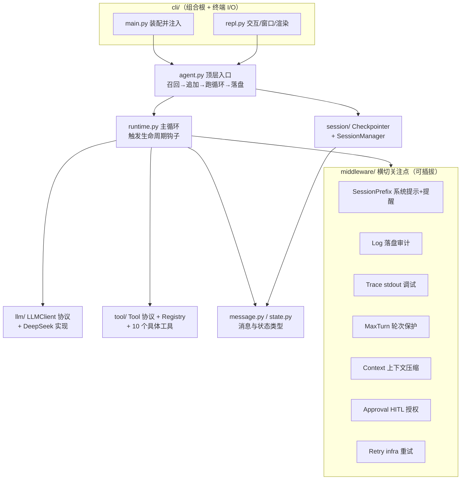

# 01 · 心智模型与总览

> 读完本篇，你应当能用一句话向别人解释「这个 Agent 是怎么转起来的」，并在脑中画出七大模块的协作图。

## 1.1 它是什么

一个 **ReAct Agent**：让大模型在「**推理（Reason）→ 行动（Act：调工具）→ 观察（观察工具结果）→ 再推理**」的循环里解决问题，直到它认为不需要再调工具、直接给出最终答案。

落到代码，这个循环就是一个朴素的 `while`（[runtime.py:34](../../src/runtime.py#L34)）：

```
模型决策 → 有 tool_calls? → 执行工具、把结果回灌历史 → 再问模型 → … → 无 tool_calls → 结束
```

## 1.2 它「不是」什么——一个关键定位

它是 **Agent 本体，不是一个「造 Agent 的框架」**。这句话决定了大量取舍：

- **没有 graph / node / edge 抽象**。LangGraph 那套「把流程画成状态图」的能力是为「让你搭任意流程」服务的；而我们只需要一条确定的 ReAct 主循环，引入图抽象只会增加理解成本。
- 我们**借鉴**两个成熟框架的「思想」，而非依赖它们的「代码」（这是题目约束，也是刻意的学习目标）：
  - **LangGraph → 运行时生命周期**：把一次执行切成若干「阶段」，在阶段边界开放钩子。
  - **LangChain → 中间件抽象**：把横切关注点（日志、重试、压缩……）做成可插拔的中间件，而不是塞进主流程。

> 取舍小结：当流程是**简单、确定**的，「主循环 + 生命周期钩子」比「状态图」更清晰可维护；代价是面对**开放式动态任务规划**时不如图灵活（见 [DDD §14](../DDD.md) 开放问题）。我们刻意选了前者。

## 1.3 七大模块职责地图



一句话记住每个模块：

| 模块 | 一句话职责 |
|---|---|
| `message.py` / `state.py` | 数据类型：消息子类、持久态 `AgentState`、瞬态 `RunContext` |
| `runtime.py` | ReAct 主循环；只管主干，按阶段触发钩子 |
| `middleware/` | 横切关注点的家；每个关注点一个中间件，可插拔 |
| `llm/` | LLM 抽象（协议）+ DeepSeek 实现（function calling、流式、推理） |
| `tool/` | 工具抽象（协议）+ 注册表 + 具体工具；开闭扩展点 |
| `session/` | 按 `thread_id` 隔离的会话状态存取与持久化 |
| `agent.py` | 顶层入口，把上面这些装配起来，暴露 `run()` |
| `cli/` | 组合根（实例化具体依赖并注入）+ 唯一做终端 I/O 的地方 |

## 1.4 整体设计立场（贯穿全项目的几条「总纲」）

这些立场会在后续每一篇反复出现，先在此立靶：

1. **依赖倒置贯穿到底（DI）**：业务只依赖协议（`LLMClient` / `Tool` / `Checkpointer` / `confirm` 回调），具体实现一律由**组合根（`cli/main.py`）实例化后注入**。`src/` 里不出现「自己 new 一个 OpenAI 客户端」这种事。好处：换实现不改业务、离线测试注入 fake 即可（见 [07 设计原则](07-design-principle.md)）。

2. **横切关注点外移成中间件**：主循环只写主干逻辑；日志、重试、压缩、授权等全部是中间件。新增一个关注点 = 写一个 `Middleware` 子类并加进列表，**不改主循环**（开闭原则）。

3. **同步，而非 async**：流式输出解决的是「实时看到字」，不是「并发」。本项目单用户、窗口串行，没有并发需求，于是**全程同步**——避免 `async` 函数染色污染整个调用链（见 [DDD §7.3](../DDD.md)）。

4. **错误分两类，区别对待**：
   - **逻辑错误**（除零、坏参数、未知工具）→ 包成 `is_error` 的 `ToolMessage` 回灌历史，让模型自己看到错误、自我纠正，循环继续。
   - **基础设施错误**（网络/超时/限流）→ 抛 `*InfraError`，交给 `RetryMiddleware` 退避重试。
   这条分类法贯穿 `tool/registry`、`retry`、`llm`（见 [05](05-tool-and-llm.md) / [06](06-cross-cutting.md)）。

5. **参数集中、单数命名**：可调参数集中在 `config.py`（库）/ `cli/config.py`（客户端），不硬编码进函数；文件/目录用单数名。降低「找参数」与「猜命名」的认知负担。

## 1.5 从这里去哪

- 想立刻看清「东西是怎么串起来跑的」→ [02 一次请求的旅程](02-request-journey.md)。
- 想深入核心机制 → [03 运行时与中间件](03-runtime-and-middleware.md)。
- 想动手扩展 → [08 扩展实践指南](08-extension-guide.md)。
