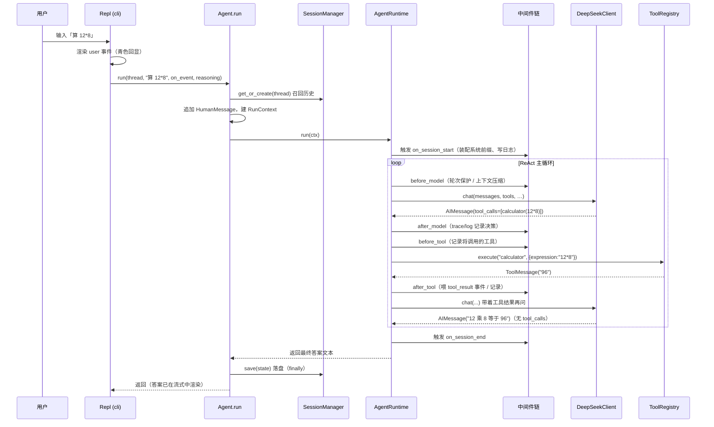

# 02 · 一次请求的旅程

> 本篇用一个最小例子——用户输入 **「算 12*8」**——带你从敲下回车一路走到屏幕上出现「96」。读完你会对「谁调用谁、数据怎么流」有完整直觉。后续各篇都是对这条主线上某一段的放大。

## 2.1 全景时序图



## 2.2 分步走读

### ① CLI 层：把输入变成一次 `run` 调用

用户输入进入 `Repl._say`（[cli/repl.py](../../cli/repl.py)）。它做三件事：先把用户输入作为 `user` 通道事件回显，再决定是否流式，最后调用 `agent.run`：

```python
self._render(Event(kind="user", text=text))          # 青色回显
on_event = self._render if self._toggles.stream_on else None
answer = self._agent.run(self._thread, text, on_event=on_event, reasoning=self._toggles.think_on)
```

> 关注点：CLI 是**唯一**做终端 I/O 的地方。它把「怎么显示」收在自己手里，通过 `on_event` 把一个**结构化展示 sink** 注入下去——`src/` 完全不知道终端的存在（见 [06 横切](06-cross-cutting.md)）。

### ② Agent 层：召回 → 追加 → 跑循环 → 落盘

`Agent.run`（[agent.py:23](../../src/agent.py#L23)）是顶层入口，逻辑只有四步，且用 `try/finally` 保证**无论正常还是异常都落盘**：

```python
state = self._session.get_or_create(thread_id)        # 召回该窗口历史
state.messages.append(HumanMessage(content=user_input))
ctx = RunContext(state=state, tools_schema=…, on_token=…, on_event=…, reasoning=…)
try:
    return self._runtime.run(ctx)
finally:
    self._session.save(state)                          # 异常也不丢用户输入
```

> 关注点：这里出现了两种状态——持久的 `AgentState`（属于某个 `thread_id`）和瞬态的 `RunContext`（只活在这一次 `run`）。为什么要分两个？见 [04 数据模型](04-data-model-and-session.md)。

### ③ Runtime 层：ReAct 主循环

`AgentRuntime.run`（[runtime.py:31](../../src/runtime.py#L31)）是心脏。它先触发 `on_session_start`，然后进入 `while ctx.stop_reason is None`：

```python
self._fire("on_session_start", ctx)                    # 中间件装配系统前缀、写 session_start
while ctx.stop_reason is None:
    self._fire("before_model", ctx)                    # 轮次保护 / 上下文压缩
    if ctx.stop_reason: break
    ai = self._model_chain(ctx)                        # 调模型（被环绕钩子洋葱包住）
    ctx.state.messages.append(ai); ctx.step += 1
    self._fire("after_model", ctx)                     # trace/log 记录决策
    if not ai.tool_calls: break                        # 无工具调用 → 给出最终答案，结束
    self._run_tools(ctx, ai)                           # 执行工具、回灌结果
self._fire("on_session_end", ctx)
return self._final_text(ctx)
```

第一圈，模型返回的 `AIMessage` 带着 `tool_calls=[calculator(expression="12*8")]`，于是进入工具执行。

### ④ 工具执行：校验 → 运行 → 回灌

`_run_tools`（[runtime.py:48](../../src/runtime.py#L48)）对每个 tool_call 串行执行；真正的执行由 `ToolRegistry.execute`（[registry.py:28](../../src/tool/registry.py#L28)）完成：它按工具的 Pydantic 参数模型校验入参，调用 `run`，把返回文本包成 `ToolMessage` 追加回历史。

计算器（[calculator.py](../../src/tool/calculator.py)）用**白名单 AST 求值**算出 `12*8 = 96`（不是 `eval`，拒绝任意代码）。结果 `ToolMessage(content="96")` 被回灌进 `messages`，并作为 `tool_result` 事件喂给 CLI 渲染。

> 关注点：如果计算器抛了异常（比如除零），`execute` 会把它包成 `is_error` 的 `ToolMessage` 而非崩溃——错误回灌给模型，让它自己纠正。这就是 [01 §1.4](01-mental-model.md) 说的「逻辑错误回灌」。

### ⑤ 第二圈与收尾

带着工具结果，主循环再问一次模型。这次模型不再需要工具，直接返回 `AIMessage(content="12 乘 8 等于 96")`、`tool_calls` 为空 → `break`。

`_final_text`（[runtime.py](../../src/runtime.py)）取最后一条 `AIMessage` 的 `content` 作为返回值；若是被中间件中止（如超轮次，`stop_reason` 非空），则返回兜底提示而非空串。最后 `Agent.run` 的 `finally` 把整个 `state` 落盘。

## 2.3 这趟旅程里埋了哪些设计点

| 你看到的现象 | 背后的设计 | 详见 |
|---|---|---|
| `on_session_start` 一触发，历史最前面凭空多出系统提示 | `SessionPrefixMiddleware` 幂等装配「钉住前缀」 | [03](03-runtime-and-middleware.md) / [06](06-cross-cutting.md) |
| 模型调用被「包了好几层」才真正发出 | `wrap_model_call` 环绕钩子的洋葱嵌套（重试就藏在这层） | [03](03-runtime-and-middleware.md) |
| 异常了，下次进来历史还在 | `try/finally` 落盘 + `SessionManager` 持久化 | [04](04-data-model-and-session.md) |
| 工具出错不崩、循环继续 | 逻辑错误回灌 `is_error` | [05](05-tool-and-llm.md) |
| 答案是一个字一个字蹦出来的 | 同步流式：`on_token` 增量回调 + runtime 桥接成 `answer` 事件 | [05](05-tool-and-llm.md) / [06](06-cross-cutting.md) |

下一篇我们放大整条主线的发动机：[运行时与中间件](03-runtime-and-middleware.md)。
