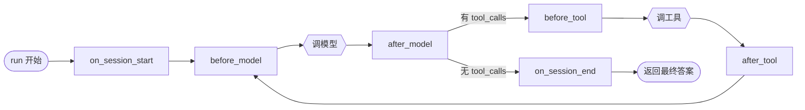
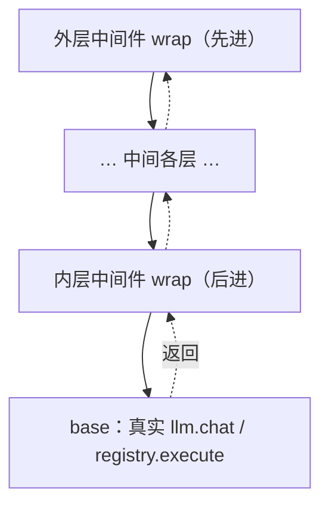

# 03 · 运行时与中间件

> 这是全项目的发动机。读完本篇，你会理解：主循环为什么能保持「干净」，横切关注点为什么不进主循环，以及那两类钩子（顺序 / 环绕）各自解决什么问题。

## 3.1 一个原则：主循环只写主干

`AgentRuntime`（[runtime.py](../../src/runtime.py)）的主循环只关心三件事：**调模型、调工具、判断走向**。它**刻意不知道**日志、重试、压缩、授权是什么——这些是「横切关注点」，被外移到中间件。

这样做的收益：

- 主循环短到一眼能读完（[runtime.py:31-44](../../src/runtime.py#L31)），新人能快速建立主干心智。
- 加一个新关注点（比如「限流」「指标上报」）= 写一个中间件 + 加进列表，**主循环一行不改**（开闭原则）。
- 每个关注点单独成文件、单独可测（注入到一个空 runtime 里跑）。

## 3.2 生命周期：6 个顺序钩子

把「一次执行」切成阶段，在阶段边界开放钩子——这是借鉴自 LangGraph 的思路。`Middleware` 基类（[middleware/base.py](../../src/middleware/base.py)）定义了 6 个**顺序钩子**，默认空实现，子类只覆写自己关心的：



顺序钩子签名统一为 `(ctx: RunContext) -> None`：**通过读写 `ctx` 完成职责**。例如：

- `SessionPrefixMiddleware.on_session_start` 往 `ctx.state.messages` 最前面插系统提示；
- `MaxTurnMiddleware.before_model` 发现 `ctx.step >= max_turn` 就设 `ctx.stop_reason`，主循环据此终止；
- `TraceMiddleware.after_model` 把这一步的模型决策打到 stdout。

触发逻辑就是按注册顺序遍历调用（[runtime.py `_fire`](../../src/runtime.py#L60)）：

```python
def _fire(self, phase: str, ctx: RunContext) -> None:
    for mw in self._middlewares:
        getattr(mw, phase)(ctx)        # 同一阶段，按列表顺序依次执行
```

## 3.3 环绕钩子：把真实调用「包起来」的洋葱

有些关注点光靠「前/后」钩子做不到——**重试**需要「失败了重新调一次」，这要求能控制「真实调用」的**调用时机与次数**。于是有了 2 个**环绕钩子**：`wrap_model_call` 与 `wrap_tool_call`。它们接收一个 `handler`（代表「内层的下一个中间件，或真实调用」），自行决定何时/是否/调几次：

```python
def wrap_model_call(self, ctx, handler):
    return handler(ctx)                # 默认透传；RetryMiddleware 在这里加重试循环
```

多个环绕中间件按**洋葱**嵌套。`_model_chain`（[runtime.py:68](../../src/runtime.py#L68)）从列表**逆序**包装，使得**列表里第一个中间件在最外层**（与顺序钩子「先注册先执行」语义一致）：

```python
handler = base                         # 最内层：真实 llm.chat
for mw in reversed(self._middlewares): # 逆序包，于是首个在最外
    handler = lambda c, mw=mw, nxt=handler: mw.wrap_model_call(c, nxt)
return handler(ctx)
```



> 记忆口诀：**外层先进、内层先出**；列表第一个最外层。重试若放最外层，它能把「内层任何一层的 infra 失败」整体重来。

## 3.4 中间件列表与顺序——以及为什么是这个顺序

组合根 [cli/main.py](../../cli/main.py) 按固定顺序装配中间件。顺序**不是随意**的，每一步都有理由：

```
SessionPrefix → Log → Trace → MaxTurn → Context → Approval → Retry
```

| 顺序 | 中间件 | 主要钩子 | 为什么在这个位置 |
|---|---|---|---|
| 1 | **SessionPrefix** | `on_session_start` | 前缀要最先装配好，后续阶段（压缩、模型调用）才看得到完整的系统提示 |
| 2 | **Log** | 顺序钩子 | 审计日志，常开；早注册以便记录到尽量靠前的事件 |
| 3 | **Trace** | 顺序钩子 | 调试日志，stdout、可开关 |
| 4 | **MaxTurn** | `before_model` | **必须在 Context 之前**：超轮次时直接短路终止，省掉一次无谓的上下文压缩（[plan/01plan.md](../plan/01plan.md) P6 完成标准） |
| 5 | **Context** | `before_model` | 在真正调模型前把过长历史压缩好 |
| 6 | **Approval** | `wrap_tool_call` | 环绕工具：**先问授权**，被拒就根本不进真实执行 |
| 7 | **Retry** | `wrap_model_call` / `wrap_tool_call` | 环绕：放在 Approval **内层**——先决定「要不要做」，再谈「做失败了重试」 |

> 顺序钩子（1–5）与环绕钩子（6–7）混在同一个列表里，互不干扰：`_fire` 只遍历顺序钩子，`_model_chain`/`_tool_chain` 只组装环绕钩子。一个中间件可以同时实现两类钩子。

## 3.5 终止与兜底

主循环的退出条件有两个：

1. **模型不再要工具**（`ai.tool_calls` 为空）→ 正常结束，返回最后一条 `AIMessage.content`。
2. **某个中间件请求终止**（设了 `ctx.stop_reason`，如 `MaxTurn`）→ `_final_text` 返回**兜底提示**而非空串（[runtime.py `FALLBACK_TEXT`](../../src/runtime.py#L17)），避免用户拿到空白回复。

工具阶段还有一层兜底：若工具抛了 `ToolInfraError` 且重试耗尽，`_run_tools` 把它接住、包成 `is_error` 的 `ToolMessage` 回灌（[runtime.py:48](../../src/runtime.py#L48)），**循环继续**而不是整体崩溃。

## 3.6 小结：两类钩子的分工

| | 顺序钩子（6 个） | 环绕钩子（2 个） |
|---|---|---|
| 签名 | `(ctx) -> None` | `(ctx, handler) -> 结果` |
| 能力 | 读写 `ctx`（注入提示、设 stop_reason、记日志） | 控制真实调用的时机/次数（重试、短路、授权拦截） |
| 典型用户 | SessionPrefix / Log / Trace / MaxTurn / Context | Approval / Retry |
| 组合方式 | 按列表顺序依次执行 | 洋葱嵌套，列表首个最外层 |

具体每个中间件「做了什么、为什么这么做」，见 [06 横切关注点](06-cross-cutting.md)。下一篇先补上它们读写的那个 `ctx` 到底是什么：[数据模型与会话](04-data-model-and-session.md)。
