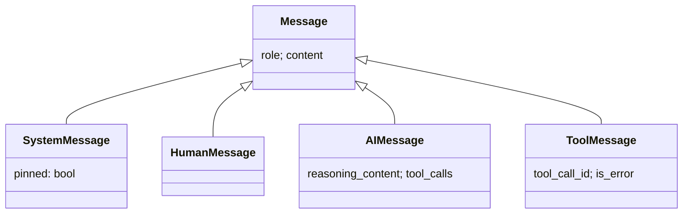

# 04 · 数据模型与会话

> 中间件和主循环整天在读写一个 `ctx`，工具结果在 `messages` 里进进出出。本篇讲清楚这些数据**长什么样、为什么这么分、怎么在多窗口间隔离与持久化**。

## 4.1 消息：用 role 区分角色的一棵小继承树

[message.py](../../src/message.py) 定义了对话的基本单位。基类 `Message` 只有 `role` + `content`，四个子类各司其职：



| 子类 | 承载什么 | 关键字段 |
|---|---|---|
| `SystemMessage` | 角色设定 / 提醒注入 | `pinned`——是否「钉住前缀」（见 §4.3） |
| `HumanMessage` | 用户输入 | — |
| `AIMessage` | LLM 输出 | `content`=最终答案、`reasoning_content`=思考块、`tool_calls`=工具调用意图 |
| `ToolMessage` | 工具执行结果回灌 | `tool_call_id` 对齐发起的调用、`is_error` 标记异常 |

> 一个设计要点：**「思考过程 / 工具调用 / 最终答案」三者由同一条 `AIMessage` 的不同字段承载**，而不是三种消息类型。`reasoning_content` 与 `content` 分流（思考 vs 答案），`tool_calls` 非空即代表「这一轮要行动」。这直接对应题目要求的「提取思考、工具调用或最终答案」。
>
> 还有个易踩的坑写进了类型注释：带 `tool_calls` 的那一轮，`reasoning_content` 在推理模式下**必须回传**给端点，否则会被判 400（见 [05](05-tool-and-llm.md) 与 [DDD §17](../ddd/02ddd.md)）。

## 4.2 双态：AgentState（持久） vs RunContext（瞬态）

这是新人最容易混淆、却最重要的一对概念。[state.py](../../src/state.py) 里有两个状态类，**职责完全不同**：

| | `AgentState` | `RunContext` |
|---|---|---|
| 生命周期 | 跨多次 `run`，按 `thread_id` **持久** | 只活在**一次** `run()` |
| 存什么 | `thread_id` / `created_at` / `messages`（对话历史） | 指向 `state` + 本次运行的瞬态：`step`、`stop_reason`、当前工具调用/结果、`on_token`/`on_event`/`reasoning` 等 sink 与开关 |
| 谁持久化 | Checkpointer 存的就是它 | **从不持久化**——run 结束即丢 |
| 用什么实现 | `pydantic.BaseModel`（需校验、可序列化） | `dataclass`（会被钩子频繁 mutate，无需每次校验） |

为什么要分两个？因为「会话记忆」和「单次运行的临时账本」是两种东西：

- `AgentState.messages` 是要**记住、要存盘**的对话；
- `step`（第几轮）、`stop_reason`（要不要中止）、`current_tool_result`（当前工具结果）、`on_event`（往哪渲染）这些只对**这一次** run 有意义，存盘毫无意义。

把瞬态塞进持久态会污染存储、还得反复校验；把它们独立成 `RunContext`，让钩子可以放心地往上面挂临时数据（[01 §1.4](01-mental-model.md) 提到「工具阶段的临时数据挂在 ctx 上」）。

> **dataclass vs pydantic 的取舍**：`RunContext` 用 dataclass，是因为它每一步都被 mutate（`step += 1`、设 `stop_reason`、换 `current_tool_call`），用 pydantic 的 `validate_assignment` 会带来无谓的校验开销；而 `AgentState` 要存盘、要保证结构合法，用 pydantic 合适。

## 4.3 钉住前缀（pinned）：一个小标记解决三个问题

`SystemMessage.pinned` 是个布尔标记，但它串起了好几处协作：会话最前面那段「系统提示 + 环境 + todo 提醒」被标成 `pinned=True`。这一个标记同时满足：

1. **幂等重注入**：每次 `on_session_start`，`SessionPrefixMiddleware` 先删掉旧的钉住前缀再重装一遍（[prefix.py `_strip_prefix`](../../src/middleware/prefix.py#L77)），于是多轮追问不会累积出一堆系统提示。
2. **不被压缩**：`ContextMiddleware` 压缩历史时，把钉住前缀整段跳过、不参与摘要（[context.py `_split_pinned`](../../src/middleware/context.py#L40)）——系统提示不该被「摘要」掉。
3. **始终置顶**：前缀永远在 `messages` 最前，模型每轮都先看到角色设定。

> 这是「用最小的数据标记表达跨模块约定」的范例：不引入新类型、不加表，一个 `bool` 就让 prefix 与 context 两个中间件协同。

## 4.4 会话：隔离与持久化

「多窗口互不干扰」「关掉再开还记得」这两个需求，落在 `session/` 两个文件上。

### Checkpointer：存取抽象（依赖倒置）

[checkpointer.py](../../src/session/checkpointer.py) 先定义协议 `Checkpointer`（`get`/`put`/`list_threads`），再给一个进程内实现 `InMemoryCheckpointer`。业务依赖**协议**，不依赖具体存储——将来换文件/DB 只需实现同一协议并注入（见 [08 扩展](08-extension-guide.md)）。

```python
class Checkpointer(Protocol):
    def get(self, thread_id: str) -> AgentState | None: ...
    def put(self, thread_id: str, state: AgentState) -> None: ...
    def list_threads(self) -> list[str]: ...
```

> 内存实现有个刻意的细节：**直接存对象、不做 JSON 往返**。因为 JSON 序列化会丢掉 `Message` 的子类型（System/Human/AI/Tool 退化成普通 dict）。换持久化实现时，这正是要小心处理的点。

### SessionManager：隔离与持久化的唯一负责方

[manager.py](../../src/session/manager.py) 是「会话状态」的唯一出入口：

- **隔离** = 多个 `thread_id` → 多份独立 `AgentState`。`get_or_create(thread_id)`（[manager.py:16](../../src/session/manager.py#L16)）不存在就新建一份空的。CLI 的「窗口」就是 `thread_id`，`:new`/`:switch` 本质是换 `thread_id`。
- **持久化集中**：所有存盘都经 `save`（[manager.py:24](../../src/session/manager.py#L24)）。

### 持久化时机：为什么用 try/finally

回到 [02](02-request-journey.md) 看到的 `Agent.run`：

```python
try:
    return self._runtime.run(ctx)
finally:
    self._session.save(state)
```

把 `save` 放 `finally` 是刻意的：即使 `RetryMiddleware` 重试耗尽抛了异常、或主循环中途崩，**用户那条输入和已产生的中间结果也已经在 `state.messages` 里、不会丢**。下次进同一个窗口，历史仍在。

> 注意：持久化**不在 runtime 内部**。runtime 只管跑循环；「跑完/出错都要存」这件事属于顶层 `Agent` 的编排责任。这是单一职责的体现——runtime 不该关心存储。

## 4.5 小结

- 消息用 role + 子类型表达；思考/工具/答案是 `AIMessage` 的不同字段。
- **持久态 `AgentState`** 与 **瞬态 `RunContext`** 严格分开，是理解整个数据流的钥匙。
- `pinned` 一个标记，协调了前缀的幂等重注入、防压缩、置顶。
- 会话隔离 = 多 `thread_id` 多份 State；持久化集中在 `SessionManager`，时机靠 `try/finally` 兜底。

下一篇看模型与工具这两个「外部世界的接口」：[工具与 LLM](05-tool-and-llm.md)。
