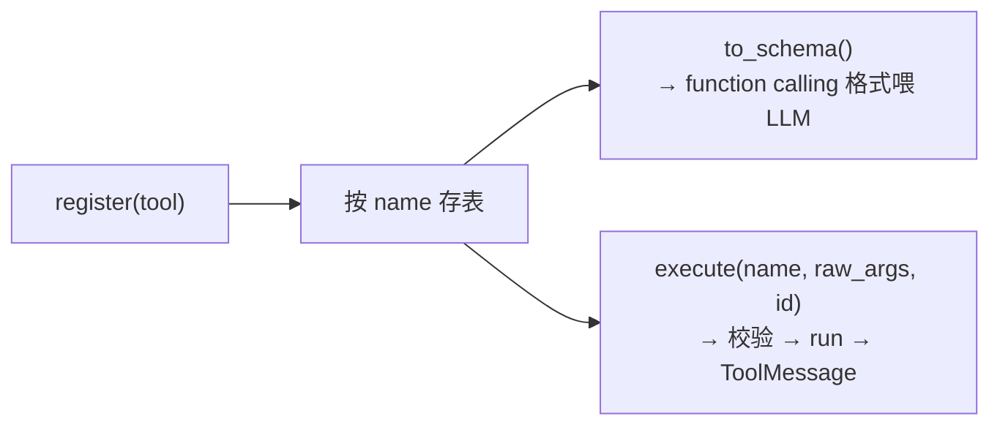

# 05 · 工具与 LLM

> 这是 Agent 与「外部世界」的两个接口：**工具**让它能行动，**LLM** 让它能思考决策。两者都遵循同一套路——先定协议，再注入具体实现。

## 5.1 工具即插件

### Tool 协议：四个字段 + 一个方法

[tool/base.py](../../src/tool/base.py) 把「工具」抽象成一个 `Protocol`：

```python
class Tool(Protocol):
    name: str
    description: str
    args_model: type[BaseModel]   # 参数 Schema 来源（Pydantic 模型）
    requires_approval: bool       # 是否需 HITL 授权
    def run(self, args: BaseModel) -> str: ...
```

只要一个类**长这个样子**（鸭子类型，无需继承），就是合法工具。关键设计是 `args_model`：每个工具用一个 **Pydantic 模型**声明自己的参数，由它**自动生成 JSON Schema** 喂给模型——不用手写 schema、不用手动校验。

### ToolRegistry：注册 / 出 schema / 执行

[registry.py](../../src/tool/registry.py) 是工具的「开闭原则落点」：**新增工具 = 实现协议 + `register()`，不动 runtime、不动中间件**。它干三件事：



`execute`（[registry.py:28](../../src/tool/registry.py#L28)）是错误分类法的关键现场：

```python
tool = self._tool.get(name)
if tool is None:
    return ToolMessage(..., is_error=True)        # 未知工具 → 逻辑错误回灌
try:
    args = tool.args_model.model_validate(raw_args)   # Pydantic 校验
    return ToolMessage(content=tool.run(args), ...)
except ToolInfraError:
    raise                                          # infra 错误 → 抛出，交 Retry 重试
except Exception as exc:
    return ToolMessage(..., is_error=True)         # 逻辑错误（坏参数/除零…）→ 回灌让模型自纠
```

> **两类错误的分水岭就在这里**：`ToolInfraError`（外部 API 超时/网络）原样抛出，由 `RetryMiddleware` 退避重试；其它一切异常（参数非法、除零、未知工具）一律包成 `is_error` 的 `ToolMessage` 回灌——模型看到「失败原因」后能在下一轮自我纠正，循环不中断。这让 ReAct 对工具出错有天然的鲁棒性。

`requires_approval` 的查询用了 `getattr(..., False)`（[registry.py:24](../../src/tool/registry.py#L24)）：只读工具可以**不声明**这个字段，消费方默认按 `False` 处理。只有 write/edit 这类有副作用的工具才置 `True`（见 [06 HITL](06-cross-cutting.md)）。

### 具体工具：以 calculator 为例看「安全」

工具的实现各有侧重，但都体现「**不信任输入**」。计算器（[calculator.py](../../src/tool/calculator.py)）不是图省事用 `eval`，而是把表达式解析成 AST，**只放行白名单运算符节点**，其余一律抛 `CalculatorError`（逻辑错误，回灌）：

```python
_BINARY_OPERATOR = {ast.Add: operator.add, ast.Mult: operator.mul, ...}  # 白名单
def _eval_node(node):
    if isinstance(node, ast.Constant) and ...: return node.value
    if isinstance(node, ast.BinOp) and type(node.op) in _BINARY_OPERATOR: ...
    raise CalculatorError(...)   # 白名单之外一律拒绝
```

> 这是工具设计的通用心法：**能力越界（任意代码执行、删文件、抓任意 URL）的工具，要么白名单约束，要么走 HITL 授权**。`bash`/`write`/`edit` 走授权，`calculator` 走白名单，`fetch` 只抓用户给的 URL（见 [06](06-cross-cutting.md) 与 [DDD §19/§20](../ddd/02ddd.md)）。

另一个值得一看的是 `todo`（[todo.py](../../src/tool/todo.py)）：它把状态 `TodoStore` 与工具本身分离——除了被 `TodoTool` 调用，`SessionPrefixMiddleware` 也复用同一个 `TodoStore` 注入「未完成提醒」。这是「一份状态、多处复用」的小范例。

## 5.2 LLM 抽象

### LLMClient 协议：业务不依赖 SDK

[llm/base.py](../../src/llm/base.py) 把模型调用抽象成一个协议 `LLMClient.chat(...)`，并定义了领域异常 `LLMInfraError` / `EmptyLLMResponseError`。业务（runtime/中间件）只依赖这个协议，**不依赖 OpenAI SDK**——测试时注入 `FakeLLMClient`（预设返回 tool_calls 或答案）即可离线跑（见 [07](07-design-principle.md)）。

```python
def chat(self, messages, tools, on_token=None, on_reasoning=None, reasoning=False) -> AIMessage: ...
```

### 为什么用 SDK 的 function calling，而非手写文本解析

这是 [deepseek_client.py](../../src/llm/deepseek_client.py) 顶部一段重要注释的核心：

> 「工具调用」原理上并不神秘：服务端把每个工具的 JSON Schema 拼进 system 区域，模型据此在输出层产生结构化片段，解码器收集成 `tool_calls`。手写方案就是让模型按 `Thought/Action/Action Input` 文本输出再正则/JSON 解析——**本质相同，但文本格式脆弱**（偶发不守格式、参数 JSON 截断）。

所以本项目用 SDK 接管「schema 注入 + 结构化解码」以求稳定，但**仍自行完成** 「SDK 结构 → 内部 `ToolCall`/`AIMessage`」的映射（[`_parse_message`](../../src/llm/deepseek_client.py#L63)）与「思考/动作/答案」的区分——这样既稳，又不把内部数据模型绑死在 SDK 上。

### 一个回传坑：带工具调用的轮必须回传 reasoning_content

`_to_sdk_message`（[deepseek_client.py:27](../../src/llm/deepseek_client.py#L27)）把内部消息转回 SDK 格式。其中只有「带 `tool_calls` 的 assistant 消息」需要特别处理：在推理模式下**必须把 `reasoning_content` 一并回传**，否则 DeepSeek 端点判 400。这是 P8 专门修过的坑，也写进了 [04](04-data-model-and-session.md) 的 `AIMessage` 注释。

## 5.3 流式与推理

### 同步流式：实时但不并发

`chat` 的 `on_token` 非空时走流式分支：`stream=True` 返回一个**阻塞迭代器**，`_parse_stream`（[deepseek_client.py:91](../../src/llm/deepseek_client.py#L91)）`for chunk in stream` 增量消费，把 `delta.content` 喂 `on_token`、`delta.reasoning_content` 喂 `on_reasoning`、`tool_call` 分片按 index 拼回，最后返回一条完整的 `AIMessage`。

> 重申 [01](01-mental-model.md) 的立场：**流式 ≠ 异步**。它解决「实时看到字」，不解决并发。本项目无并发需求，于是用同步阻塞迭代器，避免 `async` 染色整条调用链。

### 推理模式：同一个模型，按开关切换

`reasoning=True` 时，`chat` 给请求加上 `reasoning_effort` 与 `extra_body={"thinking": {"type": "enabled"}}`（[deepseek_client.py:155](../../src/llm/deepseek_client.py#L143)）。注意**不需要另备一个「推理模型」**——默认模型 `deepseek-v4-flash` 本身支持 thinking，同一模型按 `reasoning` 开关切换有无推理块。CLI 的 `:think` 命令就是翻转这个开关（见 [06](06-cross-cutting.md)）。

### 空响应也是一种 infra 错误

若模型返回 `content` 与 `tool_calls` **同时为空**，`chat` 抛 `EmptyLLMResponseError`（[deepseek_client.py:167](../../src/llm/deepseek_client.py#L167)）。它继承自 `LLMInfraError`，于是被同一条 `wrap_model_call` 重试路径覆盖——空响应视为异常、重试（见 [DDD §11](../ddd/01ddd.md)）。

## 5.4 小结

| | 工具 | LLM |
|---|---|---|
| 抽象 | `Tool` 协议 + `ToolRegistry` | `LLMClient` 协议 + `DeepSeekClient` |
| 参数/接口 | Pydantic `args_model` → JSON Schema | function calling（SDK 接管解码） |
| 错误分类 | 逻辑错回灌 `is_error` / infra 错抛出重试 | `LLMInfraError`（含空响应）→ 重试 |
| 扩展方式 | 实现协议 + register | 实现协议 + 注入（见 [08](08-extension-guide.md)） |

下一篇看那些「不在主干、却无处不在」的关注点是怎么落地的：[横切关注点](06-cross-cutting.md)。
