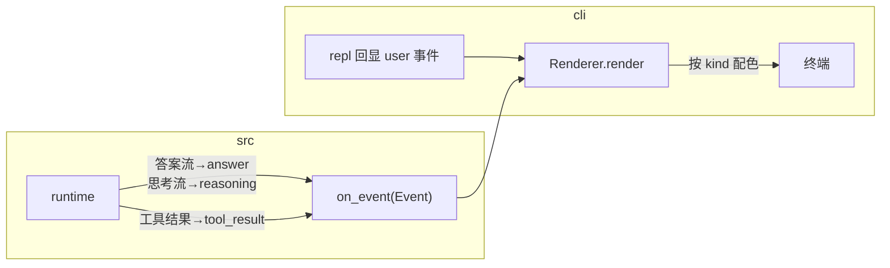

# 06 · 横切关注点

> [03](03-runtime-and-middleware.md) 讲了中间件**机制**，本篇讲每个具体中间件**做了什么、为什么这么做**。它们正是「主循环为什么能保持干净」的答案——所有不属于主干的事都在这里。

## 6.1 SessionPrefix：会话前缀（系统提示 + 环境 + 提醒）

[prefix.py](../../src/middleware/prefix.py)，钩子 `on_session_start`。它把三段东西拼成「钉住前缀」插到历史最前：

1. **静态系统提示**（01–07 段，见 [system_prompt.py](../../src/util/system_prompt.py)）：角色、任务、动作规范、工具说明、风格、输出格式。
2. **动态环境**（08 段）：工作目录、是否 git、平台、shell、模型名、日期——由 `build_runtime_env`（[prefix.py:38](../../src/middleware/prefix.py#L38)）在组合根采集后注入（便于离线测试时塞假环境）。
3. **未完成 todo 提醒**（可选）：复用 `TodoStore`，把没做完的待办拼成一句提醒。

> **一次合并的设计决策**：它合并了原本两个中间件——SystemPrompt（系统提示）与 Memory（todo 提醒）。理由：二者**同钩子**（`on_session_start`）、**同职责**（装配会话最前面的钉住前缀），拆成两个反而割裂。这是「单一职责」不等于「拆到最碎」的好例子（见 [DDD §18](../ddd/02ddd.md)）。

幂等性靠 `_strip_prefix`：每轮先删旧钉住前缀再重注入，于是多轮追问不会累积系统提示（呼应 [04 §4.3](04-data-model-and-session.md) 的 `pinned`）。

## 6.2 Context：上下文压缩

[context.py](../../src/middleware/context.py)，钩子 `before_model`。当历史消息数超过阈值时，做**破坏性摘要**：保留最近 `keep_recent` 条，把更早的对话用 LLM 摘要成一条 `SystemMessage` 置顶，原地替换早期历史。

两个值得注意的边界处理：

- **跳过钉住前缀**：`_split_pinned` 先把钉住前缀切出去，不计入阈值、不参与摘要（系统提示不该被摘要掉）。
- **对齐转折边界**：`_split_keep_recent`（[context.py:48](../../src/middleware/context.py#L48)）保证 `recent` 不以孤立的 `ToolMessage` 开头——因为工具结果若脱离它的 `AIMessage`（tool_calls）会被端点判 400，于是把边界处的 `ToolMessage` 整体并回 `older` 一起摘要，保证压缩后仍是合法消息序列。

> 摘要那次 `llm.chat` 是**直接调用、不经 `wrap_model_call`**（[context.py:63](../../src/middleware/context.py#L63)）——它是中间件内部的一次辅助调用，不该再被重试等环绕逻辑套一层。这是「中间件内部调 LLM」要留意的点。

## 6.3 Approval：HITL 人工授权

[approval.py](../../src/middleware/approval.py)，环绕钩子 `wrap_tool_call`。对「有副作用」的工具调用，先征询用户，被拒就**根本不进真实执行**，而是回灌一条 `is_error` 的 `ToolMessage`（loop 照常继续）：

```python
def wrap_tool_call(self, ctx, handler):
    call = ctx.current_tool_call
    if self._needs_approval(call) and not self._confirm(call):
        return ToolMessage(content=DENIED_MESSAGE, ..., is_error=True)  # 拒绝→不执行
    return handler(ctx)                                                 # 放行→真实执行
```

「需不需要授权」有两个来源（[approval.py `_needs_approval`](../../src/middleware/approval.py#L40)）：

1. **工具级标注** `requires_approval`（write/edit 置 True）；
2. **bash 命令命中危险模式**（`rm`/`mv`/`sudo`/重定向/`git push` 等正则清单，[config.py `DANGER_PATTERN`](../../src/config.py)）。

> **依赖倒置在这里尤其关键**：`requires_approval` 查询（= `ToolRegistry.requires_approval`）与 `confirm` 征询回调**都由组合根注入**，`src/` 不做终端 I/O。离线测试注入「恒真/恒假」的 fake confirm 即可验证放行/拦截两条路径。CLI 侧的 `confirm` 在 P11 是基本 y/N，P13 升级为彩色「允许/拒绝/总是允许」——而 `ApprovalMiddleware` **一行没改**（见 [08](08-extension-guide.md) 与 [DDD §20](../ddd/02ddd.md)）。

## 6.4 Trace vs Log：两种可观测，一份格式化

调试看输出、审计留档案，是两种不同需求，于是拆成两个中间件，但**共用事件格式化**：

| | TraceMiddleware | LogMiddleware |
|---|---|---|
| 落点 | stdout | `log/` 文件（每会话一个） |
| 开关 | 可开关（`:trace`，默认关） | 常开 |
| 用途 | 调试 | 审计 |
| 文件 | [trace.py](../../src/middleware/trace.py) | [log.py](../../src/middleware/log.py) |

两者都订 `after_model`/`before_tool`/`after_tool`，事件正文由 [event.py](../../src/util/event.py) 统一格式化（`format_model_event` / `format_tool_call_event` / `format_tool_result_event`）——**避免两份重复的格式化代码**。各自只负责加前缀（trace 加 `[trace thread=… step=…]`）和决定落点。

> Trace 的 sink 是注入的：组合根传入一个「仅当 `trace_on` 打开才打印」的闭包（`make_trace_sink`），于是 `:trace` 命令翻转 `Toggles.trace_on` 就能即时生效——开关状态由 REPL 与 sink **共享**一个 `Toggles` 对象。

Log 的文件名 = `created_at` + 清洗截断的首句用户提问，按 `thread_id` 缓存以保持稳定（[log.py `_filename`](../../src/middleware/log.py#L59)）。

## 6.5 Retry：infra 错误的退避重试

[retry.py](../../src/middleware/retry.py)，环绕钩子 `wrap_model_call` + `wrap_tool_call`。对 `LLMInfraError` / `ToolInfraError` 做指数退避重试（第 n 次等 `backoff·2^(n-1)`）。工具重试耗尽则抛出，交 runtime 兜底成 `is_error` 回灌（[03 §3.5](03-runtime-and-middleware.md)）。

> **一个微妙但重要的流式边界**：模型重试只对「**尚未流出任何 token** 的连接期失败」生效。一旦已经流出 token，就视为「已提交」、不再重试——否则用户会看到重复的片段。实现上用 `_StreamCounter` 包住 `on_token` 统计已流出数（[retry.py:24](../../src/middleware/retry.py#L24)），`committed()` 为真就放弃重试。这是「流式」与「重试」两个关注点交叉时必须处理的细节。

## 6.6 四通道事件与 CLI 渲染（P13）

最后一个横切关注点是**展示**。需求是把对话分成四个通道配色显示：**用户 / 工具返回 / 思考 / 最终回复**，并能用 `:think` 切推理。

### 设计：单 sink + runtime 桥接 + 分通道渲染



- **`Event(kind, text)`**（[state.py](../../src/schema/state.py)）：`kind ∈ {user, tool_result, reasoning, answer}`。`RunContext` 增 `on_event` 单 sink + `reasoning` 开关。
- **runtime 桥接**：`_stream_sinks`（[runtime.py:81](../../src/runtime.py#L81)）在 `on_event` 存在时，把底层的答案流/思考流桥接成 `answer`/`reasoning` 事件；`_run_tools` 在工具返回处喂 `tool_result` 事件。
- **render.py 纯展示**（[cli/render.py](../../cli/render.py)）：每通道一种 rich 样式（用户=青、工具=暗黄、思考=暗斜、回复=绿），`answer`/`reasoning` 逐 token 连续流式、切通道时自动换行收尾。

> **一个分层取舍**：DeepSeek 客户端保持**底层**的 `on_token`/`on_reasoning`（喂的是 token 字符串），不引入 CLI 才关心的 `Event` 概念；把「token → Event」的桥接放在 runtime 边界。这样 `llm/` 保持与 CLI 解耦，`Event`/`on_event` 是展示层的事，渲染分层更干净。

### 三个开关共享一个 Toggles

`:trace`（执行日志）、`:stream`（流式）、`:think`（推理）三个开关都翻转同一个 `Toggles` 对象的字段，REPL 与相关 sink 共享它，命令翻转即时生效。流式关时不逐 token 流，而是把最终答案作为一条 `answer` 事件整体渲染（CLI 的「安静模式」）。

## 6.7 小结

每个横切关注点 = 一个中间件（或一个注入的 sink），主循环对它们一无所知：

| 关注点 | 载体 | 钩子/机制 |
|---|---|---|
| 系统提示 + 提醒 | SessionPrefix | `on_session_start` 装配钉住前缀 |
| 上下文压缩 | Context | `before_model` 破坏性摘要 |
| 人工授权 | Approval | `wrap_tool_call` 拦截，依赖注入 confirm |
| 调试日志 | Trace | 顺序钩子 → 可开关 stdout sink |
| 审计日志 | Log | 顺序钩子 → 每会话文件 |
| 失败重试 | Retry | 环绕钩子 + 流式提交边界 |
| 分通道展示 | on_event + render | runtime 桥接事件 + CLI 渲染 |

下一篇把散落各处的「为什么」收拢成可复用的设计原则：[贯穿的设计原则](07-design-principle.md)。
