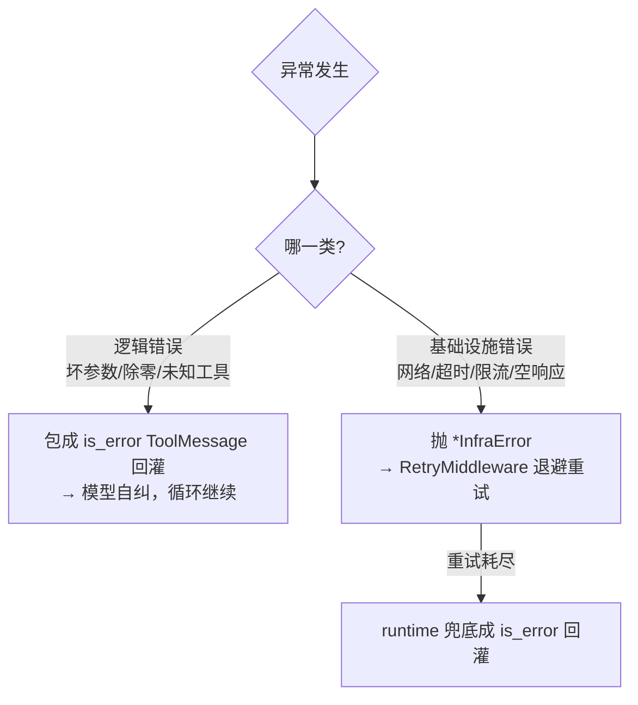

# 07 · 贯穿的设计原则

> 前面各篇反复出现的几句「为什么」，在这里收拢成可迁移的原则。它们不是事后贴的标签，而是落进了代码结构本身——理解它们，你就能在不破坏设计的前提下扩展（见 [08](08-extension-guide.md)）。

## 7.1 SOLID：哪些严格、哪些不强求

项目对 SOLID 有**明确的取舍**（见 [src/CLAUDE.md](../../src/CLAUDE.md)）：**S 与 D 严格执行；O 部分执行；L、I 初期不强求**。这种「分级」本身就是一种成熟——不为了凑齐五个字母而过度设计。

### S — 单一职责（严格）

每个类/函数/模块只有一个变化的理由。违反信号：函数超 50 行、一个类有 3+ 个不相关方法、改一个功能要动多个不相关文件。

证据遍布全项目：runtime 只管主干、每个中间件一个关注点、`SessionManager` 是持久化的唯一负责方、`event.py` 把格式化从 trace/log 里抽出来共用。

> 但 S **不等于拆到最碎**：[06 §6.1](06-cross-cutting.md) 里 SystemPrompt 与 Memory 合并成一个 SessionPrefix，因为它们同钩子同职责。「单一职责」看的是「变化的理由」，不是行数。

### D — 依赖倒置（严格）

业务依赖**抽象**，不依赖具体实现；具体实例由外部**注入**。四个协议是骨架：

| 抽象 | 具体实现 | 注入点 |
|---|---|---|
| `LLMClient` | `DeepSeekClient` | 组合根 |
| `Tool` | calculator/bash/… | register 进 registry |
| `Checkpointer` | `InMemoryCheckpointer` | 组合根 |
| `confirm` 回调 | CLI 的 `ToolApproval` | 组合根注入 ApprovalMiddleware |

`src/` 里**没有一处**自己 new 出具体依赖——连 OpenAI 客户端都是组合根建好注入（[deepseek_client.py `from_credentials`](../../src/llm/deepseek_client.py)）。这换来两件事：换实现不改业务，离线测试注入 fake（见 §7.4）。

### O — 开闭（部分执行）

通过**加新代码**扩展，而非改旧代码。两个明确的扩展点：

- **加工具** = 实现 `Tool` + `register()`，不动 runtime/中间件；
- **加运行时关注点** = 写一个 `Middleware` 子类 + 加进列表，不改主循环。

「部分执行」的诚实之处：并非每个角落都做了开闭（比如中间件的**顺序**仍写死在组合根里），但在「加工具/加中间件/换 LLM」这三条最常见的扩展路径上严格守住了。

### L / I — 初期不强求

里氏替换与接口隔离会随着基类稳定**自然显现**，初期不刻意为它们做设计。这条「不强求」同样是取舍——避免早期过度抽象。

## 7.2 组合根：唯一碰「具体」的地方

依赖倒置要有个落地点：**组合根**（Composition Root）。本项目的组合根是 [cli/main.py](../../cli/main.py) 的 `build_agent`——只有它实例化具体依赖（DeepSeek 客户端、10 个工具、内存 Checkpointer、有序中间件列表），装配后注入出一个可用的 `Agent`。

> 心法：**「构造」与「使用」分离**。业务代码只「使用」注入进来的抽象；「构造」具体实现这件脏活集中在组合根一处。这样依赖关系一目了然，替换实现只改一个地方。`cli/main.py` 因此被刻意保持成「造依赖 → 注入 → 启动」的薄壳。

## 7.3 错误分类法：逻辑错 vs 基础设施错

这是贯穿 tool / registry / retry / llm 的一条主线（[01 §1.4](01-mental-model.md) 立靶，[05](05-tool-and-llm.md)/[06](06-cross-cutting.md) 落地）：

为什么这么分？因为两类错误的**正确应对完全不同**：

- 逻辑错误是「模型/参数的问题」，**重试无意义**——正确做法是把错误信息喂回去让模型自我纠正（ReAct 鲁棒性的来源）。
- 基础设施错误是「外部世界抖动」，**重试有意义**——退避几次往往能恢复。

把它们用不同的异常类型区分，让上层（registry/runtime/retry）能各自做对的事。

## 7.4 离线可测：注入 fake，先 Red 后 Green

依赖倒置的最大红利是**可测性**。因为业务只依赖协议，测试时注入假实现即可完全离线、可复现：

- `FakeLLMClient`：预设返回 tool_calls 或最终答案，不连网；
- fake `confirm`：恒真/恒假，验证授权放行/拦截；
- 假环境 dict 注入 SessionPrefix，验证提示装配；
- `InMemoryCheckpointer` 本身就是测试友好的存储。

项目走 **TDD（先写失败测试，再实现）**，目标覆盖率 ≥ 80%（宪法要求）。纯函数（如 `parse_command`、calculator 求值、消息解析）尤其适合离线单测。这也是为什么 [05](05-tool-and-llm.md) 强调「自行完成 SDK→内部类型的映射」——映射是纯函数，能用打桩的 SDK 响应对象离线测。

> 一个连带的设计后果：凡是「终端 I/O」都被推到 `cli/` 并通过 sink 注入（`out`/`on_event`/`confirm`），于是 `src/` 全部可离线测——I/O 与逻辑的分离不是洁癖，是为了可测。

## 7.5 借鉴模式，而非依赖框架

题目约束「不用现成 agent 框架，从零实现，但可借鉴设计模式」。项目的应对是**借思想、不借代码**：

| 借鉴来源 | 借来的「思想」 | 我们的落地 |
|---|---|---|
| LangGraph | 运行时生命周期阶段 | 6 个顺序钩子切分一次执行 |
| LangChain | 中间件 / 洋葱环绕 | `Middleware` 基类 + `wrap_*` 钩子 |
| OpenAI function calling | schema 注入 + 结构化解码 | 用 SDK 接管解码，自行做内部类型映射 |

这不只是合规，更是一种学习姿态：**理解一个模式「解决什么问题」，比直接 import 一个框架更能内化设计能力**。

## 7.6 其它一以贯之的小约定

- **参数集中**：可调参数集中在 `config.py`（库）/ `cli/config.py`（客户端），不硬编码进函数——改参数有唯一去处。
- **单数命名**：文件/目录用单数名（`tool/` 而非 `tools/`），减少命名分歧。
- **同步优先**：无并发需求就不引入 `async`，避免函数染色（[01 §1.4](01-mental-model.md)）。
- **最小依赖**：不引入重型框架；`rich`（渲染）、`pydantic`（校验/schema）、`openai`（SDK）各有明确用途。

## 7.7 小结

这套原则的内核是一句话：**把「会变的」隔离在抽象之后，把「构造」收拢到组合根，让主干保持干净、让一切可注入因而可测、可扩展。** 带着这个内核去读 [08 扩展指南](08-extension-guide.md)，你会发现「加东西」几乎不需要碰核心。
