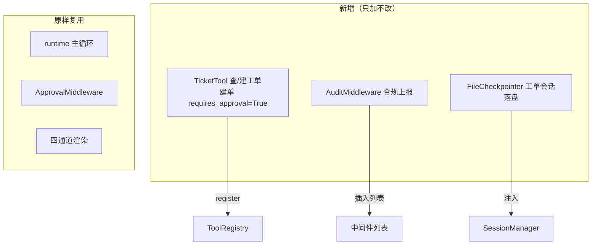

# 08 · 扩展实践指南

> 前七篇讲「为什么这么设计」，本篇把它坐实：**怎么在不碰核心的前提下扩展**。这正是开闭原则与依赖倒置的兑现现场——三条最常见的扩展路径都只需「加新代码 + 在组合根注入」。最后用一个客服业务场景把它们串起来。

阅读前先记住地图：**业务逻辑写在 `src/`，把它接进系统的「装配」写在组合根 [cli/main.py](../../cli/main.py) 的 `build_agent`。** 几乎所有扩展都是「在 `src/` 加一个实现 + 在 `build_agent` 注入一行」。

## 8.1 扩展点一：加一个工具

**场景**：给 Agent 加一个「查订单状态」的领域工具。

### 步骤 1 — 实现 `Tool` 协议（`src/tool/order.py`）

```python
from pydantic import BaseModel, Field
from src.tool.base import ToolInfraError

TOOL_NAME = "order_status"
TOOL_DESCRIPTION = "按订单号查询订单状态，返回状态文本。"

class OrderArgs(BaseModel):
    order_id: str = Field(description="订单号，如 'A1001'")

class OrderStatusTool:
    name = TOOL_NAME
    description = TOOL_DESCRIPTION
    args_model = OrderArgs
    # requires_approval 不声明 → registry 用 getattr 默认 False（只读工具无需授权）

    def __init__(self, client: OrderClient) -> None:  # 依赖注入，便于离线测
        self._client = client

    def run(self, args: OrderArgs) -> str:
        try:
            return self._client.query(args.order_id)        # 正常路径
        except TimeoutError as exc:
            raise ToolInfraError(str(exc)) from exc         # infra 错 → 交 Retry 重试
        # 其它异常（如订单不存在）让它自然抛出 → registry 包成 is_error 回灌让模型自纠
```

### 步骤 2 — 在组合根注册（`build_agent`）

```python
tools = (
    CalculatorTool(), FetchTool(), WeatherTool(), TodoTool(todo_store),
    OrderStatusTool(order_client),   # ← 只加这一行
    BashTool(), ReadTool(), ...
)
for tool in tools:
    registry.register(tool)
```

### 要点

- **不动 runtime、不动中间件**——这就是 [07 §7.1](07-design-principle.md) 说的开闭扩展点。
- `args_model` 自动转成 JSON Schema 喂给模型（[05 §5.1](05-tool-and-llm.md)），你不用手写 schema。
- 遵守**错误分类法**（[07 §7.3](07-design-principle.md)）：外部 API 抖动抛 `ToolInfraError`（会被重试）；业务性失败（订单不存在）正常抛（会被回灌让模型自纠）。
- 有副作用的工具（下单、改库）置 `requires_approval = True`，自动进入 HITL 授权（§8.4）。
- **测试**：`registry.to_schema()` 应含该工具；`execute("order_status", {...})` 校验+运行；注入会抛 `TimeoutError` 的假 client 验证 infra 错被正确翻译。

## 8.2 扩展点二：加一个中间件

**场景**：加一个「合规审计」中间件，把每次工具调用记到外部合规系统。

### 步骤 1 — 子类化 `Middleware`，覆写你关心的钩子（`src/middleware/audit.py`）

```python
from collections.abc import Callable
from src.middleware.base import Middleware
from src.util.event import format_tool_call_event   # 复用现成格式化
from src.schema.state import RunContext

class AuditMiddleware(Middleware):
    """把每次工具调用上报合规 sink（顺序钩子 before_tool）。sink 依赖注入。"""

    def __init__(self, sink: Callable[[str], None]) -> None:
        self._sink = sink

    def before_tool(self, ctx: RunContext) -> None:
        self._sink(format_tool_call_event(ctx))
```

> 选哪个钩子？看 [03 §3.6](03-runtime-and-middleware.md)：只读写 `ctx`、记录/注入 → **顺序钩子**；要控制真实调用的时机/次数（重试、拦截、限流后阻断）→ **环绕钩子** `wrap_*`。审计只是记录，用顺序钩子 `before_tool` 即可。

### 步骤 2 — 在装配工厂插入到正确位置

有序的中间件列表是 `cli`/`eval` 共用的单一事实源 [`build_middlewares`](../../src/util/stack.py)（[03 §3.4](03-runtime-and-middleware.md) / [10 §10.4](10-evaluation.md)），新增「行为相关」中间件只改这一处，`eval` 自动跟上：

```python
middlewares = [
    SessionPrefixMiddleware(...),
    LogMiddleware(...),
    AuditMiddleware(sink=compliance_sink),   # ← 放在工具相关中间件之前
    TraceMiddleware(...),
    MaxTurnMiddleware(...), ContextMiddleware(...),
    ApprovalMiddleware(...), RetryMiddleware(...),
]
```

### 要点

- **顺序有语义**（[03 §3.4](03-runtime-and-middleware.md)）：顺序钩子按列表先后执行；环绕钩子列表首个在最外层。审计要在「授权拦截前」记录「模型想调什么」，就放在 Approval 之前。
- **不改主循环、不改其它中间件**。
- **sink 依赖注入**：中间件本身不做 I/O，把「往哪上报」做成注入的 `sink`，于是离线测试注入一个 `list.append` 就能断言。
- **测试**：构造一个只含 `AuditMiddleware` 的 runtime + `FakeLLMClient`（返回一次 tool_call），断言 sink 收到了对应记录。

## 8.3 扩展点三：换一个 LLM / 换一个存储

依赖倒置（[07 §7.2](07-design-principle.md)）让「换底层实现」只是「实现协议 + 改注入」。

### 换 LLM 提供方

实现 `LLMClient` 协议（[llm/base.py](../../src/llm/base.py)）即可：

```python
class MyLLMClient:
    def chat(self, messages, tools, on_token=None, on_reasoning=None, reasoning=False, on_usage=None) -> AIMessage:
        # 1. 把内部 Message 列表转成你家 API 的格式
        # 2. 调你家 API；流式则把增量喂 on_token / on_reasoning
        # 3. 把返回映射回内部 AIMessage（content / reasoning_content / tool_calls）
        # 4. 连接期失败翻译成 LLMInfraError；空响应抛 EmptyLLMResponseError
        # 5. on_usage 非空则回调本次 token 计量（供 Log 估算成本，见 10）
        ...
```

组合根里把 `DeepSeekClient.from_credentials(...)` 换成 `MyLLMClient(...)` 即可，**runtime/中间件/工具一律不动**。

### 换会话存储（内存 → 文件 / Redis / DB）

实现 `Checkpointer` 协议（[checkpointer.py](../../src/session/checkpointer.py)）的 `get/put/list_threads`，组合根把 `InMemoryCheckpointer()` 换成你的实现注入 `SessionManager`。

> 一个**必须注意的坑**（[04 §4.4](04-data-model-and-session.md)）：跨进程存储要做序列化，而 JSON 往返会丢 `Message` 的子类型。实现 `put/get` 时要带上 `role`/类型信息并在反序列化时还原成正确的 `Message` 子类，否则 System/Human/AI/Tool 会退化成普通 dict。

## 8.4 业务场景实例：把 MVP 改造成「客服工单 Agent」

把上面三招组合起来，看一个完整的小改造——目标：**让 Agent 能查/建工单，建工单需人工授权，且所有工具调用留合规审计**。

需要做的，全是「加」与「注入」，核心代码一行不改：



各招如何各就各位：

| 需求 | 用哪个扩展点 | 怎么落地 | 复用了什么 |
|---|---|---|---|
| 查工单 / 建工单 | 加工具（§8.1） | `TicketTool`，`action=create` 时 `requires_approval=True` | function calling、schema 自动生成 |
| 建工单需人工确认 | **零新增** | `TicketTool` 标了 `requires_approval` 即自动进 HITL | `ApprovalMiddleware` 原样工作（[06 §6.3](06-cross-cutting.md)） |
| 所有工具调用留审计 | 加中间件（§8.2） | `AuditMiddleware(sink=合规上报)` 插在 Approval 前 | `before_tool` 钩子、`event.py` 格式化 |
| 工单会话要持久 | 换存储（§8.3） | `FileCheckpointer` 实现协议后注入 | `SessionManager` 隔离/持久化逻辑 |
| 分通道彩色展示 | **零新增** | 原样 | `on_event` + `render`（[06 §6.6](06-cross-cutting.md)） |

> 这张表是整套设计的「投资回报」：一个新业务，新增三个小实现 + 改几行组合根，而**主循环、授权、压缩、重试、渲染全部原样复用**。「建工单需授权」这一条甚至**零新增**——只因 `TicketTool` 声明了 `requires_approval`，HITL 链路自动接管。这就是开闭原则与依赖倒置在真实需求面前的样子。

## 8.5 扩展自查清单

动手前过一遍：

- [ ] 我加的东西是「新实现」而非「改核心」吗？（若要改 runtime/已有中间件，先想想是不是该做成新中间件）
- [ ] 依赖是**注入**进来的，还是函数里自己 new 的？（应注入，便于测试）
- [ ] 错误分了「逻辑错（回灌）/ infra 错（重试）」两类吗？
- [ ] 有副作用的工具标 `requires_approval` 了吗？
- [ ] 终端 I/O 都推到 `cli/` 并通过 sink 注入了吗？（`src/` 保持可离线测）
- [ ] 写了离线测试（注入 fake）吗？覆盖率达标吗？
- [ ] 新中间件在列表里的**位置**对吗？（顺序有语义，见 [03 §3.4](03-runtime-and-middleware.md)）
- [ ] 可调参数放进 `config.py` 了吗？

读到这里，你已经走完从「心智模型」到「动手扩展」的全程。回到 [README](README.md) 可随时跳读任一主题。
