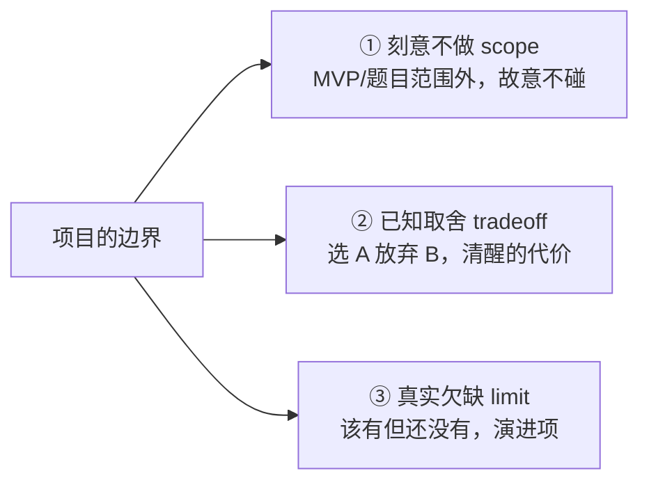

# 09 · 局限与演进方向

> 一个成熟的设计，既要说清「做了什么、为什么」，也要诚实地说清「**没做什么、为什么先不做、要做得花多大代价**」。本篇就是这份诚实清单。它面向想评估「这套设计能走多远」的读者。
>
> 注：DDD 已有 [§14「开放问题」](../ddd/01ddd.md) 作为**前瞻性能力清单**的权威来源。本篇不重复罗列，而是从**工程取舍**的角度，把局限分成三类讲透，并给出演进的落脚点。

## 9.1 先分清三类「不足」

把「不足」一锅烩地说成「缺点」是不公平的。它们其实是三种东西：

读下面每一条时，先看它属于哪一类——这决定了「要不要担心」和「该不该现在就修」。

## 9.2 持久化只是进程内内存（② 取舍 → ③ 演进）

**现状**：会话状态用 `InMemoryCheckpointer`（[checkpointer.py](../../src/session/checkpointer.py)）——一个进程内的 `dict`。`TodoStore`（[todo.py](../../src/tool/todo.py)）同样是内存、按实例隔离。**进程一退，全部丢失**。

**为何 MVP 这样**：题目核心是「走通 ReAct + 多窗口隔离 + 演示」，内存实现足以展示「窗口隔离」「追问记得上文」；且内存版**直接存对象、不做 JSON 往返**，刚好避开了「序列化丢 `Message` 子类型」的坑（[04 §4.4](04-data-model-and-session.md)），让 MVP 更聚焦。

**演进**：因为依赖倒置，落地持久化**不动业务**——实现 `Checkpointer` 协议（文件/Redis/DB）注入即可（[08 §8.3](08-extension-guide.md)）。唯一要小心的是序列化时保留 `Message` 子类型。属于**清晰可控的演进项**。

## 9.3 没有长期记忆 / 跨会话记忆 / 语义召回（③ 真实欠缺）

**现状**：记忆能力只有三样——窗口内对话历史、`todo` 提醒注入、以及超阈值时的**破坏性摘要压缩**（[06 §6.2](06-cross-cutting.md)）。

**局限**：

- 记忆**不跨会话**：换个 `thread_id` 就互不可见（这既是「隔离」的优点，也意味着没有「全局长期记忆」）。
- 压缩是**破坏性**的：摘要会丢信息且不可逆；且按**消息条数**阈值触发，而非按 token 预算。
- 召回是**按时间**（保留最近 N 条），而非**按相关度**——没有向量检索。

**演进方向**（详见 [DDD §14.1](../ddd/01ddd.md)）：分层记忆（工作 / 情景 / 语义）、跨会话长期记忆 + 向量检索按相关度召回、按 token 预算压缩。这是「从 MVP 到真正可用 Agent」最实质的一块。

## 9.4 固定阶段的主循环，面对开放式任务规划会受限（② 取舍）

**现状**：运行时是一条**固定阶段**的 ReAct 主循环（[03](03-runtime-and-middleware.md)）。

**取舍**：在简单、确定性的流程下，「主循环 + 生命周期中间件」清晰、可控、可观测；代价是面对**开放式、需要动态规划下一步**的任务时，固定阶段不如「动态 planner / 状态图」灵活。这正是 [01 §1.2](01-mental-model.md) 立下的刻意选择——**可控可观测 vs 灵活性**，MVP 选了前者（[DDD §14.4](../ddd/01ddd.md)）。

**演进**：引入「动态 planner」让模型自主决定下一步，或退回到状态机/图式编排——但那会牺牲当前这份清晰。是否要走，取决于业务是否真的需要开放式规划。

## 9.5 性能维度的留白（②/③ 混合）

| 维度 | 现状 | 类别 | 演进（[DDD §14.3](../ddd/01ddd.md)） |
|---|---|---|---|
| 工具调用 | **串行**执行（`_run_tools` 逐个） | ② 取舍 | 并行工具调用 |
| 提示缓存 | 无 | ③ 欠缺 | prompt 缓存 / KV 复用 |
| 模型路由 | 单一模型 | ③ 欠缺 | 分级模型（小模型路由 + 大模型生成） |
| 并发 | 无（单用户、窗口串行、全程同步） | ② 取舍 | 并发与限流 |

> 「全程同步、无并发」是 [01 §1.4](01-mental-model.md) 那条「同步优先」立场的直接结果——MVP 单用户场景下这是**对的简化**；真要支持多用户并发，需要重新评估同步模型（这也是当初不用 async 的代价被记账的地方）。

## 9.6 安全与可观测的边界（②/③ 混合）

- **工具沙箱**：`bash`/文件工具靠 **HITL 授权 + 危险正则**（[06 §6.3](06-cross-cutting.md)）作副作用闸门,**没有真正的沙箱隔离**。正则清单能拦常见危险，但不是强隔离边界（② 取舍，沙箱列进阶项,见 [DDD §5/§14.5](../ddd/01ddd.md)）。
- **结构化运行日志（已补 → 可视化仍缺）**：Trace 走 stdout 供人调试；`Log` 把每次 run 落成**机读结构化 JSONL**（事件正文 + token / 成本 / cache 命中），可回读为对象、离线造 case，持久化这块已补；尚缺的是可视化看板（③ 欠缺，见 [10 §10.2](10-evaluation.md)）。
- **评测集与回归（三期已补）**：MVP 只有单元/集成测试；三期建起**针对 Agent 行为的评测回归**——录制回放进 CI、在线打分看真实效果、可一键录制成长用例（详见 [10 评测与可观测](10-evaluation.md)）。
- **密钥管理基础**：密钥放 `.env`（不入库），但无更强的密钥托管/轮换（② 取舍）。

## 9.7 几处小取舍（②，了解即可）

- **单一 LLM 实现**：抽象了 `LLMClient` 协议，但只有 `DeepSeekClient` 一个实现——换/多家提供方是现成的扩展点（[08 §8.3](08-extension-guide.md)），只是当前未做。
- **非流式模式不展示思考**：`:stream` 关时进入「安静模式」，只渲染最终答案，`reasoning` 即使计算了也不展示（[06 §6.6](06-cross-cutting.md)）——刻意的简化。
- **中间件顺序写死在组合根**：顺序是固定装配的，不支持运行时重排（开闭原则在「顺序」这一维上未覆盖，[07 §7.1](07-design-principle.md) 已诚实标注「O 部分执行」）。

## 9.8 小结：一张「边界地图」

| 局限 | 类别 | 现在要担心吗 | 演进落脚点 |
|---|---|---|---|
| 内存持久化、进程退即丢 | ② → ③ | 演示不担心；上线要做 | 实现 `Checkpointer`（[08](08-extension-guide.md)） |
| 无长期/跨会话/语义记忆 | ③ | 是，最实质的一块 | 分层记忆 + 向量召回（[DDD §14.1](../ddd/01ddd.md)） |
| 固定阶段、无动态规划 | ② | 取决于业务 | 动态 planner / 图式（[DDD §14.4](../ddd/01ddd.md)） |
| 串行工具、无缓存、无并发 | ②/③ | 单用户不担心 | 并行/缓存/分级/限流（[DDD §14.3](../ddd/01ddd.md)） |
| 无真沙箱（评测回归三期已补） | ②/③ | 越权操作要关注；评测已补 | 沙箱（[DDD §14.5](../ddd/01ddd.md)）；评测见 [10](10-evaluation.md) |

**一句话**：这个项目是一个**边界清晰的 MVP**——它把「ReAct 骨架 + 可插拔中间件 + 干净的扩展点」做扎实，并**清醒地知道**长期记忆、强持久化、动态规划、性能与安全工程是「下一步」而非「这一步」。真正可用的产品级 Agent，缺的不是重写，而是沿着这些扩展点把上面这张表逐项补齐。

回到 [README](README.md) 总览，或从 [08 扩展指南](08-extension-guide.md) 看这些演进具体怎么落地。
