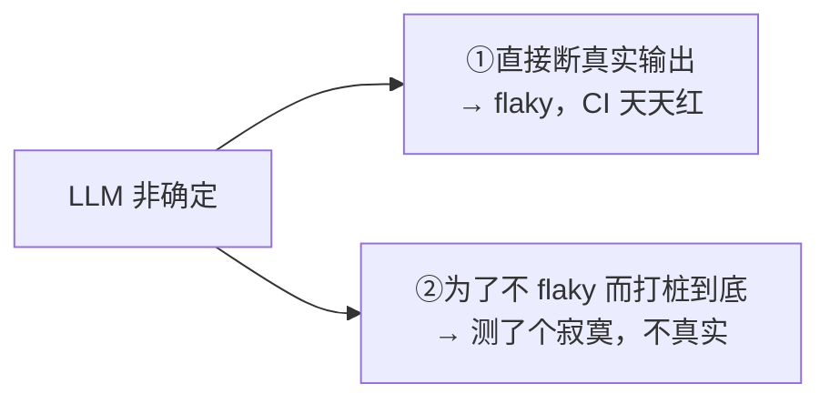
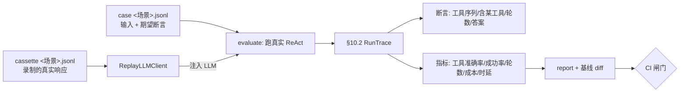
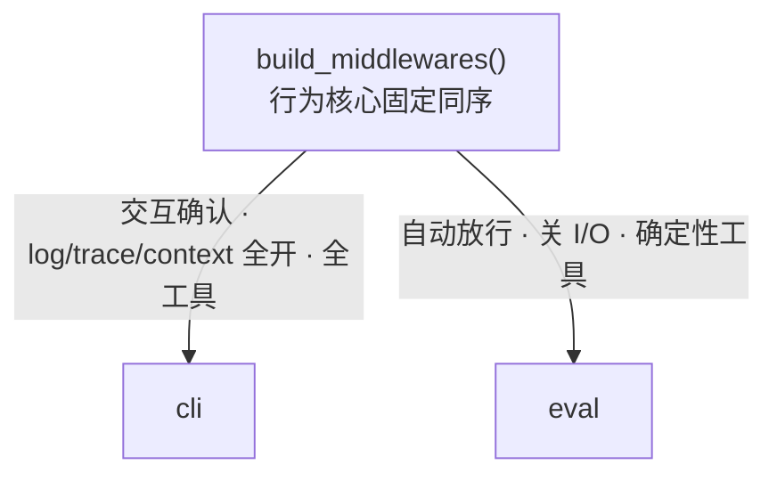
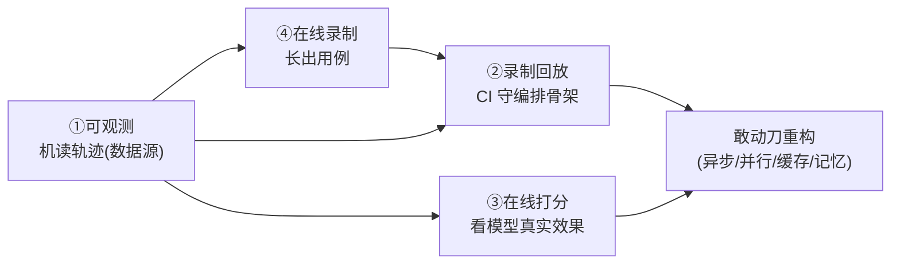

# 10 · 评测与可观测

> 前 9 篇讲「Agent 本体怎么搭」；本篇讲一件不同的事——**怎么知道它没坏、改完还对**。对 LLM Agent 来说这不是普通单测能覆盖的：模型输出非确定，而我们又要在每次重构后**秒级确认行为没变**。答案是两件相互支撑的基建：**可观测**（把一次 run 变成机读轨迹，是地基）与**评测回归**（守住 Agent 行为零回归，是安全网）。
>
> 精确的数据结构与签名在 [DDD §25/§26/§34/§35](../ddd/03ddd.md)；本篇只讲「为什么这么设计」。

## 10.1 为什么 Agent 要专门的评测（普通单测不够）

普通软件：输入定、输出定，`assert f(x) == y` 即可。LLM Agent 不一样——同一个输入，模型每次的措辞、甚至选哪个工具都可能不同。于是评测撞上一个**死穴**：

更要命的是：我们关心的不是「代码对不对」，而是「**Agent 行为对不对**」——重构 `src` 编排（中间件顺序、压缩逻辑、甚至 P18 异步化）后，代码全变了，但**外在行为应当不变**。普通单测保不住这个。

解法是**两层分治**：确定性骨架用**录制回放**（进 CI、零成本零 flaky），真实波动用少量**在线打分**（看模型效果真实变化）。下面从地基讲起。

## 10.2 地基：把一次 run 变成机读轨迹（Observe）

[06 §6.4](06-cross-cutting.md) 已有两种可观测：`Trace`（人调试、stdout、可关）与 `Log`（人审计、文件、常开）。评测需要**第三种**——机器读的：

| | 受众 | 介质 | 结构 |
|---|---|---|---|
| Trace | 人调试 | stdout | 文本行 |
| Log | 人审计 | `log/*.log` | 半结构化 |
| **Observe** | **机器 / 评测** | **`trace/*.jsonl`** | **严格结构化、可回读为对象** |

[ObserveMiddleware](../../src/middleware/observe.py) 订生命周期钩子，把每轮 model-call 收成一条 `TurnRecord`（选了哪些工具、各工具是否出错、时延、`usage`），整个 run 汇成 `RunTrace` 落 `trace/<thread_id>/<run_id>.jsonl`，可被 `read_trace` 回读为对象。`usage` 含 DeepSeek 的 `prompt_cache_hit/miss_tokens`，乘单价即估算成本。

> **一个不污染的设计**：`usage` 不塞进持久的 `AIMessage`（那是对话内容，不该混入计量）。`LLMClient.chat` 新增 `on_usage` 回调（与 `on_token`/`on_reasoning` 同风格），运行时把它挂到瞬态 `RunContext.last_usage` 供 Observe 读取——对既有调用与一众测试 fake **零破坏**。细节见 [DDD §25](../ddd/03ddd.md)。

这条机读轨迹是后面一切的**数据源**：评测要打分靠它、成本/缓存分析靠它、未来分级路由看成本也靠它。所以它排在评测之前先做。

## 10.3 两层分治：录制回放守骨架，在线打分看效果

- **录制回放（`make eval`）**：cassette 是录好的真实模型响应；回放时注入 [`ReplayLLMClient`](../../eval/replay.py)（实现 `LLMClient`，按序吐录制响应）→ **确定性**。注意**工具仍真实执行**（calculator 真的算），只把「模型这一不确定来源」换成录制。于是它守的是「**`src` 编排骨架端到端走不走得通**」——重构后秒级确认零行为回归，进 CI，零成本零 flaky。
- **在线打分（`make eval-online`）**：注入真实 `DeepSeekClient`，看「改动后模型效果是否真变好/变差」。非确定，故用 `must_call`/`answer_contains` 等**软断言**、少用精确 `tool_sequence`，与**在线基线**比。无 API Key 优雅跳过。
- **真实冒烟（`make eval-live`）**：最轻量的 `@slow`，只验证「API 通不通」。

> **关键解耦**：`run_case`（回放）与 `run_online`（真实）共用同一个 `evaluate(case, llm, …)`——**LLM 注入**，回放盒↔真实客户端切换**不改打分逻辑**。这正是「依赖倒置」（[07](07-design-principle.md)）在评测上的复用。细节见 [DDD §26](../ddd/03ddd.md)。

## 10.4 评测必须跑「真·生产的 Agent」：单一中间件事实源

这里有个**真实踩过的坑**：评测最初自己手拼了一份中间件栈来「镜像」生产，结果漏挂了 `SessionPrefix`——于是评测里的模型**收不到系统提示**，行为和真实 CLI 不一样，评测**失真而不自知**。

教训：镜像靠手维护必然漂移。解法是抽 [`build_middlewares`](../../src/util/stack.py) 做**单一事实源**，`cli` 与 `eval` 都调它，差异收敛成几个**有名字的开关**：

> 「一致」**不是「完全相同」**：Log/Trace 是纯 I/O、Approval 在评测要自动放行、工具只能用确定性的（无 bash/网络副作用）——这些**必须不同**。要消灭的是**隐性漂移**：新增一个行为中间件只落工厂一处，评测**自动跟上**。细节见 [DDD §34.2](../ddd/03ddd.md)。

## 10.5 场景化数据集与并行

用例按**场景**组织：一个 `<场景>.jsonl` = 一个场景，每行一条 case；cassette 同名 jsonl，按 `(场景, name)` **键**配对（不按行号，重排免疫）。报告**逐场景出指标 + 全局 rollup**，于是能看「计算场景 100%、问候场景掉了」。

在线评测的提速也在这里：用例彼此独立、且是**网络 I/O 密集**，直接用线程池（`EVAL_PARALLEL`）并发跑——**不需要**把 Agent 核心改 async（那是 [P18](../ddd/03ddd.md)），二者正交。细节见 [DDD §34.1/§34.3/§34.4](../ddd/03ddd.md)。

## 10.6 让评测集自己长出来：在线录制

手写多轮 cassette（逐字填准 `tool_calls` 参数 + `usage`）既烦又易错。于是补上回放的**写侧对偶**——在真实会话里一键录制：

- [`RecordMiddleware`](../../src/middleware/record.py)（`ReplayLLMClient` 的写侧对偶）：`after_model` 采集完整 `AIMessage`+`usage`，`on_session_end` 落 cassette 一行 + **case 桩**一行。
- CLI 命令 `:cassette <场景>` 开始、再 `:cassette` 结束（默认关，与 `:trace`/`:stream` 同源；REPL 改句柄、中间件读句柄，跨层零 import）。

> **边界：录「发生了什么」，但「应该发生什么」要人写**。录制能自动抓 `input` 与**观测到的** `tool_sequence` 作起点，但 `answer_contains`/`must_not_call` 等断言是**判断**，需你改定。另外录制会**真实执行工具**（有副作用）。细节见 [DDD §35](../ddd/03ddd.md)。

## 10.7 闭环：四件事如何相互支撑

一句话：**可观测是地基，录制-回放是安全网，在线打分是体检，录制是评测集自我繁殖的方式**。它们合起来，正是把 [09 §9.6](09-limitation-and-evolution.md) 那条「无评测集与回归 / trace 不持久化」的真实欠缺补上的落点——也是 [DDD §27 起](../ddd/03ddd.md)那些会改变 Agent 行为的重构（异步化、并行、缓存、压缩、分层记忆）**敢动刀的底气**。

| 入口 | 作用 |
|---|---|
| `make eval` | 离线录制回放，确定性，进 CI 闸门 |
| `make eval-online` | 真实 API 对 case 打分，软指标比在线基线 |
| `make eval-live` | `@slow` 真实 API 冒烟，验证「通不通」 |
| `:cassette <场景>` | CLI 里录制真实会话为 cassette + case 桩 |

---

回到 [README](README.md) 总览，或看 [09 局限与演进](09-limitation-and-evolution.md)——本篇填补的正是那里曾经的留白。
