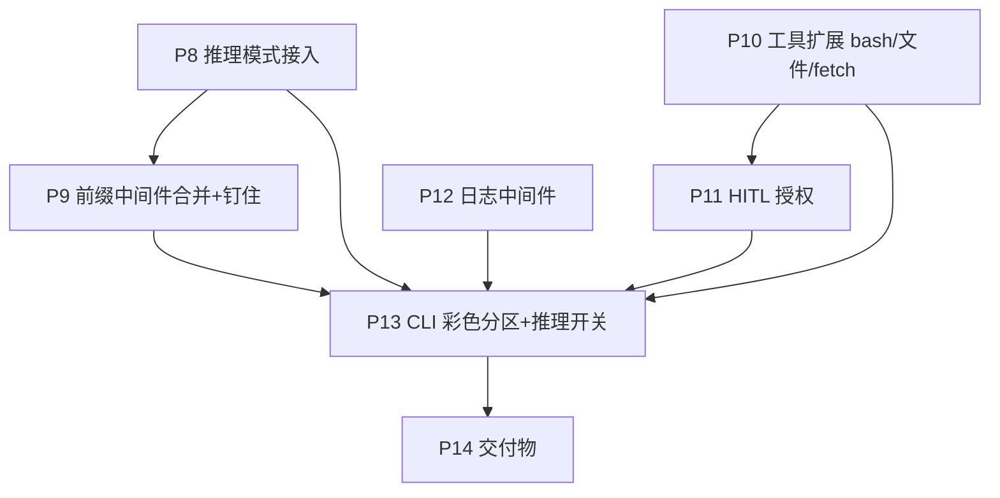

# 详细设计文档（二期）——9 项工程化增强（2026-06-25 新增）

> 本文承接 [01ddd](01ddd.md)（一期 §1–§15），**章节编号续为 §16–§23**。对应 [PRD.md](../prd/02prd.md)「第二阶段需求」R1–R9，分阶段计划见 [plan/02plan.md](../plan/02plan.md)。
> **不推翻一期架构**：仍是「主循环 + 生命周期中间件 + 注册式工具」。新增能力一律落在**新中间件 / 新工具 / 已有扩展点**上，主循环零改动（开闭原则，见 §2）。

## 16. 总览：R1–R9 落点

| 需求 | 落点（新增/改动）| 性质 |
|---|---|---|
| R1 日志 | `middleware/log.py`（新中间件）+ `AgentState.created_at` + `config.LOG_DIR` | 顺序钩子，每会话落文件 |
| R2 彩色 | `cli/render.py`（rich 渲染，新）| 客户端 I/O |
| R3 分区显示 | `RunContext` 加结构化 display sink + CLI 分通道渲染 | 客户端 I/O + 瞬态上下文字段 |
| R4 Bash/文件工具 | `tool/bash.py`/`read.py`/`write.py`/`edit.py`/`glob.py`/`grep.py`（新工具）| 注册即用（开闭）|
| R5 系统提示词 | 合并进 `middleware/prefix.py` 的 `on_session_start` | 顺序钩子 |
| R6 中间件梳理 | `SystemPrompt`+`Memory` → 合并为 `SessionPrefixMiddleware`；`Context` 独立 | 重构 |
| R7 推理模式 | `AIMessage.reasoning_content` + `DeepSeekClient` 接 thinking + `RunContext.reasoning` 开关 | 跨层 |
| R8 HITL | `middleware/approval.py`（新中间件，`wrap_tool_call`）+ `Tool.requires_approval` | 环绕钩子 |
| R9 fetch | `tool/search.py` → `tool/fetch.py`（httpx 真实请求）| 改工具 |



## 17. 推理模式（DeepSeek thinking / `reasoning_content`）

题目「提取思考过程」一期是把 `AIMessage.content` 当思考/答案合体；二期改用 DeepSeek **原生推理块**，思考与答案在响应里**字段分离**，更真实也便于 R3 分区显示。

- **开启方式**：`reasoning_effort="high"`（复杂可 `"max"`）+ `extra_body={"thinking": {"type": "enabled"}}`，调用时按需传入。默认模型 `deepseek-v4-pro` **本身支持 thinking**，**同一模型按 `reasoning` 开关切换有无推理，无需另备推理模型**。`config.py` 增 `REASONING_EFFORT`；CLI `:think` 开关写入 `RunContext.reasoning`。
- **响应字段**：`message.reasoning_content`（思考）与 `message.content`（答案）同级；流式下 `delta.reasoning_content` 与 `delta.content` **分别累积**。
- **类型扩展**：`AIMessage` 增 `reasoning_content: str = ""`。`DeepSeekClient.chat` 解析时填两段；`on_token` 拆成「答案增量 sink」与「思考增量 sink」两个回调（或一个带 kind 的结构化事件），透传给 CLI 分通道渲染。

### 17.1 这解决了一期 `_to_sdk_message` 的 TODO（原 §7.2 #7）

> **结论：缺的不是 system 转换。** `SystemMessage.role == "system"`，本就走 `_to_sdk_message` 末尾通用分支 `{"role": msg.role, "content": msg.content}` 正确转换（user/无 tool_calls 的 assistant 同理）。**真正的缺口是推理块回传**：

DeepSeek 规定——**带 `tool_calls` 的那轮 assistant 消息，在后续请求里必须把 `reasoning_content` 一并回传**，否则端点返回 **400**；而**不带工具调用**的最终答案轮，后续无需回传 `reasoning_content`。故：

```python
# _to_sdk_message：assistant + tool_calls 分支补回 reasoning_content
if isinstance(msg, AIMessage) and msg.tool_calls:
    out = {"role": "assistant", "content": msg.content, "tool_calls": [...]}
    if msg.reasoning_content:          # 推理模式下回传，避免 400
        out["reasoning_content"] = msg.reasoning_content
    return out
```

> 取舍：`reasoning_content` 只在「带工具调用、会被再次发回」的 assistant 消息上保留；最终答案轮不持久回传（省 token、符合官方约定）。

## 18. 会话前缀中间件（合并 SystemPrompt + Memory，R5/R6）

按 #6 决策：**把「系统提示词装配」与「记忆/提醒注入」合并**为 `SessionPrefixMiddleware`，**Context（压缩）保持独立**。

- **为什么合并这两个、却不并 Context**：两者**同钩子（`on_session_start`）、同职责（装配会话最前面的「钉住前缀」）**——静态系统提示 + 动态环境 + 未完成 todo 提醒，本就该一处管理、一处定顺序；而 Context 是**另一钩子（`before_model`）、另一职责（破坏性压缩）**，合并会把两类变更原因塞进一个类，违反 SRP。

```python
class SessionPrefixMiddleware(Middleware):
    """会话前缀装配：on_session_start 拼「钉住前缀」并置顶。
    顺序：[系统提示(静态 01–07 + 动态 ENV08)] + [未完成 todo 提醒]，均标 pinned=True。
    注入 TodoStore(召回提醒) 与已采集的 env(由组合根 build_runtime_env(settings) 提供)。
    """
    def __init__(self, todo: TodoStore, env: dict[str, str]): ...
    def on_session_start(self, ctx: RunContext) -> None: ...   # 幂等重注入：先清掉旧前缀再装配，避免追问累积
```

- **静态段**来自 `src/util/system_prompt.py`（INTRO/SYSTEM/TASK/ACTION/TOOL/STYLE/OUTPUT 按 01→07 序），**动态段** `ENV_PROMPT08` 用 `build_runtime_env(settings)` 采集的运行环境填 `{workdir}/{is_git}/{platform}/{shell}/{os_version}/{model}/{date}`（注入而非中间件自取，便于离线测试）。
- **「钉住前缀」机制（补一期 §10.3 未做项①）**：前缀是 `messages` 最前、`SystemMessage.pinned=True` 的连续若干条（系统提示 + 可选 todo 提醒）。靠 **`pinned` 标记**而非"位置"区分——这样既能让 `ContextMiddleware._split_pinned` 跳过前缀只摘要其后（摘要置于 `[*pinned, summary, *recent]`），又能让 `on_session_start` 的幂等重注入只清掉自己的 pinned 前缀、**不会误删那条非 pinned 的压缩摘要**。前缀每轮重注入，天然自愈。

## 19. 工具扩展：Bash / 文件工具 + fetch（R4/R9）

仍走 §8 注册式扩展：实现 `Tool` 协议 + `register()`，**不动 runtime/中间件**。`Tool` 协议声明 `requires_approval: bool` 供 HITL（§20）读取——**仅 write/edit 显式置 `True`**，其余只读工具不声明，消费方用 `getattr(tool, "requires_approval", False)` 取默认 `False`（避免给每个工具加样板）。

| 工具 | 参数 | 行为 | `requires_approval` |
|---|---|---|---|
| `bash` | `command: str` | 在工作目录执行 shell；超时/非零退出→错误文本回灌 | 由 §20 按**命令模式**判定（非整工具）|
| `read` | `path: str`, `offset?`, `limit?` | 读文件（带行号）| False |
| `write` | `path: str`, `content: str` | 覆写/新建文件 | **True** |
| `edit` | `path`, `old: str`, `new: str` | 精确串替换 | **True** |
| `glob` | `pattern: str`, `path?` | 文件名匹配 | False |
| `grep` | `pattern: str`, `path?` | 内容检索 | False |
| `fetch` | `url: str` | **httpx GET** 用户提供的 URL，返回正文文本 | False |

- **fetch（R9）**：替换一期 mock `search`（`tool/search.py` → `tool/fetch.py`）。`httpx.get(url, timeout=...)`；**网络/超时 → `ToolInfraError`**（交 `wrap_tool_call` 重试），HTTP 4xx/解析失败 → `is_error` 文本回灌。与 `INTRO_PROMPT01`「只用用户提供的 URL、不臆造」一致。
- **边界与安全（MVP 取舍）**：bash/文件工具默认以工作目录为根、不做沙箱；副作用的唯一闸门是 §20 的 HITL。沙箱/越权防护列为进阶项（§14）。命令超时等顶层参数集中在 `config.py`。

## 20. HITL 人工授权中间件（R8）

新增 `ApprovalMiddleware`，用**环绕钩子 `wrap_tool_call`** 包住工具执行——天然契合「在真实调用前拦一道」。

```python
class ApprovalMiddleware(Middleware):
    """有副作用的工具调用前向用户征询授权（环绕钩子）。
    判定 = 工具级标注 ∪ bash 命令模式（中间件只拿到 ToolCall，故工具标注经注入的
    requires_approval(name) 查询，而非直接读 tool）：
      · requires_approval(name) 为 True（write/edit）→ 需授权；
      · 工具是 bash 且 command 命中危险模式(rm/mv/dd/>/>>/git push/chmod…) → 需授权；
      · 其余只读工具(read/glob/grep/fetch/calculator…) → 放行。
    征询经注入的 confirm 回调；拒绝 → 回灌 is_error ToolMessage('用户拒绝授权')，loop 继续。
    """
    def __init__(self, requires_approval: Callable[[str], bool],  # 注入 registry.requires_approval
                 confirm: Callable[[ToolCall], bool], danger_pattern: list[str]): ...
    def wrap_tool_call(self, ctx, handler):
        if self._needs_approval(ctx.current_tool_call) and not self._confirm(ctx.current_tool_call):
            return ToolMessage(content="用户拒绝授权", tool_call_id=ctx.current_tool_call.id, is_error=True)
        return handler(ctx)
```

- **依赖倒置**：`requires_approval`（=`ToolRegistry.requires_approval`）与 `confirm` 回调均由**装配根（CLI）注入**；`src/` 不做终端 I/O；离线测试注入 fake（恒真/恒假）。P11 的 CLI `confirm` 先用基本 y/N 输入，P13 升级为彩色「允许/拒绝/总是允许」选项。
- **拒绝即回灌**：被拒不是异常、不中断 loop——回灌 `is_error`，让 LLM 改走别的路（ReAct 自愈）。
- **危险命令模式**清单为顶层参数（`config.py`），便于调。

## 21. 日志中间件（R1）

新增 `LogMiddleware`，与 `TraceMiddleware` 同订生命周期钩子，但**始终把结构化事件写每会话一个文件**（不受 `:trace` stdout 开关影响）。

- **与 Trace 的分工**：`Trace` = 调试用、stdout、可开关；`Log` = 持久审计、落 `log/` 文件、常开。两者可共用事件格式化。
- **文件命名**：`AgentState` 增 `created_at`（持久字段）；首次落盘时文件名 = `created_at` 时间戳 + **首条 HumanMessage 截断**（清洗成合法文件名，截断长度为顶层参数 `LOG_NAME_MAXLEN`）。`config.py` 增 `LOG_DIR`。
- **内容**：模型决策（思考/工具调用）、工具调用与参数、工具结果/异常、提前终止原因。

## 22. CLI 彩色分区显示（R2/R3）

用 `rich`（已是依赖）。一期 CLI 只流式打印「最终答案」；二期 CLI 要分四通道渲染。

- **结构化 display sink**：`RunContext` 增 `on_event: Callable[[Event], None] | None`（CLI 注入；`Event` 含 `kind ∈ {user, tool_result, reasoning, answer}` 与文本）。流式时 `DeepSeekClient` 把 `delta.content`→`answer`、`delta.reasoning_content`→`reasoning` 两路喂出；工具结果由 runtime/中间件在 `after_tool` 喂 `tool_result`。
- **渲染**（`cli/render.py`，纯展示）：每通道一种 rich 样式/前缀——用户(青)、工具返回(黄/暗)、思考(暗/斜体)、最终回复(常规/绿粗)。
- **开关**：`:think` 控推理（写 `RunContext.reasoning`）、沿用 `:stream`/`:trace`。

## 23. 类型/配置增量小结

- `message.py`：`AIMessage.reasoning_content: str = ""`；`SystemMessage.pinned: bool = False`（钉住前缀标记）。
- `state.py`：`AgentState.created_at`; `RunContext.reasoning: bool`、`RunContext.on_event`。
- `tool/base.py`：`Tool.requires_approval: bool`（仅 write/edit 置 True；消费方 `getattr(..., False)`）。
- `config.py`：`REASONING_EFFORT`、`LOG_DIR`、`LOG_NAME_MAXLEN`、`DANGER_PATTERN`、`BASH_TIMEOUT`、`FETCH_TIMEOUT`。
- 装配根（`cli/main.py`）中间件顺序：`SessionPrefix → Log → Trace → MaxTurn → Context → Approval → Retry`（前缀先装配；Approval 在 Retry 外层，先问授权再谈重试）。
