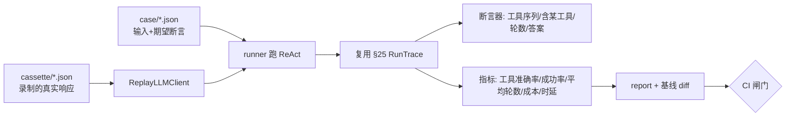
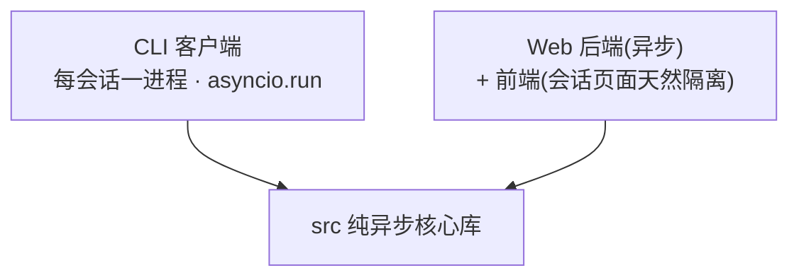
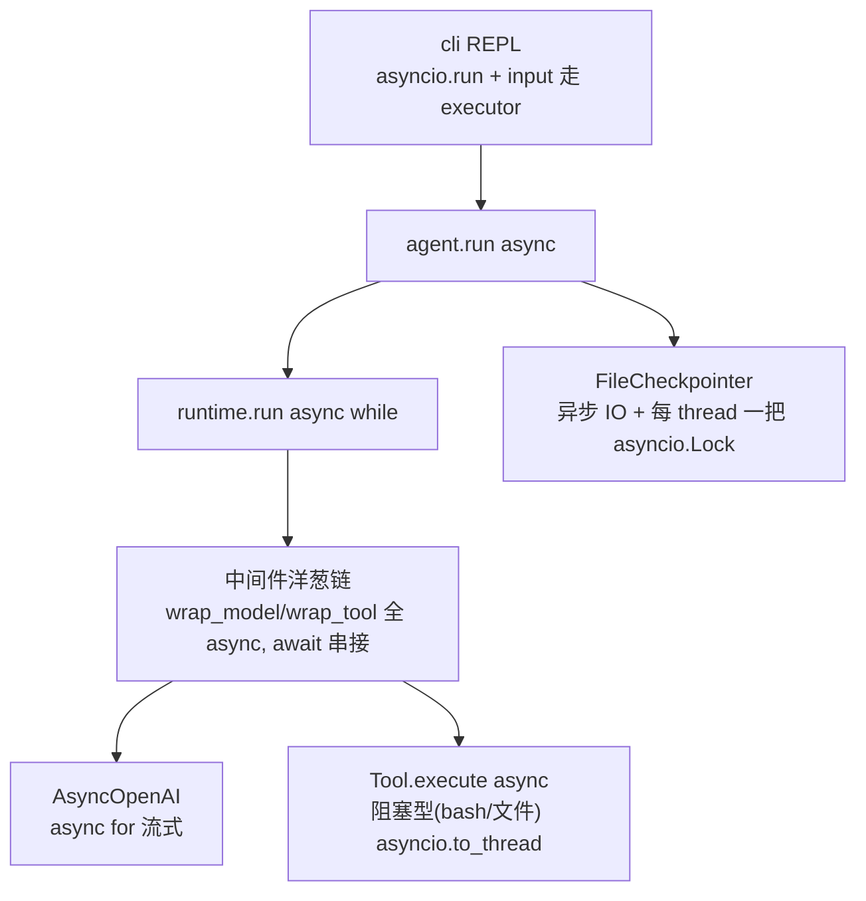
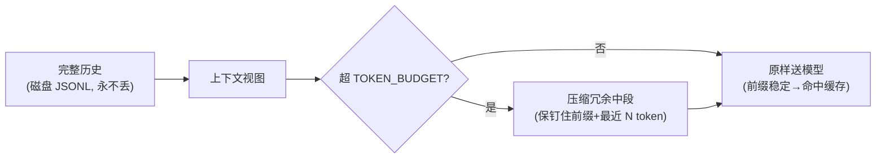
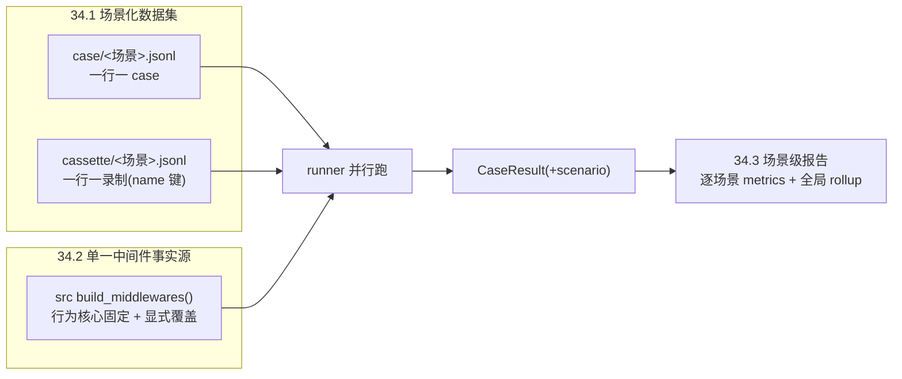
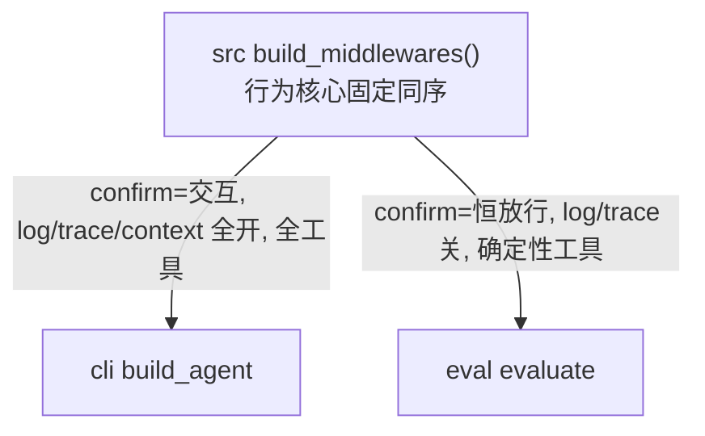
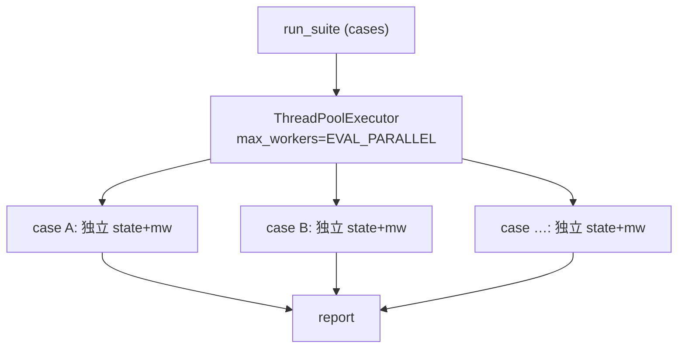
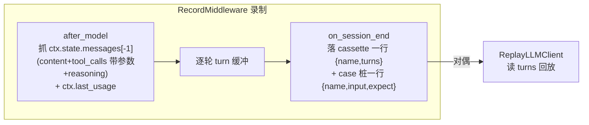
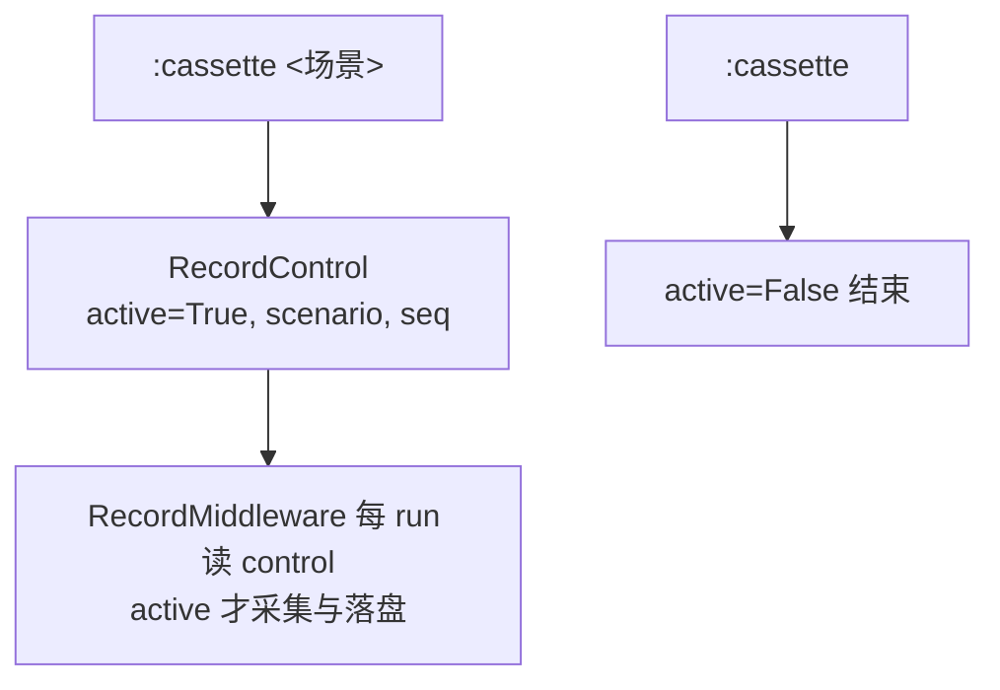

# 详细设计文档（三期）——评测回归 · 全链路异步 · 持久化与分层记忆 · 性能分级

> 本文承接 [01ddd](01ddd.md)（一期 §1–§15）与 [02ddd](02ddd.md)（二期 §16–§23），**章节编号续到 §24–§33**，故跨文档引用仍写「§24」即可对应本文。
> 对应 [PRD.md](../prd/03prd.md)「第三阶段需求」R10–R18，分阶段计划见 [plan/03plan.md](../plan/03plan.md)。
>
> **一次刻意翻案**：一/二期立的「同步优先、内存态、破坏性压缩」三条简化（[01ddd §7.3/§9/§10.3](01ddd.md)、[01 §1.4](../agent-design/01-mental-model.md)）在三期被**有意识地推翻**——目标从「单用户、窗口串行」变为「多会话并发 + 持久化 + 未来 web/飞书前端」。每节先说**为什么现在要翻**，再说**怎么翻而不毁掉既有的清晰**。

## 24. 总览：R10–R18 落点

| 需求 | 落点（新增/改动）| 性质 |
|---|---|---|
| R10 结构化可观测 | `middleware/observe.py`（新）+ `RunContext.trace` + `LLMClient` 回传 `usage` | 评测/分析地基 |
| R11 评测回归 | `eval/` 包（case/cassette/runner/report）+ CI 闸门 | 行为回归网 |
| R12 持久化 | `session/file_checkpointer.py`（新）+ `Message` 判别联合 | 实现已有协议 |
| R13 异步核心 | `LLMClient`/`Middleware`/`Tool`/`runtime`/`agent`/`session` 改 async | 逐层机械转换（边界隔离消费）|
| R14 并行工具 | `runtime._run_tools` 改 `asyncio.gather` | 主循环局部改 |
| R15 缓存+压缩 | 前缀稳定化 + `context.py` 改 token 预算非破坏 | 重构 |
| R16 分级模型路由 | `llm/router.py`（新 `LLMClient` 实现）| 装饰器层 |
| R17 分层记忆 | `memory/` 包（项目级 + 渐进披露 + 语义召回）| 新能力 |
| R18 上线前安全 | 取消/沙箱/多用户/多 provider | 延伸 |

> **架构红线**：除 R13（异步逐层转换 `src`）与 R14（主循环并发）外，其余仍守开闭——落在新中间件 / 新包 / 已有协议实现上，不改既有决策逻辑。R13 只改「调用形态（sync→async）」，**不改「决策逻辑」**，这是它能被评测网（§25）守住零回归的前提。

## 25. 可观测地基：结构化 Trace + token/成本/cache（R10，对应 P15）

**为什么先做它**：三期后续每一刀都改行为；评测要打分、缓存要验证命中、路由要看成本——全部依赖「一次 run 的机读轨迹」。它是 §26 评测的**数据源**，故排在最前。

### 25.1 与已有 Trace/Log 的分工

| | 受众 | 介质 | 开关 | 结构 |
|---|---|---|---|---|
| `Trace`（§11）| 人调试 | stdout | `:trace` 可关 | 文本行 |
| `Log`（§21）| 人审计 | `log/*.log` | 常开 | 半结构化 |
| **`Observe`（新）** | **机器/评测** | **`trace/*.jsonl`** | 常开 | **严格结构化** |

三者同订生命周期钩子、可共用事件采集，但 Observe **产出可被回读为对象**的 JSONL，供评测与成本分析消费。

### 25.2 数据形态

```python
# state.py 增量
class TurnRecord(BaseModel):
    """一轮 model-call 的机读记录。"""
    step: int
    model: str
    tool_calls: list[str]            # 本轮选了哪些工具（名）
    tool_results: list[bool]         # 各工具是否 is_error
    latency_ms: int
    usage: Usage                     # prompt/completion/cache 命中

class Usage(BaseModel):
    prompt_tokens: int
    completion_tokens: int
    cache_hit_tokens: int = 0        # DeepSeek: prompt_cache_hit_tokens
    cache_miss_tokens: int = 0       # DeepSeek: prompt_cache_miss_tokens

class RunTrace(BaseModel):
    run_id: str
    thread_id: str
    turns: list[TurnRecord] = []
    def cost(self, price: dict) -> float: ...   # Σ token × MODEL_PRICE
```

- `LLMClient.chat`（§7.1）**回传 `usage`**：`AIMessage` 不污染。落地选**新增 `on_usage` 回调形参**（与 `on_token`/`on_reasoning` 同风格，`chat` 仍返回 `AIMessage`，对既有调用与一众测试 fake 零破坏），运行时把它挂到 `RunContext.last_usage` 供 ObserveMiddleware 读取。DeepSeek 的 `completion.usage` 含 `prompt_cache_hit_tokens`/`prompt_cache_miss_tokens`，直接映射；流式靠 `stream_options.include_usage` 的尾块取计量。
- `ObserveMiddleware`：`after_model` 收一条 `TurnRecord`，`on_session_end` 把 `RunTrace` 落 `trace/<thread_id>/<run_id>.jsonl`。
- `config.py`：`TRACE_DIR`、`MODEL_PRICE`（档位→每百万 token 单价）。

> 取舍：`usage` 不塞进持久 `AIMessage`（那是对话内容，不该混入计量）；计量挂在瞬态 `RunContext`/`RunTrace` 上，落独立 trace 文件。

## 26. 评测回归体系：录制回放 + 真实冒烟（R11，对应 P16）

**为什么这样设计**：LLM 输出非确定，评测的死穴是「要么 flaky、要么不真实」。解法是**两层分治**——确定性骨架用录制回放（进 CI、零成本零 flaky），真实波动用少量 `@slow` 冒烟。



### 26.1 四个构件（`eval/` 包）

- **case**（`eval/case/*.json`，零依赖、stdlib 可读，未引入 YAML）：`input`、期望断言（`tool_sequence`、`must_call`/`must_not_call`、`max_turns`、`answer_contains` 子串）。
- **cassette**（录制回放，类 VCR）：首跑真实 DeepSeek 把响应录成 fixture；回放时注入 `ReplayLLMClient`（实现 `LLMClient`，按调用序吐录制响应）→ **确定性**。录制与回放共享同一 case。
- **runner**：跑 case → 收 §25 的 `RunTrace` → 跑断言 + 算指标（**工具选择准确率 / 任务成功率 / 平均轮数 / token 成本 / 时延**）。评测运行时**镜像生产中间件栈**（SessionPrefix 系统提示 + Observe + MaxTurn + Approval 自动放行 + Retry），去掉纯 I/O 的 Log/Trace 与单轮永不触发的 Context——否则回放评测测不到这些中间件的回归、在线评测也不反映「真实系统提示下」的模型行为。
- **report**：指标汇总 + 与基线 `baseline.json` diff，标出回归项。

### 26.2 运行与闸门

- `make eval`：录制回放，**离线确定性**，进 CI；回归不过即红（守 src 编排）。
- `make eval-online`：**真实 API 对 case 打分**（注入真实 `DeepSeekClient` 走同一 `evaluate` 链路，软指标，比在线基线 `baseline-online.json`），看「改动后效果是否变差」；无 KEY 优雅跳过。
- `make eval-live`：`@slow` 客户端真实 API 冒烟（最轻量，仅验证「API 通不通」）。
- 关键解耦：`run_case`（回放）与 `run_online`（真实）共用 `evaluate(case, llm, …)`——LLM 注入，回放盒↔真实客户端切换不改打分逻辑。
- `config.py`：`EVAL_DIR`、`EVAL_CASE_DIR`、`EVAL_BASELINE`、`EVAL_ONLINE_BASELINE`。

> 取舍：**离线回放守编排骨架（确定性、零成本、CI），在线打分看模型真实效果（非确定、软指标、比基线）**——两层分治。在线非确定，故宜用 `must_call`/`answer_contains` 软断言、少用精确 `tool_sequence`；评测网的价值在**每次重构后秒级确认零行为回归**，是 §27–§31 敢动刀的底气。

## 27. src 异步核心化（R13，对应 P18，边界隔离消费、无染色之痛）

**为什么翻案**：[01 §1.4](../agent-design/01-mental-model.md) 当初拒绝 async 的理由是「单用户、窗口串行、无并发需求」。三期需求变了——尤其 **web 后端要在单进程/事件循环里并发服务多会话**，同步阻塞的 LLM 调用会卡死事件循环。故 `src` 升级为**纯异步核心库**。

### 27.1 为什么「染色」在这里不构成问题：边界天然隔离

典型的「染色之痛」是**部分采用** async，导致 sync 海洋里到处桥接 async 的地狱。这里不存在——因为我们**整层 async**，且 `src` 作为核心库被消费的每个会话**在边界天然隔离**：

- **CLI**：不同 session 是**不同进程**（开第二个会话 = 新进程），进程内单会话串行，入口 `asyncio.run` 一把梭——不与任何 sync 代码混用。
- **Web**：基于 `src` 另建**异步后端应用 + 前端应用**；前端每个会话页面**自然隔离**，后端 async 端点直接 `await` 核心，无 sync/async 边界摩擦。



因此染色退化为「把 `src` 各层签名机械改成 `async def`」的**一次性工作量**，而非风险。下列每层从 `def` 变 `async def`：



### 27.2 关键设计点

- **LLM**：`deepseek_client.py` 换 `AsyncOpenAI` + httpx async；流式 `async for chunk in stream`。`LLMClient.chat` → `async def`。
- **中间件**：`base.py` 的 6 个生命周期钩子 + 2 个环绕钩子改 `async`；洋葱链由 `handler = lambda c: mw.wrap_model_call(c, nxt)` 变为 `async` 闭包，`await nxt(c)` 串接。
- **工具**：`Tool.execute` → `async`。**CPU/阻塞型工具（bash、文件读写）用 `asyncio.to_thread` 包裹**，绝不在事件循环里直接阻塞——这是 async 化最易踩的坑。
- **会话并发安全**：`FileCheckpointer` 的 IO 异步化；**每 `thread_id` 一把 `asyncio.Lock`**——**同会话串行**（防并发 mutate 同一 `messages`）、**跨会话并发**（不同窗口互不阻塞）。这正是「多窗口同时对话」的落点。
- **CLI**：REPL 的阻塞 `input()` 走 `loop.run_in_executor`，外层 `asyncio.run` 驱动。

> 取舍与代价：`src` 对外形态从同步变异步（唯一现存消费者 CLI 同步重写为 `asyncio.run` 入口，边界干净）。这是**逐层机械转换的工作量，不是风险**——只改调用形态、不改决策逻辑，由 §25 评测网用录制回放守零行为回归才合并。

## 28. 并行工具调用（R14，对应 P19，依赖 §27）

**为什么现在能做**：一条 AIMessage 常含多个 tool_call，§6 一期是 `for call in ai.tool_calls` **串行**。异步化后用 `asyncio.gather` 并发，多工具轮时延从「求和」降到「最慢一个」。

```python
async def _run_tools(self, ctx, ai):
    if self._parallel and len(ai.tool_calls) > 1:
        results = await asyncio.gather(*[self._one(ctx, c) for c in ai.tool_calls])
    else:
        results = [await self._one(ctx, c) for c in ai.tool_calls]
    for call, result in zip(ai.tool_calls, results):   # 按 tool_call_id 对应回灌
        ...
```

### 28.1 两道闸门（不能无脑并行）

- **HITL 不能并发弹窗**：§20 的 `confirm` 是人机交互，多个授权同时弹窗会乱。**授权串行、执行并行**——先顺序收齐所有授权决定，再并发跑获批的工具。
- **副作用竞态**：write/edit/bash 并发可能互相踩（同文件）。策略二选一（设计期定）：(a)**只读工具并行、写工具串行**；(b) 全并行但写工具按资源加锁。默认 (a)，更稳。
- `config.py`：`PARALLEL_TOOL`（开关）、`PARALLEL_TOOL_MAX`（并发上限，护 API 限流）。

> 回灌顺序：OpenAI/DeepSeek 按 `tool_call_id` 配对 ToolMessage，**顺序无关**；但仍按原 `tool_calls` 序回灌以保日志可读。

## 29. 缓存前缀稳定化 + token 预算非破坏压缩（R15，对应 P20）

**两件事一起做，因为它们直接冲突**：缓存要前缀稳定，压缩却改写前缀。

### 29.1 Prompt 缓存：对 DeepSeek 是「别破坏自动缓存」

DeepSeek 的上下文缓存是**服务端自动按前缀命中**（硬盘级，usage 回报 `prompt_cache_hit_tokens`），**不像 Anthropic 要手打 `cache_control` 断点**。所以这里不「实现缓存」，而是**保护前缀可缓存性**：

- system + tools schema 组成的**稳定前缀置顶、顺序固定、逐字节稳定**；volatile 内容（时间戳、reminder、todo 提醒）**不得插在稳定前缀之前**（否则前缀一变全失缓存）。这与 §18「钉住前缀」机制天然契合。
- 用 §25 的 `cache_hit_tokens` **观测命中率**验证，而非凭感觉。

### 29.2 压缩：从「破坏性 + 条数」改「非破坏 + token 预算」

一期 §10.3 压缩是**破坏性摘要**、按**消息条数** `MAX_MSG` 触发。三期升级：

- **触发**：从条数改 **token 预算** `TOKEN_BUDGET`（更贴近真实上下文窗口与成本）。
- **非破坏**：**完整 transcript 仍落盘（§26 持久化）**，压缩**只作用于「进上下文的视图」**——磁盘历史可回溯，丢的只是当轮上下文里的冗余。
- **与缓存的平衡**：压缩改写前缀 → 整段失缓存。故**抬高触发阈值、降低压缩频次**，在「省上下文 token」与「保缓存命中」间取平衡。
- `config.py`：`TOKEN_BUDGET`、`COMPRESS_KEEP_TOKEN`（保留的最近 token 量），`MAX_MSG` 保留兼容或弃用。



## 30. 分级模型路由（R16，对应 P21，分级·其一）

**目标**：按任务复杂度选模型档位——小模型/启发式判路由与简单任务、大模型负责复杂生成，省成本降时延。

```python
class RouterLLMClient:                      # 实现 LLMClient 协议（装饰器层，对上透明）
    """按规则把请求路由到不同档位的具体客户端。"""
    def __init__(self, tiers: dict[str, LLMClient], rule: RouteRule): ...
    async def chat(self, messages, tools, ...):
        tier = self._rule.decide(messages, tools)   # 轮次/历史长度/是否需工具/小模型分类
        return await self._tiers[tier].chat(messages, tools, ...)
```

- **路由信号**：轮次深浅、历史长度、是否携带 tools、（可选）小模型/规则分类器对复杂度打标。
- **透明**：`RouterLLMClient` 自身就是 `LLMClient`，上层 runtime/中间件无感；档位映射 `MODEL_TIER`、规则 `ROUTE_RULE` 进 `config.py`。
- **校准**：路由决策记入 §25 trace，用真实成本/时延/成功率回调规则。

> 评测守护：路由不得降任务成功率。§26 评测集对「路由前/后」对比——**成功率不降、成本下降**才算达标。

## 31. 分层记忆 + 项目级长期记忆（R17，对应 P22，分级·其二）

**这是「MVP→可用 Agent」最实质的一块**（[09 §9.3](../agent-design/09-limitation-and-evolution.md)）。从「窗口内历史」升级为三层记忆，并借鉴 Claude Code 的**项目级 + 渐进式披露**。

### 31.1 三层记忆

| 层 | 是什么 | 存放 | 召回 |
|---|---|---|---|
| 工作记忆 | 当前会话上下文 | `messages`（内存+JSONL）| 全量（受 §29 压缩）|
| 情景记忆 | 跨会话的事件/对话片段 | 项目级 `memory/episodic/` | **按相关度**（向量 top-k）|
| 语义记忆 | 提炼出的稳定事实/偏好 | 项目级 `memory/MEMORY.md` 索引 + 单条文件 | 索引常驻 + body 按需 |

### 31.2 渐进式披露（progressive disclosure，借鉴 Claude Code）

```mermaid
flowchart TD
    index["MEMORY.md 索引<br/>每条 frontmatter: name/description"] -->|常驻注入前缀<br/>(只 description, 省 token)| prefix["§18 会话前缀"]
    query["当前输入"] --> recall["recall: 按相关度命中"]
    recall -->|按需载入 body| ctx["进上下文"]
    body["单条记忆文件 (完整 body)"] -.惰性.-> recall
```

- **项目级隔离**：记忆按**项目路径转义**做目录（复用 §26 的转义逻辑），换项目互不可见——与 Claude Code 项目级记忆一致。
- **索引常驻、body 惰性**：`SessionPrefix`（§18）只注入索引的 `description`（省 token）；完整 body 经 `recall` 工具或相关度触发**按需载入**。这正是「渐进式披露」。
- **语义召回**：情景/语义记忆按**相关度**（向量检索 top-k）召回，而非一期的按时间——`config.py`：`MEMORY_DIR`、`RECALL_TOP_K`、`EMBED_MODEL`。
- **写入时机**：会话结束或显式「提炼」时，把值得长期保留的事实落盘为单条记忆 + 更新索引。

> 取舍：引入向量检索/embedding 是三期最大的「新依赖」；先做项目级文件 + 渐进披露（低成本、高收益），向量召回可作为其上的增量。

## 32. 上线前：取消 · 沙箱 · 多用户 · 多 provider（R18，对应 P23，延伸）

把「单用户 CLI」补成「可接 web/飞书的多用户服务」的安全/健壮性边界。本节按上线目标可裁剪。

- **取消/中断**：异步化后单请求级 `asyncio.CancelledError` 优雅中断——**取消时会话状态须一致**（已落盘的不回滚、未完成的不残留半条 ToolMessage）。替代一期「Ctrl-C 直接断 REPL」。
- **工具沙箱**：bash/文件工具从「正则 + HITL」（§20）升级为真隔离（受限子进程/容器）。一期 §14 列的进阶项，多用户下变硬需求。
- **多用户**：会话从 `thread_id` 扩为 `(user_id, thread_id)` 隔离 + 鉴权 + 限流——接飞书前必需。
- **多 provider**：新增第二个 `LLMClient` 实现（Anthropic/OpenAI）验证抽象；注意**缓存策略按家不同**（DeepSeek 自动前缀缓存 vs Anthropic 显式 `cache_control` 断点），§29 的「保前缀」策略对二者通用，但 Anthropic 还需主动打断点。

## 33. 类型/配置增量小结

- `state.py`：`RunContext.trace: RunTrace`；新增 `TurnRecord`/`Usage`/`RunTrace`。
- `message.py`：`Message` 子类按 `role` 做**判别联合**（§26 持久化往返不丢子类型）。
- `llm/base.py`：`chat` 改 `async` 并回传 `usage`；新增 `RouterLLMClient`、`ReplayLLMClient`。
- `middleware/base.py`：8 个钩子全改 `async`。
- `tool/base.py`：`execute` 改 `async`。
- `session/`：新增 `FileCheckpointer`（JSONL + 路径转义 + 每 thread `asyncio.Lock`）。
- 新增包：`memory/`（项目级分层记忆）、`eval/`（评测）、`middleware/observe.py`。
- `config.py` 增量：`TRACE_DIR`、`MODEL_PRICE`、`EVAL_DIR`/`EVAL_CASE_DIR`/`EVAL_BASELINE`、`SESSION_DIR`、`PARALLEL_TOOL`/`PARALLEL_TOOL_MAX`、`TOKEN_BUDGET`/`COMPRESS_KEEP_TOKEN`、`MODEL_TIER`/`ROUTE_RULE`、`MEMORY_DIR`/`RECALL_TOP_K`/`EMBED_MODEL`。

## 34. 评测回归重构（R11 精化，对应 P16.5）——场景化数据集 · 单一中间件事实源 · 场景报告 · 并行评测

**为什么再动 §26**：P16（§26）已落地可用，但试用后暴露 4 处毛刺，本节是对 §26 的**精化**（非推翻；§26 记录「P16 初版形态」，本节记录其演进）：

1. **数据粒度**：一文件一用例 → 用例一多文件就爆炸，且缺「场景」这一层（无法按场景看表现）。
2. **中间件漂移**：`cli` 的 `build_agent` 与 `eval` 的 `_eval_middlewares` **各写一份栈**——已真实发生过漂移（eval 漏挂 SessionPrefix，系统提示缺失）。
3. **报告粒度**：指标只汇总到「全体用例」，缺「逐场景」汇总。
4. **在线串行**：`run_online` 顺序跑用例，真实 API 延迟下用例一多墙钟线性膨胀。



### 34.1 场景化数据集：jsonl（一文件一场景，一行一 case）

- **case**：`eval/case/<场景>.jsonl`，每行一条 `Case`；文件名 stem = **场景名**。
- **cassette**：`eval/cassette/<场景>.jsonl`，每行 `{"name": <case 名>, "turns": [...]}`。
- **配对**：按 `(场景, name)` **键**查表，**不按行号**——录制重排/增删免疫（行号配对一动就错位）。加载时把场景 cassette 读成 `{name: (responses, usages)}`。
- **`Case.cassette` 字段删除**：场景文件名 + `case.name` 已唯一定位录制，字段冗余。
- **trace 落盘**：`eval/run/<场景>/<case-name>/<run_id>.jsonl`（按场景再分层）。

> 取舍：jsonl 是评测数据集的标准形态（append 友好、一眼看全场景）；**name 键配对**而非行号是关键的健壮性选择。

### 34.2 单一中间件事实源：`build_middlewares` 共享工厂

**问题**：§26 让 eval **另写一份**中间件栈来「镜像」生产，镜像靠手维护必然漂移。**但「完全一致」既不可行也不该**——Log/Trace 是纯 I/O、Approval 在 eval 必须自动放行、registry 在 eval 只能是确定性工具（无 bash/fetch 副作用与网络）。

**原则**：不是「同一个栈」，而是「**单一事实源 + 显式覆盖项**」。在 `src` 抽一个默认装配工厂，`cli` 与 `eval` 都调它，差异收敛成几个**有名字的参数**：

```python
# src/util/stack.py（新增）
def build_middlewares(*, llm, registry, todo_store, settings,
                      confirm,            # Approval 确认函数：cli 交互 / eval 恒放行
                      trace_sink=None,    # None=不挂 TraceMiddleware（eval）
                      log=False,          # 是否挂 LogMiddleware（eval 关）
                      context=True):      # 是否挂 ContextMiddleware（eval 单轮可关）
    ...  # 行为核心恒在、且同序：SessionPrefix → Observe →[Log]→[Trace]→ MaxTurn →[Context]→ Approval → Retry
```



> 取舍：**新增行为中间件只落工厂一处，eval 自动跟上**；cli↔eval 的差异从「两份手维护列表」变成「几个显式开关」，漂移不再是隐性的。放 `src`（被 cli/eval 共同消费的默认装配 profile），符合 [cli/CLAUDE.md](../../cli/CLAUDE.md) 的「业务逻辑留 src、cli 只注入」。

### 34.3 场景级指标报告

- `CaseResult` 加 `scenario: str` 字段。
- `Report` 按 `scenario` 分组 → 每组算一份 `metrics()` + 一个全局 rollup；`render` 出「逐场景表 + 全局汇总」。
- **回归门禁先保持全局**（`GATED_METRICS` 仍比全局基线）。**按场景门禁**（如单独守 `calculator` 场景成功率）列为后续 nice-to-have，本期不做。

> 取舍：#1 落地后此项几乎免费（场景即 jsonl 文件 stem）；先给「逐场景可见性」，不急着上「逐场景闸门」。

### 34.4 并行评测：有界线程池（**不需** P18 的 async 核心）

**关键认知**：eval 并行**不需要把 agent 核心改 async**。用例彼此独立、且是**网络 I/O 密集**（openai/httpx 调用时释放 GIL）；§26 的 `evaluate` **每条 case 已新建**独立 `registry`/`AgentState`/`RunContext`/中间件实例——无跨 case 共享可变态。故直接上 `ThreadPoolExecutor(max_workers=EVAL_PARALLEL)` 跑各 case，即可拿到接近 N× 墙钟提速。



- **与 P18（§27）正交**：§27 是把 runtime/middleware/llm/tool **全链路改 `async def`** 的侵入式重写；线程池**不碰**核心的 sync/async 形态，只在 eval 外层并发跑独立的同步循环。两者互不依赖、互不阻塞。
- **限流**：`EVAL_PARALLEL` 可配（尊重 DeepSeek 速率限制），默认取保守值（如 4）。
- **作用面**：主要收益在 `make eval-online`（真实 API 延迟）；`make eval`（回放）本就秒级，并行可选。

> 取舍：以**零核心改动、零风险**拿走在线评测的墙钟瓶颈（隔离态已就绪，线程池是顺水推舟）；真正的「核心 async/await」仍留 §27/P18，本节不预支。

### 34.5 配置/类型增量小结（本节）

- `config.py`：新增 `EVAL_PARALLEL`（在线/回放并发度）。
- `eval/case.py`：删 `Case.cassette` 字段；`load_*` 改读 `<场景>.jsonl`（场景名 = 文件 stem）。
- `eval/replay.py`：`load_cassette` → 读场景 jsonl 成 `{name: (responses, usages)}`，按 `name` 取。
- `eval/report.py`：`CaseResult` 加 `scenario`；`Report` 加逐场景 `metrics`/`render`。
- `eval/runner.py`：`run_suite` 走线程池；`_eval_middlewares` 删除，改调 `src` 的 `build_middlewares`。
- `src/util/stack.py`（**新增**）：`build_middlewares()`；`cli/main.py` 与 `eval` 同源调用。
- **迁移**：现有 `eval/case/*.json`、`eval/cassette/*.json` 合并为 `eval/case/calculator.jsonl` 等；`Case(... cassette=...)` 的存量测试随字段删除一并更新。

> 与 §26 的关系：本节落地后，§26.1「`case/*.json` 单文件」与「`_eval_middlewares` 镜像栈」的表述被本节取代，届时回填 §26 指向本节，保持单一事实源不漂。

## 35. 在线录制：从真实 CLI 会话录制 cassette + case 桩（R11 延伸，对应 P16.6）

**为什么要做**：§26/§34 建好了回放盒的「**读**」侧（`ReplayLLMClient`），但回放盒至今全靠**手写**——多轮 cassette 要逐字填准 `tool_calls` 参数与 `usage`，既烦又易错，是成长评测集的瓶颈。本节补上「**写**」侧对偶：在真实 CLI 会话里**一键录制**，把模型逐轮响应落成 cassette，并脚手架一条 case 桩。

**为什么 trace 替代不了**：§25 的 `TurnRecord` 是机读**指标**（只存 `tool_calls` 名、时延、token），**不含** assistant 的 `content`/`reasoning_content`、**不含** tool 调用**参数**——而回放恰恰需要这些。故录制不是复用 trace，而是另起一个「保真到可回放」的采集。

### 35.1 RecordMiddleware：ObserveMiddleware 的同形兄弟

录制是 `ReplayLLMClient`（读）的写侧对偶，落点选**中间件**而非包一层 LLMClient——因为它与 §25 的 Observe 同形，且有 `ctx` 可顺手抓用户输入做 case 桩：



- **采集点**：`after_model` 时 `ctx.state.messages[-1]` 即完整 `AIMessage`，`ctx.last_usage` 即本轮 `Usage`；逐轮拼 `{content, reasoning_content, tool_calls:[{name,arguments}], usage}`——与 §34.1 的 `_parse_turns` **完美往返**。
- **粒度**：一次 `run()`（一条用户输入 → 一个 ReAct 循环）= **一条 case = 一行 cassette**，正好被中间件的 `on_session_start`/`on_session_end` 括住（与 Observe 每 run 一份 trace 同粒度）。一段 N 轮对话 = N 条 case。
- **产出两份**：cassette 行（写 `eval/cassette/<场景>.jsonl`，**完整**）+ case 桩行（写 `eval/case/<场景>.jsonl`：`input` 自动取本轮 `HumanMessage`、`expect.tool_sequence` 预填**实际观测序列**）。

### 35.2 `:cassette` 开关：默认关，与 `:trace`/`:stream` 同源

录制默认**关**，经 REPL 命令显式开启，与现有 toggle 一致：

- `:cassette <场景名>`：开始录制到该场景（后续每条用户输入追加一条 case）。
- `:cassette`（录制中，无参）：结束录制。



- **跨层不耦合**：`src` 不能 import `cli`。仿 `TraceMiddleware(sink=make_trace_sink(toggles))` 的做法，在 `src` 定义一个 `RecordControl`（`active`/`scenario`/`seq` 的可变句柄），REPL 的 `:cassette` 命令**改它**，`RecordMiddleware` 每 run **读它**——共享状态、零跨层 import。
- **装配**：`build_middlewares` 加 `record_control: RecordControl | None = None`，给了才挂 `RecordMiddleware`（紧随 Observe）；cli 传一个、eval 传 `None`（评测不录制）。

### 35.3 边界与取舍

- **「发生了什么」可录，「应该发生什么」要人写**：录制只能预填 `expect.tool_sequence`=实际观测；`answer_contains`/`must_not_call` 等**断言是判断**，需你改定。故产出是「完整 cassette + 待补断言的 case 桩」。
- **录制即真实执行**：录制真实会话会**真的执行工具**（bash/write/edit 有副作用）。回放时工具在 eval 的确定性 registry 下**重新执行**——故宜录制「打算进评测集」的确定性工具场景；用了 fetch/bash 的会话，回放期工具结果可能与录制时不同（仅模型响应被回放）。
- **单输入粒度**：eval 的 case 是「单条输入」模型；多轮对话被拆成多条独立 case（每条不带前序记忆）。若要「带上下文记忆的单个 case」是另一种形态，本节不覆盖（列为后续）。
- **流式无影响**：采集在 `after_model`（完整 `AIMessage` 已拼好）发生，`:stream` 开关不影响录制保真。

> 取舍：以一个**与 Observe 同形的薄中间件 + 一个默认关的 toggle**，把"手写多轮回放盒"变成"真实会话一键录制"——成长评测集的成本从「逐字填 JSON」降到「跑一遍 + 补断言」。不引入新抽象（复用 §34.1 cassette 格式与 §25 中间件生命周期），落点最小。

### 35.4 配置/类型增量小结（本节）

- `src/middleware/record.py`（**新增**）：`RecordControl`（`active`/`scenario`/`seq` 可变句柄）+ `RecordMiddleware`（采集→落 cassette + case 桩）。
- `src/util/stack.py`：`build_middlewares` 加 `record_control` 入参（None=不挂）。
- `cli`：`Toggles` 挂录制句柄、`command.py`/`repl.py` 加 `:cassette` 命令；复用 `EVAL_CASSETTE_DIR`/`EVAL_CASE_DIR`。
- 与 §34.1 cassette 格式、§25 中间件生命周期完全复用，无新数据格式。
