# 开发计划文档——最小可用 Agent

> 依据：需求见 [PRD.md](PRD.md)，设计见 [DDD.md](DDD.md)。
> 本文只讲"怎么分阶段做、每阶段做完算数"，不重复设计细节。

---

## 1. 总体策略

- **走通骨架优先**：先用 Fake LLM 把"主循环 + 一个工具"跑通（P2），再并行扩展真实 LLM / 工具 / session / 中间件，最后收口到 CLI 与交付物。
- **测试先行（TDD）**：每个阶段先写测试（Red）→ 实现（Green）→ 重构。离线测试一律注入 `FakeLLMClient`，不打真实 API；真实 API 只留一个 `@slow` 冒烟测试。
- **每阶段可交付**：每个阶段结束时代码可运行、测试全绿、`ruff` 干净，不留半成品。

### 阶段依赖

```mermaid
flowchart TD
    P0[P0 脚手架/环境] --> P1[P1 类型与协议]
    P1 --> P2[P2 Runtime 骨架: Fake LLM + calculator]
    P2 --> P3[P3 真实 DeepSeek + 解析 + 流式]
    P2 --> P4[P4 工具补齐]
    P2 --> P5[P5 Session 管理]
    P2 --> P6[P6 中间件补齐]
    P3 --> P7[P7 CLI 客户端]
    P4 --> P7
    P5 --> P7
    P6 --> P7
    P7 --> P8[P8 交付物: README/录屏/Prompt 记录]
```

P2 是枢纽（走通骨架）；P3–P6 完成骨架后可较独立推进，在 P7 汇合。

---

## 2. 全局完成定义（每个阶段都要满足）

- [ ] 该阶段测试先写、后实现，`uv run pytest` 全绿；
- [ ] 触及代码的测试覆盖率 ≥ 80%（`pytest --cov`）；
- [ ] `uv run ruff check` 与 `ruff format` 干净；
- [ ] 函数 ≤ 50 行、无 `Any`、Google 风格 docstring、依赖显式注入；
- [ ] 关键参数集中在文件顶部 / `config.py`，不硬编码进函数；
- [ ] 文件/文件夹单数命名，目录结构与 [DDD §3](DDD.md) 一致。

---

## 3. 阶段拆解

### P0 — 工程脚手架与环境

| 项 | 内容 |
|---|---|
| 目标 | 项目可跑起来、依赖齐、密钥可读 |
| 任务 | 补依赖（`pytest`、`pytest-cov`）；按 [DDD §3](DDD.md) 建空包骨架；`config.py`：顶层参数（`DEFAULT_MODEL=deepseek-v4-flash`、`DEFAULT_BASE_URL=https://api.deepseek.com`、`MAX_TURN`、`MAX_MSG`、`KEEP_RECENT`、`STREAM`）+ `Settings`（读 `.env`：`DEEPSEEK_API_KEY` 等）；`.env.example` |
| 先写的测试 | `Settings` 能从环境变量加载；包可 import |
| 完成标准 | `uv run pytest` 能跑（≥1 测试）；`ruff` 干净；`.env` 不入库 |

### P1 — 类型与协议（无 I/O 内核）

| 项 | 内容 |
|---|---|
| 目标 | 把数据结构与抽象先立稳，后续都依赖它 |
| 任务 | `message.py`（`ToolCall`/`SystemMessage`/`HumanMessage`/`AIMessage`/`ToolMessage`）；`state.py`（`AgentState` + `RunContext` dataclass）；`llm/base.py`（`LLMClient` Protocol，`chat(..., on_token=None) -> AIMessage`）；`tool/base.py`（`Tool` Protocol + `ToolInfraError`）；`middleware/base.py`（`Middleware`：6 顺序钩子 + 2 环绕钩子，默认空/透传） |
| 先写的测试 | 各消息可构造；`AgentState.messages` 追加；`RunContext` 默认值；`Middleware` 默认钩子无副作用、`wrap_*` 默认透传 |
| 完成标准 | 类型稳定、测试绿、无 `Any` |

### P2 — Runtime 走通骨架（枢纽）⭐

| 项 | 内容 |
|---|---|
| 目标 | 用 Fake LLM 把 ReAct 主循环 + 一个工具端到端跑通 |
| 任务 | `runtime.py`（`AgentRuntime.run` + `_fire` + `_model_chain`/`_tool_chain` 洋葱链）；`tool/registry.py`（`register`/`to_schema`/`execute`：逻辑错→`is_error`，infra 错→抛 `ToolInfraError`）；`tool/calculator.py`（白名单 AST 求值）；测试用 `FakeLLMClient`（预设 `tool_calls` / 最终答案） |
| 先写的测试 | 循环：模型→工具→模型→结束；无 `tool_calls` 即结束；`MaxTurnMiddleware` 超 `ctx.step` 终止 + `_final_text` 兜底非空；calculator `12*8→96`/除零/拒危险表达式；registry schema 与 `execute` 逻辑错包装；**e2e "算 12*8"** |
| 完成标准 | 离线跑通完整 loop；这是后续所有扩展的地基 |

### P3 — 真实 LLM（DeepSeek）+ 解析 + 流式

| 项 | 内容 |
|---|---|
| 目标 | 接真实 API；自实现"SDK 结构 → 内部类型"的解析；同步流式 |
| 任务 | `llm/deepseek_client.py`：`openai` SDK 指向 DeepSeek，function calling；解析 `content`→思考/答案、`tool_calls[].function.arguments`(JSON)→`ToolCall`；`on_token` 同步流式（`for chunk in stream` 累积 + 回调 content 增量）；按 [DDD §7.2](DDD.md) 写清"为何用 SDK"的 docstring |
| 先写的测试 | 用打桩的 SDK 响应对象测解析（tool_calls / 纯文本 / 坏 JSON→错误回灌）；流式：`on_token` 按增量被调用且拼回完整 `AIMessage`、工具轮不触发 `on_token`；`@slow` 真实 API 冒烟（算 12*8） |
| 完成标准 | 真实 API 能回答；流式实时输出；离线解析测试绿 |

### P4 — 工具补齐

| 项 | 内容 |
|---|---|
| 目标 | 满足"≥3 工具"（实有 4 个）+ Schema 自动生成 |
| 任务 | `tool/search.py`(mock)、`tool/weather.py`(mock)、`tool/todo.py`(+`TodoStore` 内存持久) |
| 先写的测试 | 各工具单测；`to_schema` 含全部工具（来自 pydantic `args_model`）；todo add→list→done |
| 完成标准 | 新增工具仅"实现 `Tool` + 注册"，不动 runtime/中间件（开闭原则） |

### P5 — Session 管理

| 项 | 内容 |
|---|---|
| 目标 | 多窗口独立、可追问、记住状态、持久化在 SessionManager |
| 任务 | `session/checkpointer.py`（Protocol + `InMemoryCheckpointer`）；`session/manager.py`（`get_or_create`/`save`/`list_threads`）；`agent.py`（`Agent.run`：召回→追加输入→填 `tools_schema`→`try: runtime.run finally: session.save`） |
| 先写的测试 | 两 `thread_id` 历史互不可见；同一 thread 追问能引用上文（纯对话 + 带工具）；`save` 落盘；**异常时 finally 仍落盘** |
| 完成标准 | 窗口1/窗口2 互不影响；追问正常 |

### P6 — 中间件补齐

| 项 | 内容 |
|---|---|
| 目标 | 把横切关注点拆成独立中间件，主循环零改动 |
| 任务 | `middleware/`：`trace.py`、`max_turn.py`、`context.py`（破坏性摘要）、`memory.py`（todo 提醒注入）、`retry.py`（`wrap_model_call` + `wrap_tool_call`，按 [DDD §7.3](DDD.md) 处理流式重试边界） |
| 先写的测试 | trace 记到对应阶段；max_turn 终止；压缩触发/保留最近 N/摘要置顶；memory 提醒注入；retry 模型/工具 infra 重试；**环绕钩子洋葱嵌套顺序**（首个最外层）；wrap 短路 |
| 完成标准 | 注册顺序正确（MaxTurn 在 Context 前）；逐个 TDD |

### P7 — CLI 客户端

| 项 | 内容 |
|---|---|
| 目标 | 可演示的命令行客户端 |
| 任务 | `cli/main.py`：REPL，`:new`/`:switch`/`:list`/`:trace`/`:stream`；默认 `on_token=print` 实时输出；脚本化演示窗口1「查天气记待办」、窗口2「写周报记待办」来回切换 |
| 先写的测试 | 命令解析的轻量单测（`:new`/`:switch` 等）；端到端切换隔离 |
| 完成标准 | 一条命令跑起来即可复现 PRD 的双窗口场景 |

### P8 — 交付物

| 项 | 内容 |
|---|---|
| 目标 | 对齐 PRD 提交清单 |
| 任务 | `README.md`（运行方式 + 系统设计概览 + **memory 召回时机与放置方式**，引用 [DDD §10](DDD.md)）；`doc/prompt-log.md`（AI Prompt 与问题解决记录）；录屏（双窗口演示 + 工具调用 + 流式）；最终覆盖率报告 |
| 完成标准 | PRD「提交内容」逐项齐全 |

---

## 4. PRD 需求 → 阶段对照（防漏）

| PRD 要求 | 落地阶段 |
|---|---|
| 从零实现核心 Runtime（不依赖框架）| P2 |
| 基本循环 Step1–4 | P2 |
| ≥3 工具 + 注册机制 + Schema 决策 | P2(calculator)、P4 |
| LLM 输出解析（思考/工具/答案）| P3 |
| session 独立 + 追问 + 记住状态 | P5 |
| 最大轮次限制 | P2(MaxTurn)、P6 |
| context 管理 + 基础压缩 | P6(Context) |
| 异常处理 | P2/P3/P5/P6（分层，见 [DDD §11](DDD.md)）|
| 工具 trace / 执行日志 | P6(Trace) |
| 测试用例 | 每阶段（TDD）|
| 真实 LLM API | P3 |
| README / 录屏 / Prompt 记录 | P8 |
| 流式输出（加分）| P3 |

---

## 5. 风险与缓解

| 风险 | 缓解 |
|---|---|
| DeepSeek 密钥/网络不稳 | 离线测试全用 `FakeLLMClient`；真实调用走 `RetryMiddleware`；密钥放 `.env` |
| function calling 返回格式偶发异常（坏 JSON / 空响应）| 解析层显式处理：坏参数→`is_error` 回灌、空响应→重试一次（见 [DDD §11](DDD.md)）|
| 流式 + 重试导致重复 token | 只对"未流出 token 的连接期失败"重试（见 [DDD §7.3](DDD.md)）|
| 破坏性压缩丢早期细节 | MVP 接受；README 注明取舍，留"可逆压缩"为进阶项 |
| 过度设计 | 严守宪法 YAGNI：当前阶段用不到的抽象一律不加 |

---

## 6. 建议提交顺序（Git）

按阶段提交，scope 用 [git-command.md](../.claude/git-command.md) 约定：
`P0 chore(infra)` → `P1/P2 feat(agent)` → `P3 feat(agent)` → `P4 feat(agent)` → `P5 feat(agent)` → `P6 feat(agent)` → `P7 feat(cli)` → `P8 docs(docs)`。
