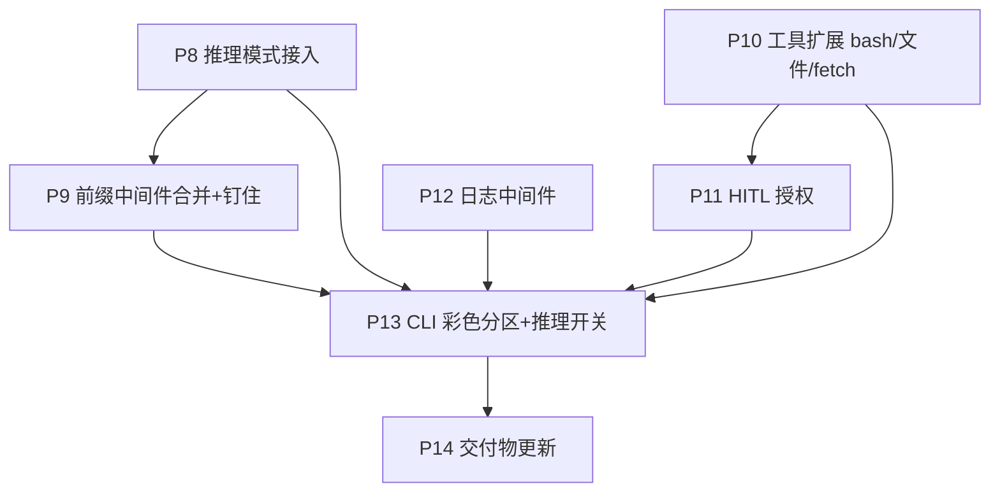

# 开发计划文档（二期）——9 项工程化增强

> 依据：需求见 [PRD.md](../PRD.md)「第二阶段需求」R1–R9，设计见 [DDD.md](../DDD.md) §16–§23。
> 一期（P0–P7）见 [01plan.md](01plan.md)。本文只讲「怎么分阶段做、每阶段做完算数」，不重复设计细节。
> 起始日期 2026-06-25。

---

## 1. 总体策略

- **不推翻一期架构**：仍是「主循环 + 生命周期中间件 + 注册式工具」。每项能力落在**新中间件 / 新工具 / 已有扩展点**，主循环零改动（开闭原则）。
- **测试先行（TDD）**：离线一律注入 `FakeLLMClient` / fake 回调；真实外部（DeepSeek 推理、httpx fetch、bash 执行）只留 `@slow` 冒烟。
- **先地基后体验**：先把「推理字段、前缀中间件、工具、授权、日志」补齐（P8–P12），最后在 CLI 汇合成彩色分区体验（P13），再收口交付物（P14）。

### 阶段依赖

> P8/P10/P12 相互独立，可并行；P9 依赖 P8（钉住前缀与推理无强耦合，但前缀装配在 P8 之后更稳），P11 依赖 P10，P13 汇合全部。

---

## 2. 全局完成定义（每阶段都要满足）

沿用 [01plan.md §2](01plan.md)：`uv run pytest` 全绿、触及代码覆盖率 ≥ 80%、`ruff check`/`format` 干净、函数 ≤ 50 行、无 `Any`、Google docstring、依赖显式注入、关键参数集中 `config.py`、文件/文件夹单数命名。新增：**真实外部调用全部 `@slow`、离线不打网络**。

---

## 3. 阶段拆解

### P8 — 推理模式接入（DeepSeek thinking）｜R7、并修一期 #7

| 项 | 内容 |
|---|---|
| 目标 | 思考从「content 合体」升级为 DeepSeek 原生 `reasoning_content`；解决带工具调用时的回传 400 |
| 任务 | `message.py`：`AIMessage.reasoning_content: str=""`；`config.py`：`REASONING_EFFORT`；`deepseek_client.py`：`reasoning` 开启时在**同一 flash 模型**上传 `reasoning_effort`+`extra_body.thinking`、解析/流式**分别累积** content 与 reasoning_content、`_to_sdk_message` 对 **assistant+tool_calls** 回传 `reasoning_content`（见 [DDD §17](../DDD.md)）。注：`RunContext.reasoning` 开关字段移到 P13（在 CLI `:think` 处才被使用）|
| 先写的测试 | 打桩 SDK 响应：`reasoning_content` 与 `content` 各归位；流式两路增量分别回调；`_to_sdk_message`：带 tool_calls 的 AIMessage 含 `reasoning_content`、最终答案轮不含、SystemMessage 仍正确转 system；`@slow` 推理冒烟 |
| 完成标准 | 离线解析/回传测试绿；推理模式真实可答且不触 400 |

### P9 — 前缀中间件合并 + 钉住前缀｜R5、R6

| 项 | 内容 |
|---|---|
| 目标 | SystemPrompt+Memory 合并为一个会话前缀注入；压缩不再吃掉系统提示 |
| 任务 | `message.py`：`SystemMessage.pinned`；新增 `middleware/prefix.py`（`SessionPrefixMiddleware`：`on_session_start` 拼**静态 01–07 + 动态 ENV08 + 未完成 todo 提醒**并以 pinned 置顶、幂等重注入；`build_runtime_env(settings)` 采集环境）；删除 `middleware/memory.py` 的旧职责并入；`middleware/context.py`：`_split_pinned` **跳过 pinned 前缀**只摘要其后（见 [DDD §18](../DDD.md)）|
| 先写的测试 | 前缀含系统提示 + 动态环境 + todo 提醒且置顶；追问二次 `on_session_start` **不重复累积**（幂等）；超阈值压缩**保留钉住前缀**、只摘要其后历史；无 todo 时不注提醒 |
| 完成标准 | 装配根用 `SessionPrefix` 取代 `Memory`；压缩后前缀仍在 |

### P10 — 工具扩展：Bash / 文件工具 + fetch｜R4、R9

| 项 | 内容 |
|---|---|
| 目标 | 满足 R4 全套工具 + R9 真实抓取；仅「实现 Tool + 注册」，不动 runtime/中间件 |
| 任务 | `tool/base.py`：`Tool.requires_approval: bool=False`；新增 `tool/bash.py`(执行+超时)、`read.py`/`write.py`/`edit.py`/`glob.py`/`grep.py`；`tool/search.py → tool/fetch.py`（httpx GET 用户 URL，网络/超时→`ToolInfraError`、4xx/解析失败→`is_error`）；`config.py`：`BASH_TIMEOUT`/`FETCH_TIMEOUT`（见 [DDD §19](../DDD.md)）|
| 先写的测试 | 各工具单测（read 行号、edit 精确替换、glob/grep 命中、write 落盘、bash 退出码/超时→错误文本）；`write`/`edit` 的 `requires_approval=True`；fetch 用打桩 httpx：成功返回正文、超时→`ToolInfraError`、404→`is_error`；`to_schema` 含全部新工具 |
| 完成标准 | 注册即用；不触 runtime/中间件；fetch 取代 search |

### P11 — HITL 人工授权中间件｜R8（依赖 P10）

| 项 | 内容 |
|---|---|
| 目标 | 有副作用的工具调用前征询授权，拒绝即回灌不中断 |
| 任务 | `tool/registry.py`：加 `requires_approval(name)` 查询；新增 `middleware/approval.py`（`ApprovalMiddleware.wrap_tool_call`：注入的 `requires_approval(name)` ∪ bash 命令命中 `DANGER_PATTERN` → 调注入的 `confirm` 回调；拒绝→`is_error` 回灌）；`config.py`：`DANGER_PATTERN`；组合根注入 `registry.requires_approval` 与基本 y/N `confirm`（见 [DDD §20](../DDD.md)）|
| 先写的测试 | write/edit 触发征询；bash `rm -rf`/`>` 触发、`ls`/`cat` 放行；只读工具放行；`confirm` 返 False→`is_error('用户拒绝授权')` 且 loop 继续；fake confirm 离线可测 |
| 完成标准 | 授权逻辑全在中间件；`src/` 不做终端 I/O（confirm 注入）|

### P12 — 日志中间件｜R1

| 项 | 内容 |
|---|---|
| 目标 | 每会话一份持久日志文件，常开、独立于 `:trace` |
| 任务 | `state.py`：`AgentState.created_at`；`config.py`：`LOG_DIR`/`LOG_NAME_MAXLEN`；新增 `middleware/log.py`（订生命周期钩子→结构化事件写 `log/<created_at>+<首句截断>.log`，文件名清洗）（见 [DDD §21](../DDD.md)）|
| 先写的测试 | 文件名 = 创建时间 + 清洗后首句截断；记录模型决策/工具调用/结果/异常；不受 `:trace` 开关影响；非法字符被清洗 |
| 完成标准 | 跑一轮对话后 `log/` 下生成对应文件且内容完整 |

### P13 — CLI 彩色分区显示 + 推理开关｜R2、R3（汇合）

| 项 | 内容 |
|---|---|
| 目标 | 四通道（用户/工具返回/思考/最终回复）配色区分；`:think` 控推理 |
| 任务 | `state.py`：`RunContext.reasoning`（:think 开关）/`on_event`；`deepseek_client.py` 流式把 content→answer、reasoning_content→reasoning 两路喂事件；runtime/中间件 `after_tool` 喂 tool_result 事件；`cli/render.py`（rich 分通道样式）；`cli/main.py`：注入 `on_event`、新增 `:think`、HITL `confirm` 用终端「允许/拒绝/总是允许」选项（见 [DDD §22](../DDD.md)）|
| 先写的测试 | `parse_command` 认 `:think`；事件分发到对应通道（注入 fake renderer 断言 kind）；推理关时不喂 reasoning 事件；端到端：一次带工具+推理的对话四通道都被渲染 |
| 完成标准 | 一条命令跑起来即见分区彩色输出与可切的推理 |

### P14 — 交付物更新｜原 P8

| 项 | 内容 |
|---|---|
| 目标 | 把二期能力补进交付物 |
| 任务 | `README.md` 增「推理模式 / bash 与文件工具 / HITL 授权 / fetch / 日志 / 彩色 CLI」说明与运行方式；更新录屏（展示授权拦截 + 推理分区）；最终覆盖率报告 |
| 完成标准 | PRD R1–R9 在 README 逐项可查；演示可复现 |

---

## 4. 需求 → 阶段对照（防漏）

| 需求 | 阶段 |
|---|---|
| R7 推理模式 + 修 #7 回传 | P8 |
| R5 系统提示词装配 / R6 中间件合并 | P9 |
| R4 Bash/文件工具 / R9 fetch | P10 |
| R8 HITL 授权 | P11 |
| R1 日志 | P12 |
| R2 彩色 / R3 分区显示 | P13 |
| 交付物（README/录屏）| P14 |

---

## 5. 风险与缓解

| 风险 | 缓解 |
|---|---|
| 推理 + 工具调用未回传 `reasoning_content` → 400 | `_to_sdk_message` 对 assistant+tool_calls 回传；P8 专门测此用例 |
| bash/文件工具越权或误删 | HITL（P11）作唯一副作用闸门；危险模式清单可配；沙箱列进阶项 |
| fetch 抓任意 URL 的安全/超时 | 只抓用户提供 URL（与 INTRO_PROMPT01 一致）；超时→`ToolInfraError` 重试；打桩离线测 |
| 钉住前缀与破坏性压缩边界 | `_split_pinned` 按 pinned 标记切走前缀；P9 专测「压缩保前缀」 |
| 工具暴增致测试/覆盖率压力 | 每工具小而纯、单测独立；I/O 用打桩；遵守 ≤50 行 |
| `src/` 被 CLI I/O 污染（授权/渲染）| 一律注入回调（confirm/on_event），`src/` 不直接读终端 |

---

## 6. 建议提交顺序（Git）

scope 用 [git-command.md](../../.claude/git-command.md) 约定：
`P8 feat(agent)` → `P9 refactor(agent)` → `P10 feat(agent)` → `P11 feat(agent)` → `P12 feat(agent)` → `P13 feat(cli)` → `P14 docs(docs)`。
