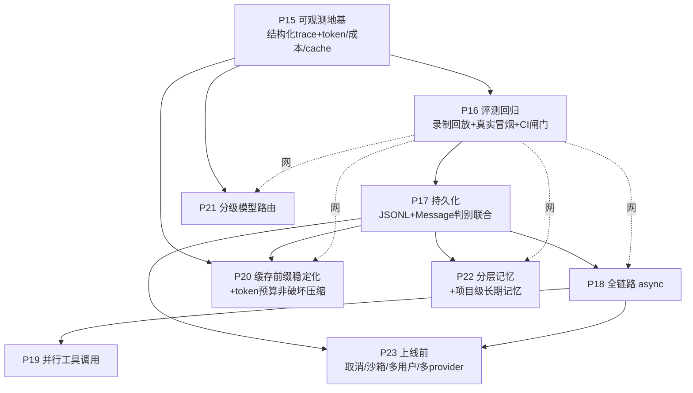

# 开发计划文档（三期）——评测回归 · 全链路异步 · 持久化与分层记忆 · 性能分级

> 依据：需求见 [PRD.md](../prd/03prd.md)「第三阶段需求」R10–R18，设计见 [DDD3.md](../ddd/03ddd.md) §24–§33。
> 一期（P0–P7）见 [01plan.md](01plan.md)，二期（P8–P14）见 [02plan.md](02plan.md)。本文只讲「怎么分阶段做、每阶段做完算数」，关键设计决策以「设计要点」内联标注、细节随后回填 DDD。
> 起始日期 2026-06-26。

---

## 1. 总体策略

- **先建网，再动刀**：三期的核心动作（异步化、并行、缓存、压缩重构）都会**改变 Agent 行为**，没有回归网就是盲飞。因此 **P15 可观测 + P16 评测回归** 是一切的地基，必须先做、先绿（这也回应「评测最重要」的排序）。
- **异步核心，边界隔离消费（无染色之痛）**：`src` 升级为纯异步核心库，被 CLI（不同 session 不同进程）与未来 web（异步后端 + 前端、会话页面天然隔离）消费。因为**整层 async + 消费端会话天然隔离**，不存在 sync/async 混用的「染色之痛」——代价只是把 `src` 各层签名机械改成 `async def`（见 [DDD3 §27](../ddd/03ddd.md)/P18）。
- **持久化是异步的前置**：并发会话必须先有**durable、隔离、可序列化**的状态，否则并发 + 内存态会同时踩「丢状态」和「竞态」两个坑。故 P17 排在 P18 之前。
- **测试先行（TDD）不变**：离线一律注入 fake；真实外部（DeepSeek、httpx、bash）只留 `@slow` 冒烟。三期新增**录制回放（cassette）**作为评测的确定性来源。
- **能力分核心与延伸**：P15–P20（网 + 持久化 + 异步 + 并行 + 缓存/压缩）是三期核心；P21–P23（分级路由 + 分层记忆 + 上线前安全/多 provider）是把「MVP→可用产品」补齐的延伸，可按需推进。

### 阶段依赖

> P15→P16 是硬地基；P16 作为「回归网」虚线护住其后所有改动。P17 是 P18/P20/P22 的共同前置。P19 依赖 P18（asyncio.gather）。P21/P23 相对独立，可后置。

---

## 2. 全局完成定义（每阶段都要满足）

沿用 [02plan §2](02plan.md)：`uv run pytest` 全绿、触及代码覆盖率 ≥ 80%、`ruff` 干净、函数 ≤ 50 行、无 `Any`、Google docstring、依赖显式注入、关键参数集中 `config.py`、文件/文件夹单数命名、真实外部调用全部 `@slow`。

三期新增：
- **异步纪律**：async 函数不混阻塞 I/O（阻塞调用走 `run_in_executor`）；离线测试用 `pytest.mark.asyncio` + fake async 客户端，不打网络。
- **行为回归**：凡改动主循环/中间件/LLM 客户端的阶段，必须先跑 P16 评测集（录制回放）确认零行为回归，再合并。

---

## 3. 阶段拆解

### P15 — 可观测地基：结构化 Trace 持久化 + token/成本/cache 统计｜R10

| 项 | 内容 |
|---|---|
| 目标 | 把「一次 run」沉淀为**结构化轨迹**：每轮 model 输入摘要/输出、tool 选择与参数、各阶段耗时、usage（prompt/completion/`prompt_cache_hit_tokens`/`miss`）、估算成本。评测要打分、缓存要观测，都依赖它 |
| 任务 | `state.py`：`RunContext` 挂 `trace: RunTrace`（逐轮累积 `TurnRecord`）；`llm/base.py`/`deepseek_client.py`：`chat` 返回携带 `usage`（含 cache 命中字段）；新增 `middleware/observe.py`（订生命周期钩子→把 `TurnRecord` 写结构化 JSONL `trace/<thread_id>/<run_id>.jsonl`）；`config.py`：`TRACE_DIR`、`MODEL_PRICE`（每百万 token 单价，用于成本估算）。**与已有 `Log` 区别**：Log 是人读审计，Observe 是机读评测/分析（见 [DDD3 §25](../ddd/03ddd.md)）|
| 先写的测试 | 打桩 SDK usage（含 `prompt_cache_hit_tokens`）→ `TurnRecord` 各字段归位；一次「带工具 + 多轮」run 的 trace 含每轮决策/工具/耗时/token；成本估算 = token×单价；JSONL 可被回读为 `RunTrace` |
| 完成标准 | 跑一轮对话后 `trace/` 下生成可机读 JSONL；token 与 cache 命中可见 |

### P16 — 评测回归体系：录制回放 + 真实冒烟（混合）+ CI 闸门｜R11

| 项 | 内容 |
|---|---|
| 目标 | 建立针对 **Agent 行为** 的评测集与回归。**确定性骨架**用录制回放（零成本零 flaky、进 CI），**真实波动**用少量 `@slow` 真实 API 冒烟 |
| 任务 | 新增 `eval/` 包：①`case` 格式（`input` + 期望断言：tool 选择序列、是否含某工具、最终答案匹配、最大轮数）；②`cassette`（录制真实 DeepSeek 响应为 fixture，回放时注入 `ReplayLLMClient` 喂录制响应→确定性）；③`runner`（跑 case → 收 P15 的 `RunTrace` → 算指标：**工具选择准确率 / 任务成功率 / 平均轮数 / token 成本 / 时延**）；④`report`（指标汇总 + 与基线 diff）。`Makefile`：`make eval`（回放，CI 用）/`make eval-live`（`@slow` 真实冒烟）；`config.py`：`EVAL_DIR`、`EVAL_CASE_DIR`（见 [DDD3 §26](../ddd/03ddd.md)）|
| 先写的测试 | 录制 cassette → 回放产出确定性轨迹；断言器：tool-序列匹配/含某工具/轮数上限各自命中与失败；指标计算正确；基线 diff 能标出回归；`@slow` live 冒烟跑通真实一例 |
| 完成标准 | `make eval` 离线确定性全绿；CI 挂 `make eval`，回归不过即红；≥1 例 `@slow` 真实冒烟可跑 |

### P16.5 — 评测回归重构：场景化数据集 · 单一中间件事实源 · 场景报告 · 并行评测｜R11 精化

| 项 | 内容 |
|---|---|
| 目标 | 精化 P16 的 4 处毛刺：数据粒度（一文件一用例→爆炸、缺场景层）、中间件漂移（cli 与 eval 各写一份栈）、报告粒度（只到用例缺场景）、在线串行（用例多则墙钟线性膨胀） |
| 任务 | ①**场景化数据集**：`case`/`cassette` 改 `<场景>.jsonl`（一文件一场景、一行一 case），按 `(场景,name)` 键配对而非行号，删冗余 `Case.cassette` 字段，trace 落 `eval/run/<场景>/<case>/`；②**单一中间件事实源**：抽 `src/util/stack.py::build_middlewares`，cli 与 eval 同源调用，差异收敛为显式开关（confirm/log/trace_sink/context）；③**场景级报告**：`CaseResult` 加 `scenario`，`Report` 逐场景 `metrics`/`render` + 全局 rollup（门禁仍全局）；④**并行评测**：`run_suite` 走 `ThreadPoolExecutor`（用例已隔离、I/O 密集），`eval/config.py` 加 `EVAL_PARALLEL`，与 P18 async 核心正交（见 [DDD3 §34](../ddd/03ddd.md)）|
| 先写的测试 | 场景 jsonl 解析 + scenario 注入；cassette 按 name 键查表；`build_middlewares` cli 全开/eval 关 I/O 的栈顺序；逐场景指标分组互不混淆；`run_suite` parallel>1 结果保序、name 配对正确、成功率 100% |
| 完成标准 | `make eval` 场景化全绿、报告按场景出指标；cli 与 eval 中间件单一来源不漂；在线评测可并发（`EVAL_PARALLEL` 可配） |

### P16.6 — 在线录制：从真实 CLI 会话录制 cassette + case 桩｜R11 延伸

| 项 | 内容 |
|---|---|
| 目标 | 补上回放盒的「写」侧对偶：在真实 CLI 会话里一键录制，把模型逐轮响应落成可回放的 cassette，并脚手架 case 桩——告别手写多轮回放盒的烦琐易错 |
| 任务 | 新增 `src/middleware/record.py`：`RecordControl`（`active`/`scenario` 可变句柄）+ `RecordMiddleware`（`after_model` 采集完整 `AIMessage`+`usage`，`on_session_end` 落 cassette 一行 + case 桩一行，名 `<场景>-NN` 自增）；`build_middlewares` 加 `record_control`/`cassette_dir`/`case_dir`（给了才挂、紧随 Observe），eval 不挂；cli 加 `:cassette <场景>` 命令（默认关，REPL 改句柄、中间件读句柄，跨层零 import，仿 `make_trace_sink`），落盘复用 `EVAL_CASSETTE_DIR`/`EVAL_CASE_DIR`（见 [DDD3 §35](../ddd/03ddd.md)）|
| 先写的测试 | active=False 不落盘；active 录全 turns（含 tool_calls 参数 + usage）+ case 桩（input + 观测 tool_sequence）；同场景多 run 用例名自增；`build_middlewares` 给 record_control 才挂 RecordMiddleware；端到端：录出的 cassette 可被 `run_case` 回放通过（写↔读对偶闭环）|
| 完成标准 | CLI `:cassette <场景>` 录一段会话即在 `eval/` 生成可回放 cassette + 待补断言 case 桩；`make eval` 对录得用例（补断言后）可跑 |

### P17 — 持久化：JSONL 落盘 Checkpointer + Message 判别联合序列化｜R12

| 项 | 内容 |
|---|---|
| 目标 | 会话状态从进程内 dict 升级为**本地 JSONL 持久化**，进程退出不丢；解决 JSON 往返丢 `Message` 子类型的坑（[04 §4.4](../agent-design/04-data-model-and-session.md)）|
| 任务 | `message.py`：给 `Message` 子类做 **pydantic 判别联合** `AnyMessage`（按 `role` 加 `discriminator`，反序列化还原 Human/AI/Tool/System），`AgentState.messages` 用之；新增 `session/file_checkpointer.py`（实现已有 `Checkpointer` 协议：**扁平项目本地目录** `<SESSION_DIR>/<thread_id>.jsonl`——`.session` 已在项目内且 gitignore，本身即项目隔离，故**不做路径转义**；首行 meta + **每条「非钉住」消息一行追加写**，崩溃安全、不重写整文件；**钉住前缀不入盘**——由 `SessionPrefix` 每轮重注入，存它只会过期；空会话不落盘）；`SessionManager.previews()` 出 `(thread_id, created_at, 首条用户消息)` 供 CLI 展示；组合根把 `InMemoryCheckpointer` 换注入 `FileCheckpointer`；`config.py`：`SESSION_DIR`；CLI：`thread_id` 改 **uuid4**（取代 `w1` 计数），`:switch`→`:resume`（按 `:list` 序号恢复）、`:list`/`:resume` 以**首句**展示不暴露 uuid（见 [DDD3 §32](../ddd/03ddd.md)）|
| 先写的测试 | 判别联合：含 tool_calls 的 AIMessage / ToolMessage / pinned System 各自往返**类型不丢**；`FileCheckpointer.put→get` 还原完整历史；追加写不重写整文件；钉住前缀不入盘、非钉住 System 保留；空会话不落盘；`list_threads` 列出磁盘已有；进程重启（新实例读同目录）历史仍在；`previews` 取首句为标题；CLI 会话按 uuid 隔离、`:resume <序号>` 切回、`:list` 以首句展示不露 uuid |
| 完成标准 | 重启 CLI 后旧会话历史可 `:resume` 续上；评测集（P16）对持久化前后零行为回归（eval 自带隔离态、不接 `FileCheckpointer`）|
| 已知边界 | 破坏性压缩（`ContextMiddleware`，≥`MAX_MSG` 触发）与追加写的协调留到 P20「非破坏压缩、完整 transcript 落盘」（[§29](../ddd/03ddd.md)）；P17 会话普遍在阈值内，磁盘 JSONL 即完整历史 |

### P18 — src 异步核心化｜R13（边界隔离消费，无染色之痛）

| 项 | 内容 |
|---|---|
| 目标 | 把 LLM 调用 / 中间件 / 工具 / runtime / agent / session IO **整链路异步化**，支撑多会话并发与未来 web/飞书 |
| 任务 | `llm/base.py`：`LLMClient.chat` → `async def`；`deepseek_client.py`：用 `AsyncOpenAI` + httpx async，流式改 `async for`；`middleware/base.py`：`wrap_model_call`/`wrap_tool_call` 与 6 个生命周期钩子改 `async`，洋葱链 `await` 串接；`tool/base.py`：`Tool.execute` → `async`（CPU/阻塞型工具如 bash 用 `asyncio.to_thread` 包裹，不阻塞事件循环）；`runtime.py`/`agent.py`：主循环改 `async`；`session/`：IO 改 async + **每 `thread_id` 一把 `asyncio.Lock`**（同会话串行、跨会话并发）；`cli/`：REPL 阻塞 `input()` 走 `run_in_executor`，`asyncio.run` 驱动（见 [DDD3 §28](../ddd/03ddd.md)）|
| 先写的测试 | `pytest.mark.asyncio` + fake async LLM：主循环 `await` 跑通；中间件洋葱链异步串接顺序正确；bash 工具在事件循环里不阻塞；同 thread 并发请求被锁串行、不同 thread 并发不互阻；`@slow` 真实异步冒烟 |
| 完成标准 | 两个窗口可**同时**各跑一轮且互不阻塞；评测集（P16，录制回放层也异步化）零行为回归 |

### P19 — 并行工具调用｜R14（依赖 P18）

| 项 | 内容 |
|---|---|
| 目标 | 一条 AIMessage 含多个 tool_call 时**并发执行**（`asyncio.gather`），缩短多工具轮时延 |
| 任务 | `runtime.py` `_run_tools`：`asyncio.gather` 并发跑各 tool_chain，**结果按 tool_call_id 正确回灌**（顺序无关、id 对应）；**副作用闸门**：需授权工具（write/edit/bash）的 HITL `confirm` 不能并发弹窗→**授权串行、执行可并行**，或退化为「只读工具并行、写工具串行」；`config.py`：`PARALLEL_TOOL`（开关）、`PARALLEL_TOOL_MAX`（并发上限）（见 [DDD3 §29](../ddd/03ddd.md)）|
| 先写的测试 | 3 个只读工具并发 → 总耗时 ≈ 最慢一个而非求和（注入可控延迟 fake）；结果按 id 正确配对、回灌顺序不串；含写工具时授权串行触发、不并发弹窗；某工具 `InfraError` 不拖垮其余 |
| 完成标准 | 多只读工具轮时延显著下降；HITL 与副作用安全；评测集零回归 |

### P20 — Prompt 缓存前缀稳定化 + token 预算非破坏压缩｜R15

| 项 | 内容 |
|---|---|
| 目标 | 提升 DeepSeek **自动前缀缓存命中**（省成本/降时延）；把破坏性压缩升级为**按 token 预算触发的非破坏压缩** |
| 任务 | **缓存**：保证「system + tools schema」稳定前缀**置顶且顺序固定**，volatile 内容（时间戳/reminder）不得插在稳定前缀之前；用 P15 的 cache 命中率观测验证。**压缩**：`context.py` 触发条件从消息条数 `MAX_MSG` 改为 **token 预算**；**完整 transcript 仍落盘（P17）、只压缩进上下文的视图**（非破坏、可回溯）；压缩会改写前缀→**整段失缓存**，故抬高触发阈值、减少压缩频次以平衡缓存；`config.py`：`TOKEN_BUDGET`、`COMPRESS_KEEP_TOKEN`，弃用/保留 `MAX_MSG` 兼容（见 [DDD3 §30](../ddd/03ddd.md)）|
| 先写的测试 | 稳定前缀在多轮间字节一致（可被缓存）；插入 reminder 不破坏前缀顺序；按 token 预算触发压缩（注入可控 token 计数）；压缩后**磁盘完整历史不丢**、仅上下文视图缩短；P15 trace 中 cache 命中率上升 |
| 完成标准 | 多轮对话 cache 命中可见提升；压缩非破坏且可回溯；评测集零回归 |

### P21 — 分级模型路由｜R16（分级·其一）

| 项 | 内容 |
|---|---|
| 目标 | 按任务复杂度路由模型档位：**小模型/启发式判路由与简单任务，大模型负责复杂生成**，省成本降时延 |
| 任务 | 新增 `llm/router.py`（`RouterLLMClient` 实现 `LLMClient`：依据轮次/历史长度/是否需工具/小模型分类，选 `model` 档位转发给具体客户端）；`config.py`：`MODEL_TIER`（档位→model id 映射）、`ROUTE_RULE`（路由阈值/规则）；用 P15 成本/时延信号校准（见 [DDD3 §31](../ddd/03ddd.md)）|
| 先写的测试 | 简单问候→小档、含复杂工具规划→大档（注入可控分类 fake）；路由决策记入 P15 trace；档位映射可配；路由层对上层透明（仍是 `LLMClient`） |
| 完成标准 | 路由按规则生效、决策可观测；评测集任务成功率不降而成本下降 |

### P22 — 分层记忆 + 项目级长期记忆（渐进式披露 + 语义召回）｜R17（分级·其二）

| 项 | 内容 |
|---|---|
| 目标 | 从「窗口内历史」升级为**分层记忆**：工作记忆（当前上下文）/ 情景记忆（跨会话事件）/ 语义记忆（提炼事实）；长期记忆**项目级**、借鉴 Claude Code 的**渐进式披露**（索引常驻 + body 按需召回）|
| 任务 | 新增 `memory/` 包：①项目级目录（路径转义，复用 P17）存 `MEMORY.md` 索引（每条 frontmatter `name/description`）+ 单条记忆文件（body）；②`SessionPrefix` 只注入**索引**（description 常驻、省 token），完整 body 经 `recall` 工具或相关度触发**按需载入**（progressive disclosure）；③语义召回：情景/语义记忆按**相关度**（向量检索）召回而非按时间；④记忆写入：会话结束/显式提炼时落盘。`config.py`：`MEMORY_DIR`、`RECALL_TOP_K`、`EMBED_MODEL`（见 [DDD3 §32](../ddd/03ddd.md)）|
| 先写的测试 | 索引注入前缀、body 不全量入上下文（渐进披露）；`recall` 按相关度取 top-k（注入 fake embedder）；跨会话：A 会话写入的语义记忆在 B 会话可召回；项目隔离：换项目目录互不可见 |
| 完成标准 | 跨会话长期记忆可召回、按相关度而非时间；上下文 token 因渐进披露下降；评测集（含「记得上文」用例）通过 |

### P23 — 上线前：取消/中断 · 工具沙箱 · 多用户鉴权隔离限流 · 多 provider｜R18（延伸·接飞书前）

| 项 | 内容 |
|---|---|
| 目标 | 把「单用户 CLI」补齐为「可接 web/飞书的多用户服务」所需的安全与健壮性边界 |
| 任务 | **取消**：单请求级 `asyncio.CancelledError` 优雅中断（不污染会话状态）；**沙箱**：bash/文件工具从「正则+HITL」升级为真隔离（容器/受限子进程，列进阶）；**多用户**：会话按 user 维度隔离、鉴权、限流（接飞书前必需）；**多 provider**：新增第二个 `LLMClient` 实现（Anthropic/OpenAI）验证抽象 + 各家缓存策略差异。本阶段可按上线目标裁剪/拆分（见 [DDD3 §33](../ddd/03ddd.md)）|
| 先写的测试 | 运行中取消→状态一致不残留；越权命令被沙箱拦；多 user 数据隔离 + 超限被限流；第二 provider 注入即用、评测集对其可跑 |
| 完成标准 | 取消安全、多用户隔离、第二 provider 可切换；为前端接入扫清安全障碍 |

---

## 4. 能力 → 阶段对照（防漏）

| 能力（你的 6 项 + 补充） | 阶段 |
|---|---|
| 结构化可观测（评测前置，补充项）| P15 |
| ① 评测回归体系（混合）+ CI 闸门 | P16 |
| ③ 会话持久化（本地 JSON/JSONL + 哈希式目录）| P17 |
| ② 同步改异步（src 异步核心，边界隔离消费）| P18 |
| ④ 并行工具调用 | P19 |
| ⑤ Prompt 缓存 / KV 复用（+ token 预算非破坏压缩，补充项）| P20 |
| ⑥ 分级·模型路由 | P21 |
| ⑥ 分级·分层记忆 + ③ 项目级长期记忆（渐进披露）| P22 |
| 取消 / 沙箱 / 多用户 / 多 provider（补充项·接飞书前）| P23 |

---

## 5. 风险与缓解

| 风险 | 缓解 |
|---|---|
| async 逐层转换面广、易引入回归 | 消费端会话天然隔离、整层 async 无 sync/async 混用；P16 评测网先行，P18 只改「调用形态」不改「决策逻辑」，靠录制回放逐阶段守零回归 |
| 阻塞 I/O（bash/文件）卡死事件循环 | 一律 `asyncio.to_thread`/`run_in_executor` 包裹；P18 专测「bash 不阻塞循环」 |
| 同会话并发 mutate 竞态 | 每 `thread_id` 一把 `asyncio.Lock`，同会话串行、跨会话并发 |
| JSON 往返丢 Message 子类型 | pydantic 判别联合（按 role）；P17 专测各子类型往返 |
| 并行工具的副作用竞态 / HITL 并发弹窗 | 授权串行、执行并行，或只读并行写串行；P19 专测 |
| 非破坏压缩与缓存命中互相拉扯 | 完整历史落盘、只压上下文视图；抬高压缩阈值减少失缓存；P15 观测命中率校准 |
| LLM 评测 flaky / 成本 | 确定性回放进 CI，真实 API 仅 `@slow` 少量冒烟；指标看趋势不卡单点 |
| 评测集随代码腐烂 | CI 闸门：回归不过不许合并；基线 diff 显式标注 |

---

## 6. 建议提交顺序（Git）

scope 用 [git-command.md](../../.claude/git-command.md) 约定：
`P15 feat(observe)` → `P16 feat(eval)` → `P17 feat(session)` → `P18 refactor(agent)!` → `P19 feat(runtime)` → `P20 perf(agent)` → `P21 feat(llm)` → `P22 feat(memory)` → `P23 feat(security)`。

> 注：P18 改 `src` 对外形态（同步→异步），按约定加 `!`；非「染色之痛」——整层 async 且消费端会话天然隔离，唯一现存消费者 CLI 同步重写为 `asyncio.run` 入口，边界干净。
