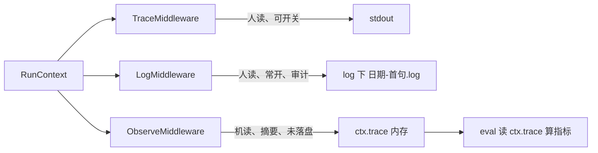
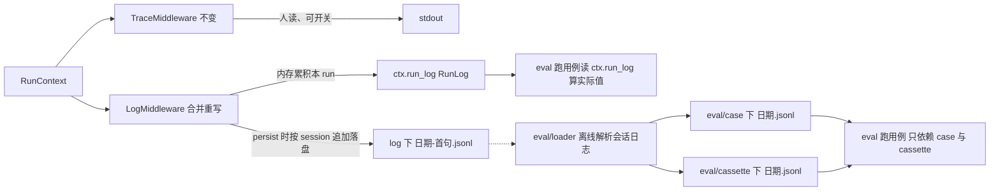

# 01 结构化运行日志（RunLog）与离线造 case

> 重构主题：把 **LogMiddleware（人读审计）** 与 **ObserveMiddleware（机读摘要）** 合并为**一份完整、机读、可回读的结构化运行日志**；并据此提供**离线 loader**，从真实会话日志解析出评测 `case` 与 `cassette`。
> 关联设计：[DDD §21 Log](../ddd/02ddd.md)、[DDD §25 TurnRecord/Observe](../ddd/03ddd.md)、[DDD §34 中间件栈](../ddd/03ddd.md)、[DDD §35 Record](../ddd/03ddd.md)。
> 确认日期：2026-06-30。

---

## 1. 背景与动机

当前可观测分三套中间件，信息高度重叠却各自残缺：

| 中间件 | 落点 | 性质 | 消费方 |
|---|---|---|---|
| [TraceMiddleware](../../src/middleware/trace.py) | stdout（可注入 sink） | 人读、可开关、调试 | CLI `:trace` |
| [LogMiddleware](../../src/middleware/log.py) | `log/<时间>-<首句>.log` | **人读**、常开、审计 | 人 |
| [ObserveMiddleware](../../src/middleware/observe.py) | `trace/<thread>/<run>.jsonl` | **机读**、`TurnRecord` 摘要 | eval（内存） |

核心问题：

1. **同一份信息的两种残缺投影**：Log 有正文（user/model 正文、工具入参出参）但无结构；Observe 有结构（`TurnRecord`）但**只存摘要、不含正文**（仅工具名、是否出错、时延、usage）。
2. **Observe 当前根本没落盘**——[observe.py:64](../../src/middleware/observe.py) 的 `_write` 被注释，它只在内存往 `ctx.trace` 累积给 eval 用；`read_trace` 无任何调用方。
3. 想"后续据日志回放/造 case"时，两份都不够：摘要缺正文不可回放，人读日志不可机器解析。



---

## 2. 目标

合并 Log + Observe 为**一个仍叫 `LogMiddleware`** 的中间件，产出**一份完整的结构化运行日志**：

- **完整**：事件级，逐条记录 user / model / tool_result，**含正文 + 每轮指标**，足以回放整段对话并派生任何摘要。
- **机读**：JSONL，可被 `RunEvent.model_validate_json` 往返。
- **按 session 一份、跨 run 追加**：文件名沿用旧 Log 的 `日期-首句`；同一 session 内多次 run 追加进同一文件，新建/重启 session 才另起新文件。
- **单一来源**：cost / 工具序列 / 轮数 / 时延等摘要**加载时派生**，不再单独持久化 `TurnRecord` 这类"trace 副产物"。
- **可据其离线造用例**：提供 loader 解析会话日志 → 生成 `eval/case` 与 `eval/cassette`（场景按日期命名）。

同时**取消**旧的人读审计排版（改为机读 JSONL，文件名规则不变）。

---

## 3. 决策记录（2026-06-30 已确认）

| # | 决策 | 选择 | 含义 |
|---|---|---|---|
| D1 | 日志粒度 | **事件级·完整** | 每行一个生命周期事件，带正文与指标，可回放、可派生摘要 |
| D2 | TraceMiddleware 去留 | **保留不动** | stdout 实时调试通道与持久化结构化日志正交，本次不动它 |
| D3 | loader 定位 / eval 依赖 | **loader 解析 log → 生成 case+cassette** | eval 跑用例**只依赖 `eval/case` 与 `eval/cassette` 的 jsonl，绝不读 log 文件**；eval 运行期算"实际值"仍读内存 `ctx.run_log`（非文件，不违反） |
| D4 | 与 RecordMiddleware 关系 | **保留 Record，loader 并存** | `:cassette` 内联录制照旧；结构化日志 + loader 是另一条**独立**的离线造用例路径 |
| D5 | 中间件命名 | **继续用 `LogMiddleware`** | 合并落到 `src/middleware/log.py`（重写），**删除 `observe.py`** |
| D6 | 落盘目录与文件名 | **`log/` + `日期-首句`** | 复用 `LOG_DIR="log"` 与 `LOG_NAME_MAXLEN`；文件名 = `created_at-清洗截断的首句`，扩展名改 `.jsonl`（机读） |
| D7 | loader 产物 | **case + cassette，场景按日期命名** | 场景名 = 日志 `created_at` 的 `%Y%m%d`；同名 case/cassette 行按 `name` 配对 |
| D8 | loader 入口 | **CLI + make 命令** | `python -m eval.loader <path>` + `make eval-case` |
| D9 | 文件粒度 | **按 session（thread）一份、跨 run 追加** | 已有 session 追加、新建/重启 session 另起新文件（凭 `created_at` 区分）；文件内每个 run 以一条 `user` 事件起头，loader 据此切分 |

> 关于 D3 的关键澄清：「eval 不依赖 log 文件」约束的是**文件依赖**。eval 在进程内跑 replay run，期间中间件把"实际发生"累积到 `ctx.run_log`，eval 据此算 tool 序列/轮数/cost/时延——这是内存对象，不是 log 文件，符合约束。

---

## 4. 目标设计



### 4.1 合并后的中间件 `LogMiddleware`（重写 `src/middleware/log.py`）

- 取代旧 `LogMiddleware`（人读审计）与 `ObserveMiddleware`（机读摘要）：重写 `src/middleware/log.py`，类名仍 `LogMiddleware`；**删除 `src/middleware/observe.py`**。
- **文件路径（沿用旧 Log 规则，D6/D9）**：`log/<created_at>-<首句slug>.jsonl`；复用旧 `ILLEGAL_CHARS` 清洗 + `LOG_NAME_MAXLEN` 截断 + 按 `thread_id` 缓存路径，使同 session 稳定指向同一文件、跨 run **追加**（`open(..., "a")`）。
- **依赖注入** `log_dir`（= `LOG_DIR`）、`name_maxlen`（= `LOG_NAME_MAXLEN`）、`model`、`persist: bool`（cli=True 落盘、eval=False 仅内存累积）。
- 事件采集点（在原 Observe 钩子上扩为含正文）：

| 钩子 | 动作 | 字段来源 |
|---|---|---|
| `on_session_start` | 新建本 run 的 `ctx.run_log` + append `user` 事件 | 末条 `HumanMessage.content` |
| `before_model` | 计时起点 | `perf_counter()` |
| `after_model` | append `model` 事件 | `messages[-1]`（AIMessage）：content + reasoning_content + tool_calls(带参) + `ctx.last_usage` + 时延 |
| `after_tool` | append `tool_result` 事件 | `ctx.current_tool_result`：工具名 + is_error + content |
| `on_session_end` | persist 时把本 run 的 `events` **追加**到会话文件 | `ctx.run_log.events` |

```mermaid
sequenceDiagram
    participant Loop as AgentRuntime
    participant LM as LogMiddleware
    Loop->>LM: on_session_start 新建本 run 的 run_log
    Note over LM: append user 事件
    loop 每轮 ReAct
        Loop->>LM: before_model 计时起点
        Loop->>LM: after_model
        Note over LM: append model 事件 含 content reasoning tool_calls usage latency
        Loop->>LM: after_tool 逐个工具
        Note over LM: append tool_result 事件 含 tool is_error content
    end
    Loop->>LM: on_session_end
    Note over LM: persist 时把本 run 的 events 追加到会话文件
```

### 4.2 数据模型（`src/schema/state.py`）

用 `RunLog` / `RunEvent` 取代 `RunTrace` / `TurnRecord`（删除后者）。摘要由 `RunLog` 的方法**派生**，不再独立存储。`RunLog` 是**一次 run** 的单位（内存里给 eval 用；loader 回读时按 `user` 事件切出每个 run 再重建）。

```python
# —— 顶层参数 ——
RunEventKind = Literal["user", "model", "tool_result"]

class RunEvent(BaseModel):
    """一条运行事件（机读、含正文）；按 kind 取相应字段。run 边界由 user 事件划定。"""
    kind: RunEventKind
    step: int
    content: str = ""                              # user / model / tool_result 正文
    reasoning_content: str = ""                    # model：思考过程
    tool_calls: list[ToolCall] = Field(default_factory=list)  # model：本轮决策的工具（带 arguments）
    model_name: str = ""                           # model：模型名
    latency_ms: int = 0                            # model：本轮时延
    usage: Usage = Field(default_factory=Usage)    # model：token 计量
    tool: str = ""                                 # tool_result：工具名
    is_error: bool = False                         # tool_result：是否出错

class RunLog(BaseModel):
    """一次 run 的完整事件日志：单一事实源，摘要按需派生。"""
    run_id: str
    thread_id: str
    events: list[RunEvent] = Field(default_factory=list)

    @property
    def model_events(self) -> list[RunEvent]: ...      # kind == "model"
    @property
    def turns(self) -> int: ...                        # len(model_events)
    def tool_calls(self) -> list[str]: ...             # 展平 model_events 的工具名（保序）
    @property
    def latency_ms(self) -> int: ...                   # sum model_events.latency_ms
    def cost(self, price) -> float: ...                # 按 model_name+usage 估算（迁移自 RunTrace.cost）
```

> `model` 字段改名 `model_name`，避开 pydantic v2 `model_` 前缀保留；`tool_calls` 复用 `src/schema/message.py` 的 `ToolCall`，使日志足以回放/转 cassette。

`RunContext` 改动：`trace: RunTrace | None` → `run_log: RunLog | None`；`last_usage` 注释里"ObserveMiddleware 读"改为"LogMiddleware 读"。

### 4.3 落盘格式（`log/<created_at>-<首句>.jsonl`，按 session 追加）

每行一个 `RunEvent`；一份文件 = **一个 session（thread）**，文件内顺序追加该 session 各次 run 的事件，**每个 run 以一条 `user` 事件起头**。示例（同一 session 两次 run）：

```json
{"kind":"user","step":0,"content":"北京天气怎么样"}
{"kind":"model","step":0,"content":"","tool_calls":[{"name":"weather","arguments":{"city":"北京"}}],"model_name":"deepseek-v4-pro","latency_ms":820,"usage":{"prompt_tokens":210,"completion_tokens":18}}
{"kind":"tool_result","step":0,"tool":"weather","is_error":false,"content":"晴 26℃"}
{"kind":"model","step":1,"content":"北京今天晴 26℃。","model_name":"deepseek-v4-pro","latency_ms":610,"usage":{"prompt_tokens":300,"completion_tokens":12}}
{"kind":"user","step":0,"content":"再帮我算 12*7"}
{"kind":"model","step":0,"content":"","tool_calls":[{"name":"calculator","arguments":{"expr":"12*7"}}],"model_name":"deepseek-v4-pro","latency_ms":540,"usage":{"prompt_tokens":260,"completion_tokens":12}}
{"kind":"tool_result","step":0,"tool":"calculator","is_error":false,"content":"84"}
{"kind":"model","step":1,"content":"12×7=84。","model_name":"deepseek-v4-pro","latency_ms":300,"usage":{"prompt_tokens":280,"completion_tokens":8}}
```

回读：`read_session_log(path) -> list[RunLog]`（迁移自 `read_trace`）：读全部 `RunEvent`，**按 `user` 事件切分**为多个 run，逐段重建 `RunLog`。

### 4.4 离线 loader（`eval/loader.py`，D3/D4/D7/D8）

一个**独立的离线工具**，绝不被 eval 跑用例的路径 import（保证 eval 不依赖 log 文件）：

- **输入**：一份 `log/<created_at>-<首句>.jsonl`，或整个 `log/` 目录（批量）。
- **解析**：`read_session_log` 切出每个 run；**一次 run → 一条 case + 一条 cassette**（按 `name` 配对，与 [replay.py](../../eval/replay.py) / [Record](../../src/middleware/record.py) 格式往返）：
  - 场景名 `scenario` = 日志 `created_at` 的 `%Y%m%d`（从文件名前缀解析；可 `--scenario` 覆盖），同日多 run 追加进同一 `<日期>.jsonl`。
  - `name` = `<scenario>-NN`（按场景已有行数自增，复用 Record 的 `_next_name` 思路，不覆盖）。
  - `case` 一行：`{name, input(=user 事件正文), expect:{tool_sequence(=run.tool_calls())}}`（观测序列作起点，断言由人改定）。
  - `cassette` 一行：`{name, turns:[{content, reasoning_content, tool_calls, usage}]}`（逐 model 事件 → 一 turn）。
- **入口**：`python -m eval.loader <path> [--scenario NAME]`，并加 make 目标 `eval-case`。

### 4.5 eval 接入（`eval/runner.py`）

跑用例期间读内存 `ctx.run_log` 算实际值（替换原 `ctx.trace`）：

```python
run_log = ctx.run_log or RunLog(run_id=ctx.run_id, thread_id=thread_id)
tools   = run_log.tool_calls()
turns   = run_log.turns
cost    = run_log.cost(MODEL_PRICE)
latency = run_log.latency_ms
```

eval 仍**只从 `eval/case` + `eval/cassette` 文件**取用例与回放数据，不触碰 `log/`。

---

## 5. 改动清单（影响面）

| 文件 | 改动 |
|---|---|
| `src/middleware/log.py` | **重写**为合并后的 `LogMiddleware`：事件级采集（含正文）+ 沿用 `日期-首句` 文件名 + 按 session **追加**落盘 |
| `src/middleware/observe.py` | **删除**；`read_trace` → `read_session_log` 迁入（可放 `log.py` 或 `schema`） |
| `src/schema/state.py` | `TurnRecord`/`RunTrace` → `RunEvent`/`RunLog`；`RunContext.trace` → `run_log` |
| `src/util/stack.py` | 去掉 `ObserveMiddleware` import；保留唯一 `LogMiddleware(log_dir, name_maxlen, model, persist=log)`（cli 落盘、eval 仅内存），删旧"人读 Log"分支 |
| `src/util/event.py` | 仅剩 TraceMiddleware 使用，更新模块 docstring（去掉"与 LogMiddleware 共用"） |
| `src/config.py` | 保留 `LOG_DIR="log"`、`LOG_NAME_MAXLEN`；删 `TRACE_DIR` |
| `src/runtime.py` | `last_usage` 注释中的"ObserveMiddleware"措辞更新为"LogMiddleware" |
| `eval/runner.py` | `ctx.trace`/`RunTrace` → `ctx.run_log`/`RunLog`，指标改走 `RunLog` 派生方法 |
| `eval/loader.py` | **新增**：离线解析 `log/` → 按 `user` 切 run → `case` + `cassette`（场景按日期），CLI 入口 |
| `Makefile` | **新增** `eval-case` 目标：`uv run python -m eval.loader $(LOG)` |
| `src/middleware/record.py` | **不动**（D4 保留并存） |
| `src/middleware/trace.py` | **不动**（D2 保留） |

> 命名取意：中间件沿用 `LogMiddleware`（D5）；类型 `RunLog`/`RunEvent`、目录 `log/`、文件名 `日期-首句`、loader `eval/loader.py`——直指"运行日志/用例加载"语义。

---

## 6. 迁移与兼容

- **文件名/扩展名**：沿用旧 `日期-首句` 命名，内容由人读排版改为**机读 JSONL**，扩展名 `.log → .jsonl`（如有异议可保留 `.log`）。旧人读 `*.log` 可手删，不与新 `*.jsonl` 撞名。
- **旧 `trace/*.jsonl`**：`TurnRecord` 摘要本就未落盘，无历史包袱；`TRACE_DIR` 一并移除。
- **eval baseline**：指标口径（tool 序列/轮数/cost/时延）数值不变，仅取数对象从 `RunTrace` 换到 `RunLog`，[baseline](../../eval/baseline.json) 预期不漂移；需跑一次回放确认。
- **cassette/case 现网文件**：不受影响；loader 产物与 [case.py](../../eval/case.py) / [replay.py](../../eval/replay.py) 既有 schema 一致。

---

## 7. 验证标准（Definition of Done）

1. `make test` 全绿；`make eval` 回放通过且 baseline 指标与改前一致。
2. CLI 在同一 session 跑两次 run → 同一 `log/<日期-首句>.jsonl` 内**追加**出两段（两条 `user` 事件起头）；逐行可 `RunEvent.model_validate_json`，`read_session_log` 切出 2 个 `RunLog`。
3. 重启/新建 session 后再跑 → 生成**新**日志文件（`created_at` 不同）。
4. `make eval-case LOG=log/<日期-首句>.jsonl` 生成 `eval/case/<日期>.jsonl` + `eval/cassette/<日期>.jsonl`，每个 run 一行、name 两两配对，可被 `load_scenario` / `load_cassette` 正常加载并参与 `make eval`。
5. 代码库中**无任何** eval 跑用例路径 import `log/` 或 `eval/loader`（D3 约束）。
6. `grep` 确认 `RunTrace`/`TurnRecord`/`ObserveMiddleware`/`read_trace`/`TRACE_DIR` 已无残留引用。
